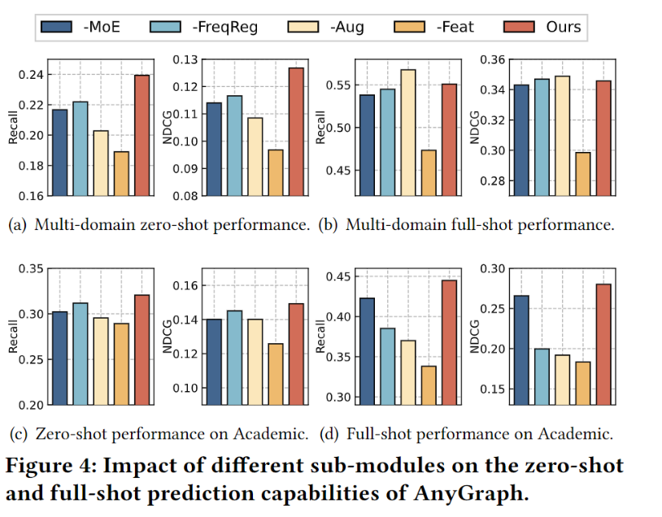

### Summarization:

### Title:

AnyGraph: Graph Foundation Model in the Wild (KDD 2024)

### Background:

The growing ubiquity of relational data structured as graphs has underscored the need for graph learning models with exceptional generalization capabilities.

### Challengers:

#### Structure Heterogenity:

Addressing distribution shift in graph structural information.

#### Feature Heterogenity:

Handling diverse feature representation spaces across graph datasets.

#### Fast Adaptation:

Efficiently adapting the model to new graph domains.

#### Scaling Law Emergence:

Enabling the model to exhibit scaling law behavior, where its performance scales favorably with the amount of data and parameter sizes.

### Innovation:

#### Methodology Design Motivations of AnyGraph:

Mixture-of-Experts, This new paradigm empowers the model to flexibly adjust to the nuances of diverse graph datasets, dynamically selecting the most appropriate experts to learn distinct patterns.

#### Stronger Generalization Capacities of AnyGraph:

Through our extensive experiments, the proposed AnyGraph model with the graph MoE framework has demonstrated strong generalization capacities across a wide range of graph tasks and domains.

#### Fast Adaptability of AnyGraph:

Our innovative dynamic expert selection mechanism enhances AnyGraph's ability to swiftly adapt to new graph domains.

#### The Scaling Law of AnyGraph:

Our experiments reveal that AnyGraph's performance follows the scaling law, where the model continues to improve as model size and training data increase.

### Introduction:

With a differentiable training objective L and an evaluation criterion C to measure the prediction accuracy of downstream tasks, building a graph foundation model𝑓Θ with trainable parameters Θ can be formalized as follows:
$$
\arg\max_{f,\mathcal{L}}\sum_{\mathcal{G}_t}C\left(f_\Theta(\mathcal{G}_t),\mathcal{Y}_t\right),\Theta=\arg\min_\Theta\sum_{\mathcal{G}_s}\mathcal{L}\left(f_\Theta(\mathcal{G}_s),\mathcal{Y}_s\right)
$$

#### MoE Architecture of AnyGraph:

##### Addressing Cross-domain Graph Heterogeneity:

An automated routing algorithm is designed to assign input graph data to the most competent expert model for training and prediction.

The AnyGraph framework can be denoted as $$\mathcal{M}=(f_{\Theta_{1}},f_{\Theta_{2}},\cdots,f_{\Theta_{K}},\psi)$$
$$
\hat{y}_{i,j}=\hat{\mathbf{e}}_i^\top\hat{\mathbf{e}}_j,\quad\hat{\mathbf{E}}=f_{\Theta_k}(G),\quad k=\psi(G)
$$

##### Graph Expert Routing Mechanism:

$$
\varphi_k=\frac{1}{S}\cdot\sum_{s=1}^S\sigma(\hat{\mathbf{e}}_{c_s}^\top\hat{\mathbf{e}}_{p_s}-\hat{\mathbf{e}}_{c_s}^\top\hat{\mathbf{e}}_{n_s})
$$

##### Training Frequency Regularization:

$$
\varphi_k^{\prime}=\varphi_k\cdot\left((1-\frac{m_k}{\sum_{k^{\prime}}m_{k^{\prime}}})\cdot\rho+1.0-\frac{\rho}{2}\right)
$$

With this additional step, the expert routing mechanism will assign more training instances to the less trained expert models, thereby preventing the aforementioned winner-takes-all situation.

##### Fast Adaptation Capabilities of AnyGraph:

With the aforementioned MoE architecture and routing mechanism, the training and inference process of AnyGraph is conducted by only one expert model. This approach consumes only 1/𝐾 of the computational and memory resources required for predictions and optimization.

#### Adaptive and Efficient Graph Experts:

##### Addressing In-domain Graph Heterogeneity:

Inspired by the effectiveness of singular value decomposition (SVD) in extracting important latent features, we utilize SVD for this unified mapping process as follows:
$$
\mathbf{U_A},\Lambda_A,\mathbf{V_A}=\mathrm{SVD}(\tilde{\mathbf{A}})\quad\mathbf{U_F},\Lambda_F,\mathbf{V_F}=\mathrm{SVD}(\mathbf{F})
$$

$$
\mathbf{E}_0=\mathrm{LayerNorm}\left(\mathbf{U}_\mathbf{A}\sqrt{\Lambda_\mathbf{A}}+\mathbf{V}_\mathbf{A}\sqrt{\Lambda_\mathbf{A}}+\mathrm{Flip}(\mathbf{U}_\mathbf{F}\sqrt{\Lambda_\mathbf{F}})\right)
$$

In particular, the function Flip(·) reverses the 𝑑 dimensions of each row for the SVD features of **F**, such that the important features of $$\tilde{\mathbf{A}}$$ are aligned with the less important features of **F**, and vice versa.

##### High-order Connectivity Injection:

A non-trainable layer normalization LayerNorm(·) is applied for numerical stability.

To better preserve the multi-hop connection information into the initial embeddings, AnyGraph adopts a simplified GCN without parameters for E0 as follows:
$$
\mathbf{E}_1=\sum_{l=1}^L\mathbf{E}_0^{(l)},\quad\mathbf{E}_0^{(l)}=\tilde{\mathbf{A}}\cdot\mathbf{E}_0^{(l-1)},\quad\mathbf{E}_0^{(0)}=\mathbf{E}_0
$$

##### Efficient and Strong Feature Encoder:

$$
\bar{\mathbf{E}}^{(l+1)}=\mathrm{LayerNorm}\left(\mathrm{Dropout}\left(\mathrm{ReLU}(\bar{\mathbf{E}}^{(l)}\mathbf{W}+\mathbf{b})\right)+\bar{\mathbf{E}}^{(l)}\right)
$$

##### Multiple Simple Experts as Strong Encoder:

No complex models are needed to accommodate different types of graphs within a single network, This is because AnyGraph employs a MoE architecture, where each expert is expected to handle only a subdomain of all graph data through simple feature transformations

##### Efficient Cross-domain Model Training:

To maximize the cross-graph generalizability of AnyGraph, the training samples from different datasets are mixed together and randomly shuffled for model training.
$$
S=
\begin{pmatrix}
 & \{(v_{c_b},v_{p_b})|b\in B\}\subset\mathcal{E}_{\mathcal{G}_s}, \\
 & \mathbf{E}_1=\text{InitialEmbed}(\mathcal{G}_s), \\
 & f_{\Theta_k}\mathrm{~where~}k=\psi(\mathcal{G}_s)
\end{pmatrix}
$$
The loss function used by our AnyGraph training is as follows:
$$
\mathcal{L}=\sum_S\sum_{b\in B}-\frac{1}{B}\log\frac{\exp(\hat{y}_{c_b,p_b}-\hat{y}_{\max})}{\sum_{v_n\in\mathcal{V}_{G_s}}\exp(\hat{y}_{c_b,n}-\hat{y}_{\max})}
$$

##### Feature and Structure Augmentation:

To further enrich the training data, the training of AnyGraph undergoes periodic reprocessing of, firstly, the initial graph embeddings E1, and secondly, the graph routing results.

This essentially performs structure augmentation by using a random subset to evaluate the performance of graph experts on the input graph, thereby enhancing the model's robustness against structural noise.

##### Complexity Analysis:

The training and inference process of AnyGraph is conducted by only one expert model, which has a complexity of $$O(B\times d^{2}\times L^{\prime})$$ for each batch.

### Experiments:

#### AnyGraph's Zero-Shot Prediction:

#### Scaling Law of AnyGraph Framework:

1. Generalizability of AnyGraph Follows the Scaling Law
2. Emergent Abilities of AnyGraph
3. Insufficient training data may bring bias

#### Ablation Study:

1. MoE Significantly Enhances Zero-Shot Performance

2. Feature Modeling is Crucial in AnyGraph
3. Effectiveness of Frequency Regularization and Graph Augmentation

#### Investigation on Expert Routing

#### Efficiency Study

##### Tuning Curve Comparison

##### Training Time Comparison

