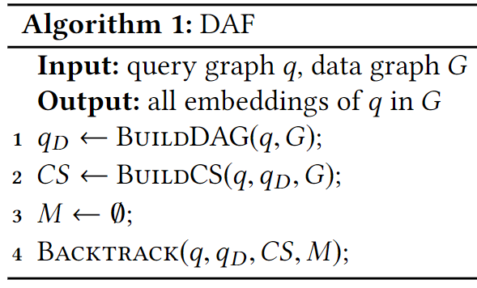
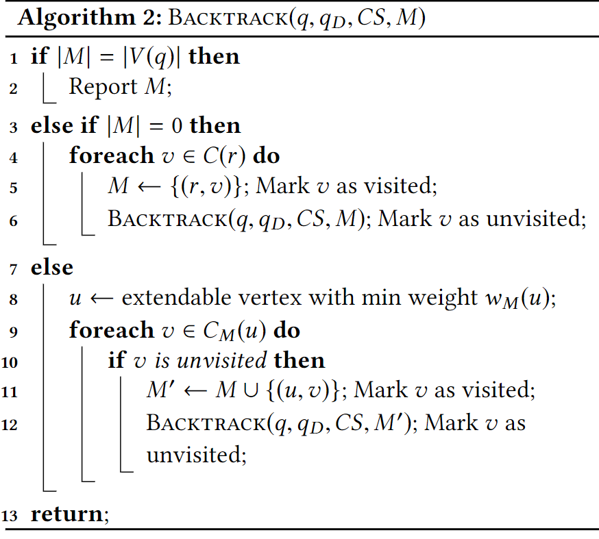

## Title:

Efficient Subgraph Matching: Harmonizing Dynamic Programming, Adaptive Matching Order, and Failing Set Together

## Introduction:

In recent years, graphs have been playing an increasingly **important role** in various domains, social networks, bioinformatics, chemistry, software engineering. One of the most fundamental problems in graph analysis is subgraph matching.

#### Limitations of Spanning Trees

#### Sub-optimal Matching Order

#### Redundant Computations in Search

#### DAG-Graph DP:

We use a directed acyclic graph (**DAG**) $$q_D$$ of q in the filtering process instead of a **spanning tree**, and we find potential embeddings of $$q_D$$ in data graph G.

#### Adaptive Matching Order with DAG Ordering:

In this way all **nontree edges** are checked as early as possible to reduce redundant Cartesian products.

#### Pruning by Failing Sets:

We introduce a new notion of failing set to prune out some parts of the search space.

Once we find a failing set, we can safely remove some partial embeddings in the search space.

## Related Work:

### Subgraph Matching:

#### $$\text {Turbo}_{\text {iso}}$$ :

$$\text {Turbo}_{\text {iso}}$$ uses the idea that an optimal matching order varies with each region of the data graph, and thus $$\text {Turbo}_{\text {iso}}$$ finds embeddings of query graph q in data graph G **region by region**. Based on the CR, an effective matching order for each region is computed by the **path-ordering** technique.

#### CFL-Match:

CFL-Match proposes the core-forest-leaf decomposition, where the query graph is decomposed into a **core, a forest, and leaves**.

CFL-Match proposes a more compact auxiliary structure CPI.

### Dynamic Programming:

Dynamic programming can be used to solve some NP-hard graph problems in polynomial time for some subclasses of graphs.

## DAF:

## DAG-GRAPH DP:

### CS Structure:

1. For each u ∈ V (q), there is a candidate set C(u), which is a subset of $$C_{ini}(u)$$.
2. There is an edge between v ∈ C(u) and v ′ ∈ C(u′) if and only if (u, u′) ∈ E(q) and (v, v ′) ∈ E(G).

### DAG-Graph DP:

We first define the weak embedding, which is a key notion in our dynamic programming.

For a rooted DAG g with root u, a weak embedding M′ of g at v ∈ V (G) is defined as a homomorphism of the path tree of g such that M′(u) = v.

For each candidate set C(u), we define the refined candidate set $$C^′(u)$$ as follows:

$$v \in C^′(u)$$ if $$v \in C(u)$$ and there is a weak embedding of $$q^′_u$$ at v in the CS.

To compute $$C^′(u)$$ by dynamic programming, we obtain the following recurrence:

$$v \in C^′(u)$$ if $$v \in C(u)$$ and $$∃v_c$$ adjacent to v such that $$v_c \in C^′(u_c )$$ for every child $$u_c$$ of u in $$q^′$$.

Suppose that we define D[u, v] = 1 if v ∈ C(u);

D′[u, v] = 1 if D[u, v] = 1 and $$∃v_c$$ adjacent to v such that $$D^′[u_c , v_c ] = 1$$ for every child $$u_c$$ of u in q′.

### Optimizing CS:

1. In this first step, candidates may be further filtered by considering the **local features** of the query vertices.
2. In the second step, we further refine the CS using $$q_D$$ .Note that the changes of the candidate sets by the second step give a chance of further refinement using $$q^{−1}_D$$ again, and so on.

Our empirical study showed that **three steps** are enough for optimization

## DAG ORDERING AND ADAPTIVE MATCHING ORDER:

### DAG Ordering

#### Backtracking Framework:

1. Select an extendable vertex u regarding the current partial embedding M.
2. Extend M by mapping u to each unvisited $$v \in C_M (u)$$ and recurse.

### Adaptive Matching Order:

1. Candidate-size order: we select an extendable vertex u such that $$|C_M (u)|$$ is the minimum.
2. Path-size order: we select an extendable vertex u such that $$w_M (u)$$ is the minimum. Since $$w_M (u)$$ is an estimate of path embeddings, this is called the path-size order.

We wish to adopt the same strategy, but it is not clear what in $$q_D$$ should be considered as basic units of the strategy under the DAG ordering. 

The weight array Wu (v) can be computed in time proportional to the size of the CS by dynamic programming in a bottom-up fashion:

1. If $$u \in V (q)$$ has no child in $$q_D$$ that has only one parent,$$W_u (v) = 1$$ for all $$v \in C(u)$$.

2. Otherwise, let the children of u in $$q_D$$ which have only one parent be c1, . . . , ck . For each v ∈ C(u), we compute $$W_u (v)$$ as follows. For each $$c_i$$ , we compute $$W_{u,c_i} (v) =\sum_{\upsilon^{\prime}\in N_{c_i}^u(\upsilon)}W_{c_i}(\upsilon^{\prime})$$. Then, we set $$W_u(\upsilon)=\min_{1\leq i\leq k}W_{u,c_i}(\upsilon)$$

3. The weight (denoted by $$w_M (u))$$ of an extendable vertex u of $$q_D$$ regarding a partial embedding M is computed as
   $$
   w_M(u)=\sum_{\upsilon\in C_M(u)}W_u(\upsilon).
   $$

### Backtracking Process:

We represent them by mapping functions with '!' and ∅, where '!' means a mapping conflict, the leftmost leaf $$(u_5, v_1)$$! means that $$v_1$$ is already matched and so $$u_5$$ cannot be mapped to $$v_1$$, and (u, ∅) means that there are no extendable candidates of u.

## Failing Set:

1. A set of query vertices relevant to any of the failures during the exploration of the subtree rooted at M, which is $$F = \{u_1, u_2, u_3, u_5 \}$$.
2. A subset $$M^′ = \{(u_1, v_1), (u_2, v_2)\}$$ of M as a partial embedding of induced subgraph q[F].

Let M be a search tree node labeled with (u, v), and FM be a non-empty failing set of node M. If $$u \notin F_M$$ , then all siblings of node M (including itself) are redundant.

### Computing Failing Sets:

The failing sets are computed in the search tree in a bottom-up fashion. The leaves are categorized into the following three classes.

1. A leaf belongs to the conflict-class if a conflict of mapping occurs in the leaf.
2. A leaf belongs to the empty-set-class if $$C_M (u) = \empty$$ for the current query vertex u.
3. A leaf belongs to the embedding-class if it is a full embedding of q. For an embedding-class node M, we cannot define a failing set. Thus, we set $$F_M = \empty$$.

We compute the failing set $$F_M$$ of node M according to the following cases:

1. If there exists a child node $$M_i$$ such that $$F_{M_i} = \empty$$, we set $$F_M = \empty$$
2. If there exists a child node $$M_i$$ such that $$u_n \notin F_{M_i}$$ , we set $$F_M=F_{M_i}$$ . Otherwise, we set $$F_M=\bigcup_{i=1}^kF_{M_i}$$ .