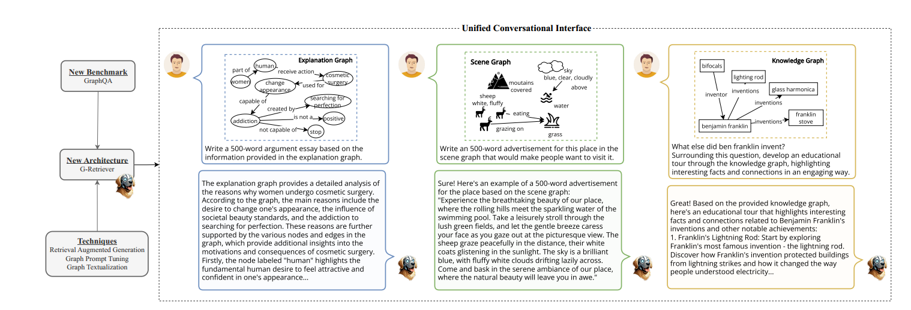
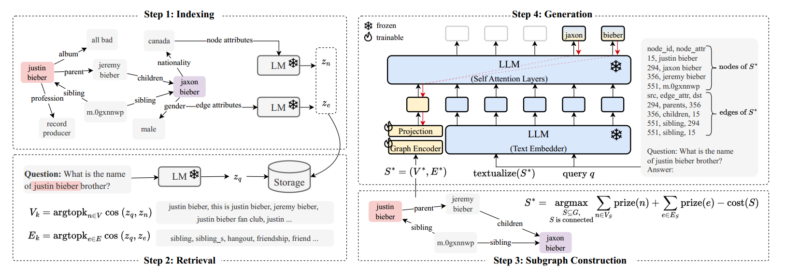
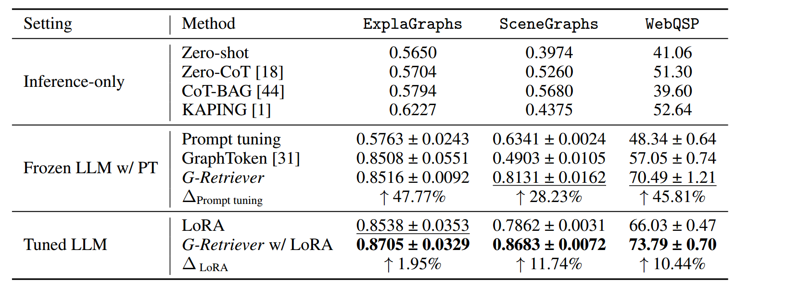
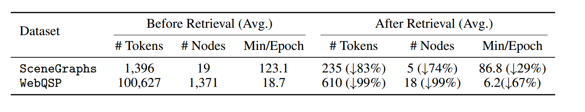
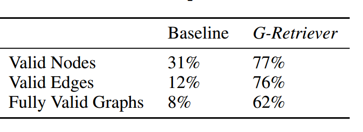
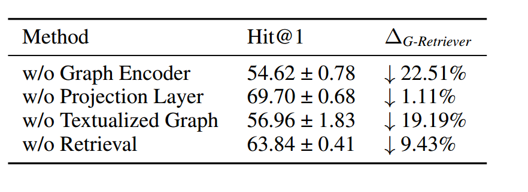

#### Title:

G-Retriever: Retrieval-Augmented Generation for Textual Graph Understanding and Question Answering

#### Background:

The advent of LLMs has significantly shaped the artificial intelligence landscape. While existing works integrate LLMs and
GNNs in various ways, they mostly focus on conventional graph tasks such as node, edge and graph classification, or answering simple questions on small or synthetic graphs. 

#### Innovation:

We develop a flexible question-answering framework targeting complex and real-world graphs. This framework enables users to ‘chat with their graph’ via a unified conversational interface, representing a leap towards intuitive interaction with graph data. We propose our G-Retriever method, introducing the first retrieval-augmented generation (RAG) approach for general textual graphs,
which can be fine-tuned to enhance graph understanding via soft prompting.

##### The Need for a Comprehensive GraphQA Benchmark:

In contrast to existing benchmarks that focus on basic graph-based reasoning tasks such as node degree, edge existence, and
shortest path, our benchmark addresses complex and real-world graph applications including common sense reasoning, scene understanding, and knowledge graph reasoning.

##### New Architecture for GraphQA:

To enable effective and efficient graph QA, even on large graphs, we propose G-Retriever, a new framework combining the strengths of GNNs, LLMs, and RAG.

##### Tackling Hallucination in Graph LLMs:

LLMs are prone to hallucination, a phenomenon where the generated content is factually inaccurate or nonsensical by employing RAG for direct information retrieval from the actual graph, our G-Retriever mitigates this issue.

##### Enhancing Scalability and Efficiency in Graph LLMs:

Converting a graph with thousands of nodes and edges into a text sequence results in an excessive number of tokens, surpassing the input capacity of many LLMs. An alternative of truncating the graph text sequence to fit the LLM’s input token limit leads to loss of information and response quality. G-Retriever overcomes these issues with its RAG component, which allows for effective scaling to larger graphs by selectively retrieving only relevant parts of the graph.

##### Tailoring the RAG Approach to Graphs:

We introduce a new retrieval approach for general textual graphs. Notably, we formulate subgraph retrieval as a Prize-Collecting Steiner Tree (PCST) optimization problem, which takes the neighborhood information into account during retrieval. This also allows the return of a subgraph most relevant to a query, thereby improving explainability.

#### Introduction:

##### Textual Graphs:

$$G = (V, E, \{x_n\}n∈V , \{x_e\}e∈E),$$ where V and E represent the sets of nodes and edges, respectively. Additionally, $$x_n \in D^{Ln}$$ and $$x_e \in D^{Le}$$ denote sequential text associate with a node n ∈ V or an edge e ∈ E, where D represents the vocabulary, and $$L_n$$ and $$L_e$$​ signify the length of the text associated with the respective node or edge.

##### Language Models for Text Encoding:

For a node n with text attributes $$x_n \in D^{Ln}$$ , an LM encodes these attributes as:$$z_n = LM(x_n) ∈ R^d$$ where $$z_n$$ is the output of the LM, and d is the dimension of the output vector.

##### Large Language Models and Prompt Tuning:

LLMs have introduced a new paradigm for task-adaptation known as “pre-train, prompt, and predict”, replacing the traditional “pre-train, fine-tune” paradigm. The LLM, parameterized by weights θ, takes a sequence of tokens X, and a prompt P as input, and
generates a sequence of tokens Y = {y1, y2, . . . , yr} as output.
$$
p_θ(Y |[P; X]) =\prod ^r _{i=1} p_θ(y_i|y_{<i}, [P; X]).
$$
$$y_{<i}$$ represents the prefix of sequence y up to position i − 1, and $$p(y_i|y_{<i}, [P; X])$$ represents the probability of generating token $$y_{<i}$$ given $$y_{<i}$$ and [P; X].

Soft prompt tuning eliminates the need for manual prompt design. Given a series of p tokens$$X = {x_1, x_2, . . . , x_p}$$, after being processed by the text embedder, it forms a matrix $$X_e ∈ R^{p×d_l}$$,where $$d_l$$ is the dimension of the embedding space. Soft prompts can be represented as parameters$$P_e \in R^{q×d_l}$$, where q is the length of the prompt. The prompt is then concatenated with the embedded input, forming a single matrix $$[P_e; X_e] \in R^{ (q+p)×d_l}$$​. 

#### G-Retriever:

To allow efficient fine-tuning while preserving the LLM’s pretrained language capabilities, we freeze the LLM and use a soft prompting approach on the output of the GNN. Our RAG-based design mitigates hallucinations through direct retrieval of the graph, while allowing our approach to scale to graphs exceeding the LLM’s context window size.

G-Retriever comprises four main steps: indexing, retrieval, subgraph construction and generation.

##### Indexing:

We initiate the RAG approach by generating node and graph embeddings using a pre-trained LM.
$$
z_n = LM(x_n) \in R^d
$$

##### Retrieval:

$$
z_q = LM(x_q) \in R^d
$$

The retrieval operation is defined as:
$$
V_k = argtopk_{n\in V} cos(z_q, z_n)\\
E_k = argtopk_{e\in E} cos(z_q, z_e),
$$
where $$z_n$$ and $$z_e$$ are the embeddings of node n and edge e, respectively. We use the cosine similarity function, cos(·, ·), to measure the similarity between the query representation and the node/edge embeddings. The $$argtopk$$ operation retrieves the top-k elements based on this similarity, providing a set of nodes $$V_k$$ and edges $$E_k$$​ considered most relevant to the query.

##### Subgraph Construction:

This step aims to construct a subgraph that encompasses as many relevant nodes and edges as possible, while keeping the graph size manageable. This approach offers two key benefits: Firstly, it helps to filter out nodes and edges that are not pertinent to the query. Secondly, it enhances efficiency; by keeping the graph size manageable, it becomes feasible to translate the graph into natural language and then input it into the LLM for processing.

##### Prize-Collecting Steiner Tree (PCST):

The PCST problem aims to find a connected subgraph that maximizes the total prize values of its nodes while minimizing the total costs of its edges. Our approach assigns higher prize values to nodes and edges more relevant to the query, as measured by
cosine similarity.
$$
prize(n) = 
	\begin{cases}
	k − i,& \text{if n $\in$ $V_k$ and n is the top i node}\\
	0, & \text{otherwise}
	\end{cases}
$$
Edge prizes are assigned similarly.$$S^∗ = (V^∗, E^∗)$$
$$
S^∗ = argmax ({S⊆G,S\ is\ connected})\sum_{n\in V_s}price(n)+ \sum _{n\in V_S}prize(e)− cost(S)
$$

$$
cost(S) = |E_S| × C_e,
$$

$$C_e$$ denotes a predefined cost per edge, which is adjustable to control the subgraph size. The original PCST algorithm is designed for node prizes only, we adapt the algorithm to accommodate edge prizes as follows: Consider an edge e with a cost $$C_e$$ and a prize $$P_e$$. If $$C_e > P_e$$, it can be treated as a reduced edge cost of $$C_e − P_e$$. However, if $$P_e > C_e$$, negative edge costs are not allowed in the original algorithm. Our solution involves replacing edge e with a ‘virtual node’ $$v_e$$, connected to both endpoints of e. This virtual node is assigned a prize of $$P_e − C_e$$​, and the cost of the two new edges leading to the virtual node is set to zero.

#####  Answer Generation:

1. Graph Encoder: We use a graph encoder to model the structure of this graph : $$h_g = POOL(GNN_{ϕ1}(S^∗)) \in R^{d_g}$$, POOL denotes the mean pooling operation, and $$d_g$$ is the dimension of the graph encoder.

2. Projection Layer: We incorporate a multilayer perceptron (MLP) to align the graph token with the vector space of the LLM:$$\hat h_g=MLP_{ϕ2}(h_g) \in R^{d_l}$$, $$d_l$$​ is the dimension of the LLM’s hidden embedding.

3. Text Embedder: To leverage the text-reasoning capabilities of LLMs, we transform the retrieved subgraph $$S^∗$$​ into a textual format. Let $$x_q$$ denote the query; we concatenate it with the textualized graph textualize($$S^∗$$).We then map the result to an embedding $$h_t$$​​​ using a text embedder, which is the first layer of a pretrained and frozen LLM:

   $$
   h_t = TextEmbedder([textualize(S^∗); x_q]) \in R^{L×d_l}, 
   $$
   where [; ] represents the concatenation operation, and L is the number of tokens.

5. LLM Generation with Graph Prompt Tuning: The final stage involves generating the answer Y given the graph token $$\hat h_g$$, acting as a soft prompt, and the text embedder output $$h_t$$
   $$
   p_{θ,ϕ1,ϕ2}(Y |S^∗, x_q) =\prod ^r_{i=1}p_{θ,ϕ1,ϕ2}(y_i|y_{<i}, [\hat h_g; h_t]),
   $$
   where $$[\hat h_g; h_t]$$ concatenates the graph token $$\hat h_g$$ and the text embedder output $$h_t$$. While θ is frozen, the graph token $$\hat h_g$$ receives gradients, enabling the optimization of the parameters of the graph encoder $$ϕ_1$$ and the projection layer $$ϕ_2$$ through standard backpropagation.

#### Experiments:

##### Results:

##### Efficiency:

##### Mitigation of Hallucination:

##### Ablation Study:

#### Limitations:

Currently, G-Retriever employs a static retrieval component. Future developments could investigate more sophisticated RAG where the retrieval is trainable.
