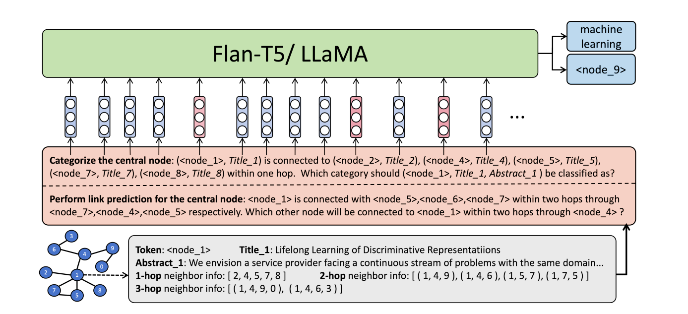
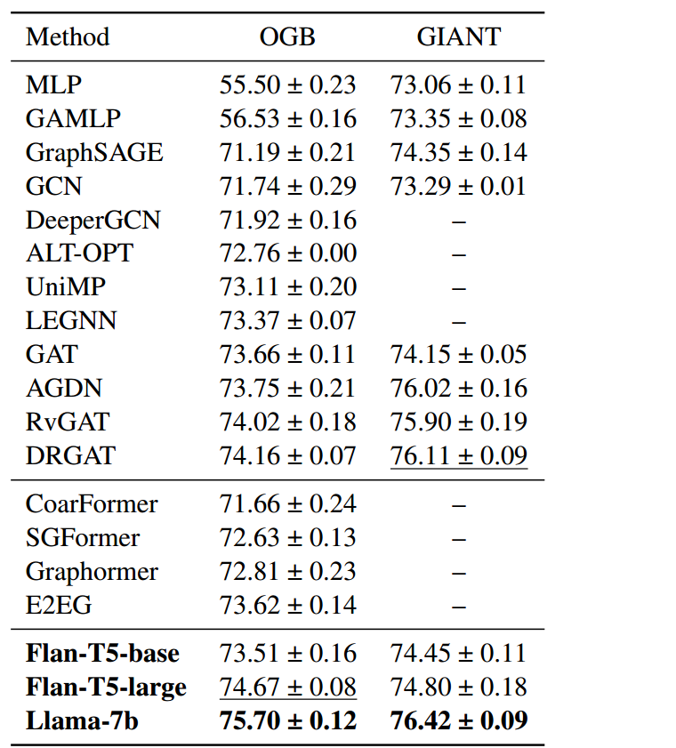
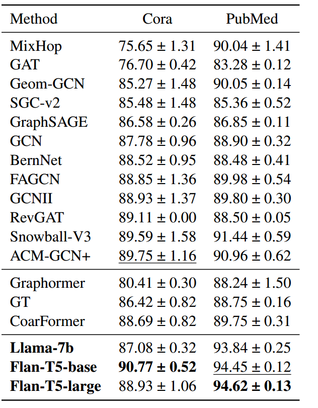

#### Title:

​	Language is All a Graph Needs.

#### Background:

​	The emergence of large-scale pre-trained language models has revolutionized various AI research domains. Considering the rising prominence of LLMs, it becomes essential to explore whether LLMs can also replace GNNs as the foundation model for graphs.

#### Related work:

 1. GNN-based Methods:

    Another major drawback of GNNs is their inability to directly process non-numeric raw data such as text or images, requiring additional feature engineering techniques.

    Limitation: Its lack of compatibility with existing large-scale generative models presents a significant challenge for integration with other AI domains such as vision and language into a unified intelligent system.

2. Transformers-based Methods: 

   Attention-based Transformer models can be utilized for graph processing by representing nodes and edges as distinct tokens. However, it is computationally intensive for handling large-scale graphs and the global attention mechanism can not effectively capture the graph’s topology.

   Limitation: It can be difficult to be extended beyond classification due to the use of encoder-only model . Additionally, its natural language templates are not designed for general graph learning thus not as expressive and flexible to serve as a foundation model for graph learning.

3. Fuse GNN and Transformers

   GNNs excel at learning structure, while Transformers are proficient in capturing multi-modality features. To combine the advantages of both, to solve problem about graph effectively.

   Limitation: The model performance is still susceptible to inherent issues of GNNs, such as over-smoothing (Yang et al., 2020) and the pipeline of multi-model training is usually very complex compared to the simplicity of a single generative LLM framework.

4. Large Language Model based Methods:

   Existing works have included utilizing LLM to select the most suitable graph processor based on the query (Zhang, 2023), employing LLM’s zero-shot explanations for data augmentation to obtain advanced graph features (He et al., 2023), generating prompts and benchmarks for graph construction, evaluation, biology and structural reasoning.
   

Limitation: Their performance does not surpass GNN baselines for the most of time with the model freeze, merely demonstrating the potential of LLM as an optional candidate for graph tasks.

#### Innovation：

​	We use natural language to describe multi-scale geometric structure of the graph and then instruction finetune an LLM to perform graph tasks, which enables Generative Graph Learning. 

​	Two crucial operations contributing to the outstanding performance of InstructGLM in node classification task:

1. Multi-prompt instruction-tuning, which provides multi-hop graph structure information to the LLM.
2. The utilization of self-supervised link prediction as an auxiliary task. 

​	InstructGLM owns the following advantages over GNNs:

1. Flexibility: A natural language sentence is capable of effectively describing the connectivity at any desired hop level and intermediate paths without iterative message passing and aggregation. Even multimodal features of the nodes and edges can be directly integrated into natural language prompts, making natural language a very flexible medium to convey both structure and content on the graph.
2. Scalability: Injecting graph structure into multiple natural language sentences enables mini-batch training and independent gradient propagation, which facilitates scalable distributed training and low machine communication overhead for massive graphs.
3. Compatibility: With structure descriptions, InstructGLM is able to consistently reformulate various graph learning pipelines as language modeling tasks. This aligns well with the LLM-based multimodal processing framework, enabling the integration of graph learning with other AI domains, including vision, language, and recommendation, to build unified AI systems.

#### Introduction:

​	In order to comprehensively convey the structure information of a graph and ensure the adaptability of the created instruction prompts to various types of graphs, we have systematically designed a set of graph description prompts centered around a central node. We mainly consider the following three questions when designing the prompts:

1. What is the largest hop level of neighbor information about the central node in the prompt?

   Prompts can be classified into two types: those exclusively contain 1-hop connection information, and those with a maximum of 2-hop or 3-hop connection details.

2. Does the prompt include meta node features or edge features?

3. For prompts with large (≥ 2) hop level neighbors about the central node, does the prompt encompass information about the intermediate nodes or paths along the corresponding connecting route?

    There are two possible scenarios for each question, if or not to include the node or edge meta features in the prompt, and if or not to include the intermediate connecting paths in the prompt. 

The simplest form of a graph description prompt containing at most 2-hop neighbor information is:
$$
\begin{aligned}
\begin{aligned}\mathcal{T}(v,\mathcal{A},\{\mathcal{N}_v\}_{v\in\mathcal{V}},\{\mathcal{E}_e\}_{e\in E})=\{(v,\mathcal{N}_v)\}\text{ is}\end{aligned} \\
&\text{connected with }\{[(v_2,\mathcal{N}_{v_2})]_{v_2\in\mathcal{A}_2^v}\} \\
&\text{within two hops through }\{[(v_1,\mathcal{N}_{v_1})]_{v_1\in\mathcal{A}_1^v}\} \\
&\text{and featured paths }\{[(\mathcal{E}_{(v,v_1)},\mathcal{E}_{(v_1,v_2)})] \\
&v_1{\in}\mathcal{A}_1^v,v_2{\in}\mathcal{A}_1^{v_1}\},\text{respectively}.
\end{aligned}
$$
Its most detailed form which includes node features, edge features and the corresponding inter-mediate paths should be:

T (v,A, {$$N_v$$}v∈V, {$$E_e$$}e∈E) = {(v, $$N_v$$)} is connected with {[($$v_2$$, $$N_{v2}$$)]$$v_2$$∈$$A^v_
2$$}within two hops through {[($$v_1$$, $$N_{v_1}$$)]$$v_1$$∈$$A^v_1$$}and featured paths {[($$E_{(v,v1)}$$, $$E_{(v1,v2)}$$)]$$v_1$$∈$$A^v_1$$, $$v_2∈A^{v1}_1$$, respectively.

We propose InstructGLM as a multi-prompt instruction-tuning framework tailored for graph learning. Specifically, we utilize
a generative large language model, either with an encoder-decoder or a decoder-only architecture, as the backbone. And then we fuse all of our designed instruction prompts, which are spanning at different hop levels with diverse structural information, together as input to the LLM, enabling mutual enhancement among the instructions. By exclusively using natural language to depict graph structures, we succinctly present the graph structure to the LLM and provide a pure NLP interface for all graph-related tasks, making them solvable via a unified pipeline in generative manner.

We denote x and y as the LLM’s input and target sentence, respectively. Then our pipeline can be formed as:
$$
P_θ (y_j | x, y<j ) = LLM_θ (x, y_{<j}),x = Concatenate(P; I; Q)\\
L_θ = -\sum_{j=1}^{|y|}log P_θ (y_j | x, y_{<j} )
$$
where I = T (v, A, $$\{N_v\}_{v∈V}$$, $$\{E_e\}_{e∈E}$$​) is the graph structure description centering at node v ∈ V, L denotes the NLL loss, P and Q are the task specific instruction prefix and query. P = ‘Classify the central node into one of the following categories: [<All category>]. Pay attention to the multi-hop link relationships between the nodes.’ and Q = ‘Which category should {v} be classified as?’.

#### Experiments:

<

#### Limitation:

​	When dealing with largescale graphs, the instruction prompts we construct may not encompass all high-order neighbors within a single natural language sentence due to the limitations of sentence length.

