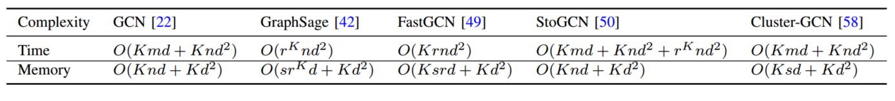

# CATEGORIZATION AND FRAMEWORKS：

## Taxonomy of Graph Neural Networks (GNNs)：

### Recurrent graph neural networks (RecGNNs)

They assume a node in a graph constantly exchanges information/message with its neighbors until a stable equilibrium is reached. 

### Convolutional graph neural networks (ConvGNNs)

The main idea is to generate a node v’s representation by aggregating its own features xv and neighbors’ features xu, where u 2 N(v). Different from RecGNNs, ConvGNNs stack multiple graph convolutional layers to extract high-level node representations.

### Graph autoencoders (GAEs)

GAEs are unsupervised learning frameworks which encode nodes/graphs into a latent vector space and reconstruct graph data from the encoded information. GAEs are used to learn network embeddings and graph generative distributions.

### Spatial-temporal graph neural networks (STGNNs)

The key idea of STGNNs is to consider spatial dependency and temporal dependency at the same time.

## Frameworks：

### Different graph analytics tasks

#### Node-level

Node-level outputs relate to node regression and node classification tasks.

#### Edge-level

Edge-level outputs relate to the edge classification and link prediction tasks.

#### Graph-level

Graph-level outputs relate to the graph classification task.

### Training Frameworks：

#### Semi-supervised learning for node-level classification

Given a single network with partial nodes being labeled and others remaining unlabeled, ConvGNNs can learn a robust model that effectively identifies the class labels for the unlabeled nodes.

#### Supervised learning for graph-level classification

The end-to-end learning for this task can be realized with a combination of graph convolutional layers, graph pooling layers, and/or readout layers.

#### Unsupervised learning for graph embedding

When no class labels are available in graphs, we can learn the graph embedding in a purely unsupervised way in an endto-end framework. 

One simple way is to adopt an autoencoder framework where the encoder employs graph convolutional layers to embed the graph into the latent representation upon which a decoder is used to reconstruct the graph structure.

Another popular way is to utilize the negative sampling approach which samples a portion of node pairs as negative pairs while existing node pairs with links in the graphs are positive pairs. Then a logistic regression layer is applied to distinguish between positive and negative pairs.

# Recurrent Graph Neural Networks

$$
\mathbf{h}_v^{(t)}=\sum_{u\in N(v)}f(\mathbf{x}_v,\mathbf{x}^\mathbf{e}_{(v,u)},\mathbf{x}_u,\mathbf{h}_u^{(t-1)})
$$

### Gated Graph Neural Network (GGNN)

$$
\mathbf{h}_{v}^{(t)}=GRU(\mathbf{h}_{v}^{(t-1)},\sum_{u\in N(v)}\mathbf{Wh}_{u}^{(t-1)})
$$

GGNN uses the back-propagation through time (BPTT) algorithm to learn the model parameters.

This can be problematic for large graphs, as GGNN needs to run the recurrent function multiple times over all nodes, requiring the intermediate states of all nodes to be stored in memory.

### Stochastic Steady-state Embedding (SSE)

$$
\mathbf{h}_{v}^{(t)}=(1-\alpha)\mathbf{h}_{v}^{(t-1)}+\alpha\mathbf{W_{1}}\sigma(\mathbf{W_{2}}[\mathbf{x}_{v},\sum_{u\in N(v)}[\mathbf{h}_{u}^{(t-1)},\mathbf{x}_{u}]])
$$

# CONVOLUTIONAL GRAPH NEURAL NETWORKS

## Spectral-based ConvGNNs

## Spatial-based ConvGNNs

### Graph Isomorphism Network (GIN)：

$$
\mathbf{h}_{v}^{(k)}=MLP((1+\epsilon^{(k)})\mathbf{h}_{v}^{(k-1)}+\sum_{u\in N(v)}\mathbf{h}_{u}^{(k-1)})
$$

#### 公式解析

- **hv(k)**：
  - 表示节点 v 在第 k 层的特征向量。
  - 这是通过聚合邻居节点的信息并更新自身特征后得到的节点表示。
- **$$MLP(\cdot)$$**：
  - 多层感知机（Multi-Layer Perceptron），用于对节点及其邻居特征进行非线性变换。
  - 它可以包含多个全连接层，并带有激活函数（如`ReLU`），从而提升模型的表达能力。
- **$$(1 + \epsilon^{(k)}) \mathbf{h}_{v}^{(k-1)}$$**：
  - **$$\mathbf{h}_{v}^{(k-1)}$$** 是节点 v 在第 k−1 层的特征向量。
  - **$$\epsilon^{(k)}$$** 是一个可学习的参数，用于调整节点自身特征的重要性。如果$$\epsilon^{(k)} = 0$$，则更新公式只依赖于邻居节点的特征。
  - 通过引入$$(1 + \epsilon^{(k)})$$，GIN 模型能够在特征聚合时更灵活地调整节点自身特征与其邻居特征之间的平衡。
- **$$\sum_{u \in N(v)} \mathbf{h}_{u}^{(k-1)}$$**：
  - 表示节点 v 的所有邻居节点 $$u \in N(v)$$ 的特征向量的求和操作。
  - 这是邻居节点特征的聚合（aggregation）步骤，将邻居的信息整合到当前节点的更新中。

#### 公式的整体作用

- 这个公式定义了 

  Graph Isomorphism Network (GIN)

   中的节点特征更新机制，它通过以下步骤更新节点特征：

  1. **邻居特征聚合**：将邻居节点的特征相加。
  2. **节点自身特征加权**：通过 $$(1 + \epsilon^{(k)})$$ 调整节点自身特征的重要性。
  3. **非线性变换**：通过 MLP 对加权和聚合后的特征进行非线性变换，得到第 k 层的新特征表示。

#### 为什么引入 $$\epsilon^{(k)}$$？

- 传统的 GNN（如 GCN）在节点特征更新时会直接对节点自身和邻居特征进行平均，这会导致在某些图结构上无法区分不同的节点（例如图同构问题）。
- 通过引入 $$\epsilon^{(k)}$$，GIN 允许对节点自身特征施加更大的权重，从而提高区分不同节点结构的能力。这使得 GIN 在图同构检测任务上具有更强的表达能力。

### GraphSAGE：

$$
\mathbf{h}_{v}^{(k)}=\sigma(\mathbf{W}^{(k)}\cdot f_{k}(\mathbf{h}_{v}^{(k-1)},\{\mathbf{h}_{u}^{(k-1)},\forall u\in S_{\mathcal{N}(v)}\}))
$$

#### 公式解析

- **$$\mathbf{h}_{v}^{(k)}$$**:
  - 这是节点 v 在第 k 层的特征向量（嵌入表示）。经过第 k 层的更新后得到。
- **$$\mathbf{h}_{v}^{(k-1)}$$**:
  - 这是节点 v 在第 k−1 层的特征向量。表示上一层节点 v 的状态。
- **$$\mathbf{h}_{u}^{(k-1)}$$**:
  - 这是节点 u（即节点 v 的邻居）在第 k−1k-1k−1 层的特征向量。邻居节点集合 $$\mathcal{N}(v)$$ 包含了所有和节点 v 直接相连的节点。
- **$$S_{\mathcal{N}(v)}$$**:
  - $$S_{\mathcal{N}(v)}$$ 是邻居节点集合 $$\mathcal{N}(v)$$ 的一个子集。这通常用于某些情况下的邻居采样技术，例如在大规模图中进行邻居下采样，以减少计算复杂度。
- **$$f_{k}(\cdot)$$**:
  - 这是一个 **聚合函数（Aggregation Function）**，用于将节点 v 的特征 $$\mathbf{h}_{v}^{(k-1)}$$ 与其邻居特征 $$\{\mathbf{h}_{u}^{(k-1)}, \forall u \in S_{\mathcal{N}(v)}\}$$ 进行组合。常见的聚合函数包括 `Mean`（平均）、`Sum`（求和）、`Max`（最大值）等，也可以是更复杂的聚合操作，如注意力机制（Attention）。
- **$$\mathbf{W}^{(k)}$$**:
  - 这是第 k 层的可学习权重矩阵，用于对聚合后的特征进行线性变换。
- **$$\sigma(\cdot)$$**:
  - 是非线性激活函数，例如 `ReLU`、`Sigmoid`、`Tanh` 等。其作用是引入非线性，以增加模型的表达能力。

#### 公式的整体作用

- 这个公式定义了 GNN 中节点特征的更新规则。
- 具体来说，它通过以下步骤来更新节点 v在第 k层的特征：
  1. **邻居特征聚合**：首先，通过聚合函数 $$f_{k}$$将节点 v 的上一层特征 $$\mathbf{h}_{v}^{(k-1)}$$ 与其邻居节点的特征 $$\{\mathbf{h}_{u}^{(k-1)}\}$$ 进行组合。
  2. **线性变换**：将聚合后的特征向量乘以权重矩阵 $$\mathbf{W}^{(k)}$$。
  3. **非线性变换**：最后，通过激活函数 $$\sigma(\cdot)$$ 对线性变换的结果进行处理，得到新的节点特征 $$\mathbf{h}_{v}^{(k)}$$。

### Graph Attention Network (GAT)：

$$
\mathbf{h}_v^{(k)}=\sigma(\sum_{u\in\mathcal{N}(v)\cup v}\alpha_{vu}^{(k)}\mathbf{W}^{(k)}\mathbf{h}_u^{(k-1)})
$$

#### 公式解析

- **$$\mathbf{h}_v^{(k)}$$**:
  - 这是节点 v 在第 k 层的特征向量，表示经过第 k 层更新后的节点嵌入（embedding）。
- **$$\mathbf{h}_u^{(k-1)}$$**:
  - 这是节点 u 在第 k−1 层的特征向量，表示上一层的节点特征。
- **$$\mathcal{N}(v)$$**:
  - 表示节点 v 的邻居节点集合。
- **$$\mathcal{N}(v) \cup \{v\}$$**:
  - 这意味着聚合操作不仅包括节点 v 的所有邻居节点，还包括节点 v 本身。即，节点 v 也会考虑自身的特征。
- **$$\mathbf{W}^{(k)}$$**:
  - 这是第 k 层的 **可学习权重矩阵**，用于对邻居节点的特征进行线性变换。
- **$$\alpha_{vu}^{(k)}$$**:
  - 这是 **注意力权重**，表示节点 v 对其邻居节点 u 的关注程度。
  - 注意力权重是可学习的，它是通过节点 v 和节点 u 的特征计算得出的，通常会通过一个注意力机制（例如点积注意力或仿射变换）来计算，并经过 softmax 归一化。
- **$$\sigma(\cdot)$$**:
  - 是非线性激活函数，例如 `ReLU`、`LeakyReLU`、`Sigmoid` 等。它引入非线性以增加模型的表达能力。

#### 注意力权重的计算

在 GAT 中，注意力权重 $$\alpha_{vu}^{(k)}$$ 通常通过以下步骤计算：

1. **仿射变换**:
   $$
   e_{vu}^{(k)} = \text{LeakyReLU}\left(\mathbf{a}^{\top} [\mathbf{W}^{(k)} \mathbf{h}_v^{(k-1)} \, \| \, \mathbf{W}^{(k)} \mathbf{h}_u^{(k-1)}]\right)
   $$
   这里，$$\mathbf{a}$$是一个可学习的向量，$$\| $$ 表示向量拼接操作。

2. **Softmax 归一化**:
   $$
   \alpha_{vu}^{(k)} = \frac{\exp(e_{vu}^{(k)})}{\sum_{z \in \mathcal{N}(v) \cup \{v\}} \exp(e_{vz}^{(k)})}
   $$
   这一步确保所有邻居节点的注意力权重之和为 1。

#### 公式的整体作用

- 邻居聚合:
  - 通过对邻居节点 u 的特征进行加权求和（权重由注意力机制确定），并将结果传递给激活函数 $$\sigma$$，从而得到节点 v 在第 k 层的特征 $$\mathbf{h}_v^{(k)}$$。
- 可变的邻居重要性:
  - 与传统的图卷积网络（GCN）不同，GAT 通过引入注意力机制，使得每个节点对其邻居的依赖程度是动态调整的。这意味着不同邻居节点在特征更新中的贡献是不同的，可以更精细地捕捉图结构中的关系。

### Mixture Model Network (MoNet)

根据节点相对位置分配相对权重。

Geodesic CNN (GCNN) , Anisotropic CNN (ACNN) , Spline CNN , GCN , DCNN.

 Largescale Graph Convolutional Network (LGCN) ranks a node’s neighbors based on node feature information.

### Improvement in terms of training efficiency：

#### GraphSage

 Training ConvGNNs such as GCN usually is required to save the whole graph data and intermediate states of all nodes into memory. To save memory, it samples a tree rooted at each node by recursively expanding the root node’s neighborhood by K steps with a fixed sample size. For each sampled tree, GraphSage computes the root node’s hidden representation by hierarchically aggregating hidden node representations from bottom to top. GraphSage以牺牲时间效率为代价节省内存

#### FastGCN

Fast Learning with Graph Convolutional Network (FastGCN) samples a fixed number of nodes for each graph convolutional layer instead of sampling a fixed number of neighbors for each node like GraphSage.

####  Stochastic Training of Graph Convolutional Networks (StoGCN)

使用历史节点表示作为控制变量，将图卷积的感受范围大小减小到任意小的尺度。StoGCN仍然必须保存所有节点的中间状态，这对于大型图形来说会消耗内存。

#### Cluster-GCN

使用图聚类算法对子图进行采样，并对采样子图中的节点进行图卷积。

### Comparison between spectral and spatial models：

1. spatial models更efficient: spectral models必须执行特征向量计算或同时处理整个图，spatial models大小可变，可以执行一组节点。
2. spectral models依赖于Fourier基的光谱模型，对图的泛化能力较差。
3. spectral models仅限于对无向图进行操作。

##  Graph Pooling Modules

### Set2Set

生成一个随着输入大小而增加的内存。它实现了一个LSTM，该LSTM旨在在应用缩减之前将依赖顺序的信息集成到内存嵌入中，否则会破坏这些信息。

### ChebNet

输入图首先通过Graclus算法粗化为多个级别，输入图的节点及其粗化版本被重新排列成平衡的二叉树。从下到上任意聚合平衡的二叉树将把相似的节点排列在一起。汇集这种重新排列的信号比汇集原始信号更有效。

###  SortPooling

根据节点在图中的结构角色对节点进行排序，来自空间图卷积的图的无序节点特征被视为连续的WL颜色，然后它们被用于对节点进行排序，除了对节点特征进行排序外，它还通过截断/扩展节点特征矩阵将图大小统一为q，如果n＞q，则删除最后n−q行，否则添加q−n零行。

### DiffPool

可以生成图形的层次表示，它在池化后生成密集图，此后计算复杂度变为O（n2）。
$$
\mathbf{S}^{(k)}=softmax(ConvGNN_{k}(\mathbf{A}^{(k)},\mathbf{H}^{(k)}))
$$

### SAGPool

同时考虑节点特征和图拓扑，并以自我关注的方式学习池化。

## Discussion of Theoretical Aspects

### Shape of receptive field

存在有限数量的空间图卷积层，使得对于每个节点$$v \in V$$，节点v 的receptive field覆盖了图中的所有节点。卷积神经网络能够通过堆叠局部图卷积层来提取全局信息。

### VC dimension 

VC维度是模型复杂性的度量，定义为模型可以破碎的最大数量的点。

### Graph isomorphism

如果两个图在拓扑上相同，则它们是同构的。 Weisfeiler-Lehman (WL) test可以区分不同构的图。

### Equivariance and invariance

执行节点级任务时，GNN必须是等变函数，执行图级任务时必须是不变函数

#### equivariant:

$$f(\mathbf{QAQ}^{T},\mathbf{QX}) = \mathbf{Q}f(\mathbf{A},\mathbf{X})$$

#### invariant:

$$f(\mathbf{QAQ}^T,\mathbf{QX}) = f(\mathbf{A},\mathbf{X})$$

### Universal approximation

不变图网络可以近似图上定义的任意不变函数。

# GRAPH AUTOENCODERS

## Network Embedding

### First-order Proximity Loss

$$
L_{1st}=\sum_{(v,u)\in E}A_{v,u}||enc(\mathbf{x}_v)-enc(\mathbf{x}_u)||^2
$$

该损失函数旨在确保图中相邻的节点在嵌入空间中的距离尽可能接近，从而保留原图的局部结构信息。我们来逐步解析公式的含义。

#### 公式解析

- **L1st**:
  - 这是 **一阶邻域损失（First-order Proximity Loss）**，表示图嵌入模型对节点之间相似度的惩罚项。
  - 其目标是让图中相连的节点在嵌入空间中的表示更为接近。
- **$$\sum_{(v,u) \in E}$$**:
  - 表示对所有边 (v,u)进行求和。这里的 (v,u)表示图中节点 v 和节点 u 之间有一条边连接。
- **$$A_{v,u}$$**:
  - 表示图的 **邻接矩阵** 中的元素。如果节点 v 和节点 u 之间有边，则 $$A_{v,u} = 1$$，否则为 0。
  - 邻接矩阵 A 记录了图中各节点之间的连通关系。
- **$$\mathbf{x}_v$$**:
  - 这是节点 v 的 **原始特征向量**。
- **$$enc(\mathbf{x}_v)$$** 和 **$$enc(\mathbf{x}_u)$$**:
  - 这是 **编码器（encoder）** 对节点特征的映射结果，即对节点 v 和 u 的嵌入表示。
  - 通常，$$enc(\cdot)$$ 可以是一个 **神经网络**，例如多层感知机（MLP）或图神经网络（GNN），它将原始特征映射到一个低维嵌入空间中。
- **$$\left\| enc(\mathbf{x}_v) - enc(\mathbf{x}_u) \right\|^2$$**:
  - 这是 **欧式距离的平方**，用来度量节点 v 和 u 在嵌入空间中的距离。
  - 该距离度量两个相邻节点在嵌入空间中的相似性。如果两个节点在嵌入空间中越接近，这个值就越小。

#### 公式的整体作用

1. 相邻节点的相似性:
   - 该损失函数通过最小化相连节点 v 和 u 的嵌入向量之间的欧式距离，来确保相邻节点在嵌入空间中靠得更近。
2. 保持图的局部结构:
   - 一阶邻域损失（First-order Proximity）侧重于保留图的 **局部结构信息**，即使得相连的节点在嵌入空间中具有相似的表示。
   - 这有助于学习出符合原图结构的嵌入向量，从而保留图中节点之间的关系。

#### 举例说明

假设我们有一个简单的图，包含 3 个节点 A、B、C，边的集合为(A,B)、(B,C)。基于这个图，我们可以构造邻接矩阵：
$$
\mathbf{A} = \begin{pmatrix} 0 & 1 & 0 \\ 1 & 0 & 1 \\ 0 & 1 & 0 \end{pmatrix}
$$
在这个例子中：

- (A,B) 和 (B,C) 是相连的节点对。

- 损失函数会包含如下项：
  $$
  L_{1st} = A_{A,B} \|enc(\mathbf{x}_A) - enc(\mathbf{x}_B)\|^2 + A_{B,C} \|enc(\mathbf{x}_B) - enc(\mathbf{x}_C)\|^2
  $$
  
- 通过最小化 $$L_{1st}$$，我们希望在嵌入空间中 A 和 B 以及 B 和 C 更加接近。

### Second-order Proximity Loss

$$
L_{2nd}=\sum_{v\in V}||(dec(enc(\mathbf{x}_v))-\mathbf{x}_v)\odot\mathbf{b}_v||^2
$$

#### 公式解析

- **$$L_{2nd}$$**:
  - 这是 **二阶邻域损失（Second-order Proximity Loss）**，用于衡量节点特征在嵌入和重构之后的保真度。
  - 其目标是让节点的嵌入能够重构原始输入特征，从而保留图的整体结构信息。
- **$$\sum_{v \in V}$$**:
  - 表示对图中所有节点 $$v \in V$$ 进行求和。
- **$$\mathbf{x}_v$$**:
  - 这是节点 v 的 **原始特征向量**。
- **$$enc(\mathbf{x}_v)$$**:
  - 这是 **编码器（encoder）** 对节点特征的映射结果，即将节点 v 的原始特征映射到嵌入空间中的表示。
  - 通常，$$enc(\cdot)$$ 可以是一个神经网络，例如多层感知机（MLP）或图神经网络（GNN）。
- **$$dec(\cdot)$$**:
  - 这是 **解码器（decoder）**，将嵌入空间中的节点表示映射回原始特征空间。
  - 解码器的作用是尝试重构输入特征，以评估嵌入的有效性。
- **$$\odot$$**:
  - 表示 **元素逐位相乘（Hadamard 乘积）**，即对应元素相乘的操作。
- **$$\mathbf{b}_v$$**:
  - 这是一个 **权重向量**，用于控制重构误差的权重。
  - 通常用来对某些特征进行加权，可能是为了考虑节点特征的不同重要性，或者是为了处理缺失数据的掩码（masking）。
- **$$\left\| \cdot \right\|^2$$**:
  - 这是 **欧式距离的平方**，用来衡量重构结果与原始特征之间的差异。
  - 这里的二范数平方度量节点特征向量的重构误差。

#### 公式的整体作用

1. **节点特征重构**:
   - 通过最小化 $$L_{2nd}$$，模型被训练成尽可能准确地从嵌入向量中 **重构出原始特征**。这意味着在学习嵌入时，节点的原始特征信息得到了保留。
2. **二阶邻域的隐式保留**:
   - 二阶邻域损失（Second-order Proximity Loss）不仅考虑节点本身，还隐式地保留了其 **邻居节点的特征相似性**。这与一阶邻域损失不同，后者仅关注直接相连节点的相似性。
3. **特征权重调整**:
   - 通过引入权重向量 $$\mathbf{b}_v$$，可以对不同特征赋予不同的重构重要性。对于某些特征，可以通过调整 $$\mathbf{b}_v$$ 来强调或忽略它们。

#### 举例说明

假设我们有一个包含 3 个节点的简单图，每个节点有 3 维特征：

- 节点特征矩阵： 
  $$
  \mathbf{X} = \begin{pmatrix} 1 & 2 & 3 \\ 4 & 5 & 6 \\ 7 & 8 & 9 \end{pmatrix}
  $$
  

1. **编码阶段**：

   - 使用编码器 $$enc(\cdot)$$ 将每个节点的特征映射到低维嵌入空间，例如 2 维： 
     $$
     enc(\mathbf{x}_v) \rightarrow \mathbf{z}_v \in \mathbb{R}^2
     $$
     

2. **解码阶段**：

   - 使用解码器 $$dec(\cdot)$$ 将嵌入 $$\mathbf{z}_v$$ 映射回原始特征空间： 
     $$
     dec(\mathbf{z}_v) \rightarrow \hat{\mathbf{x}}_v \in \mathbb{R}^3
     $$
     

3. **损失计算**：

   - 计算重构误差： 
     $$
     L_{2nd} = \sum_{v=1}^{3} \left\| \left(\hat{\mathbf{x}}_v - \mathbf{x}_v\right) \odot \mathbf{b}_v \right\|^2
     $$
     
- 通过最小化这个损失函数，我们希望嵌入向量既能保留节点特征的全局信息，又能捕捉到原始图中的关系。

### Graph Convolution

$$
\mathbf{Z}=enc(\mathbf{X},\mathbf{A})=Gconv(f(Gconv(\mathbf{A},\mathbf{X};\mathbf{\Theta_{1}}));\mathbf{\Theta_{2}})
$$

#### 公式解析

- **$$\mathbf{Z}$$**:
  - 这是输出的 **节点嵌入矩阵**，其中每一行 $$\mathbf{z}_v$$ 表示节点 v 的嵌入向量。
- **$$enc(\mathbf{X}, \mathbf{A})$$**:
  - 这是 **编码器（encoder）** 的整体函数。它接收节点特征矩阵 $$\mathbf{X}$$和图的邻接矩阵 $$\mathbf{A}$$ 作为输入，输出节点嵌入矩阵 $$\mathbf{Z}$$。
- **$$Gconv(\cdot; \mathbf{\Theta})$$**:
  - 这是 **图卷积操作（Graph Convolution）**，参数 $$\mathbf{\Theta}$$ 是图卷积的权重矩阵。
  - 图卷积的作用是聚合每个节点的邻居信息，同时更新节点的特征表示。
- **$$\mathbf{A}$$**:
  - 这是图的 **邻接矩阵（Adjacency Matrix）**，其中 $$\mathbf{A}_{vu} = 1$$ 表示节点 v 和 u 之间有边连接，否则为 0。
- **$$\mathbf{X}$$**:
  - 这是图中所有节点的 **特征矩阵**。其中每一行 $$\mathbf{x}_v$$ 是节点 v 的特征向量。
- **$$\mathbf{\Theta_{1}}, \mathbf{\Theta_{2}}$$**:
  - 这是两层图卷积的 **可训练参数矩阵**。每一层有自己的参数，用于对输入特征进行变换。
- **$$f(\cdot)$$**:
  - 这是一个 **非线性激活函数**，例如 ReLU（Rectified Linear Unit），用于引入非线性能力。

#### 公式的整体作用

1. **第一层图卷积**:

   - 首先对输入的特征矩阵 $$\mathbf{X}$$ 进行图卷积变换： 
     $$
     \mathbf{H}^{(1)} = Gconv(\mathbf{A}, \mathbf{X}; \mathbf{\Theta_{1}})
     $$
     
   - 这一操作通过聚合每个节点及其邻居的特征信息，生成新的节点特征表示 $$\mathbf{H}^{(1)}$$。
   
2. **非线性激活**:

   - 然后对 $$\mathbf{H}^{(1)}$$ 施加一个非线性激活函数 $$f(\cdot)$$​，得到非线性变换后的特征：
     $$
     \mathbf{H}^{(1)} = f(\mathbf{H}^{(1)})
     $$
     

3. **第二层图卷积**:

   - 将经过激活函数的特征 $$\mathbf{H}^{(1)}$$​ 输入到第二层图卷积中：
     $$
     \mathbf{Z} = Gconv(\mathbf{A}, \mathbf{H}^{(1)}; \mathbf{\Theta_{2}})
     $$
     
- 这一步进一步聚合节点的局部邻居信息，生成最终的嵌入矩阵 $$\mathbf{Z}$$。

#### 图卷积的具体操作

一个标准的图卷积操作可以表示为：
$$
Gconv(\mathbf{A}, \mathbf{X}; \mathbf{\Theta}) = \sigma(\mathbf{A} \mathbf{X} \mathbf{\Theta})
$$
其中：

- **$$\sigma(\cdot)$$** 是激活函数（如 ReLU）。
- **$$\mathbf{A} \mathbf{X}$$** 是邻接矩阵 A\mathbf{A}A 与节点特征矩阵 $$\mathbf{X}$$ 的乘积，这相当于对每个节点的特征进行邻居聚合。
- **$$\mathbf{\Theta}$$** 是图卷积层的权重矩阵。

为了稳定训练和提升性能，实际应用中通常使用 **归一化邻接矩阵** $$\hat{\mathbf{A}} = \mathbf{D}^{-1/2} \mathbf{A} \mathbf{D}^{-1/2}$$，其中 $$\mathbf{D}$$ 是度矩阵。

#### 举例说明

假设我们有一个简单的图，包含 4 个节点，每个节点有 2 维特征：

- **节点特征矩阵**：
  $$
  \mathbf{X} = \begin{pmatrix} 1 & 2 \\ 3 & 4 \\ 5 & 6 \\ 7 & 8 \end{pmatrix}
  $$
  
- **邻接矩阵**（无自环）：
  $$
  \mathbf{A} = \begin{pmatrix} 0 & 1 & 0 & 0 \\ 1 & 0 & 1 & 0 \\ 0 & 1 & 0 & 1 \\ 0 & 0 & 1 & 0 \end{pmatrix}
  $$
  

通过两层图卷积：

1. **第一层卷积**：从 $$\mathbf{X}$$ 到 $$\mathbf{H}^{(1)}$$，使用$$\mathbf{\Theta_{1}}$$。
2. **非线性变换**：对 $$\mathbf{H}^{(1)}$$ 施加激活函数。
3. **第二层卷积**：从 $$\mathbf{H}^{(1)}$$ 到最终的嵌入 $$\mathbf{Z}$$，使用 $$\mathbf{\Theta_{2}}$$。

### Node Relational Information

$$
\hat{\mathbf{A}}_{v,u}=dec(\mathbf{z}_v,\mathbf{z}_u)=\sigma(\mathbf{z}_v^T\mathbf{z}_u)
$$

#### 公式解析

**$$\hat{\mathbf{A}}_{v,u}$$**:

- 这是预测的 **邻接矩阵元素**，表示模型预测的节点 v 和节点 u 之间的连接强度或连接概率。
- 其取值范围在[0,1] 之间，用于指示 v 和 u 是否有连接（例如，值接近 1 表示有连接，接近 0 表示没有连接）。

- **$$dec(\mathbf{z}_v, \mathbf{z}_u)$$**:
  - 这是 **解码器（decoder）** 的定义，输入为节点 v 和节点 u 的嵌入向量 $$\mathbf{z}_v$$ 和 $$\mathbf{z}_u$$，输出是节点 v 和 u 之间的连接预测值。
  - 解码器的目标是基于节点的嵌入来预测图的结构。
- **$$\mathbf{z}_v$$** 和 **$$\mathbf{z}_u$$**:
  - 这是通过某种 **图嵌入模型**（例如 GCN、GraphSAGE 等）得到的 **节点嵌入向量**。
  - 这些嵌入向量是低维表示，保留了节点的特征信息及其在图中的结构信息。
- **$$mathbf{z}_v^T \mathbf{z}_u$$**:
  - 这是两个嵌入向量的 **点积（dot product）**。点积衡量了两个嵌入向量之间的相似性。
  - 这里的点积结果是一个标量，表示节点 v 和 u 在嵌入空间中的相似程度。点积越大，说明它们越相似，连接的概率也越大。
- **$$\sigma(\cdot)$$**:
  - 这是 **激活函数**，通常是 **Sigmoid 函数**，定义为：$$\sigma(x) = \frac{1}{1 + e^{-x}}$$
  - Sigmoid 函数将点积的结果映射到 [0,1] 的范围内，输出一个连接概率。

#### 公式的整体作用

1. **计算相似性**:
   - 通过嵌入向量的点积 $$\mathbf{z}_v^T \mathbf{z}_u$$，评估节点 v 和节点 u 在嵌入空间中的相似性。
2. **概率化输出**:
   - 通过 Sigmoid 激活函数 $$\sigma(\cdot)$$，将相似度映射为一个概率值 $$\hat{\mathbf{A}}_{v,u}$$，用于表示两个节点之间的连接强度。
3. **边的预测**:
   - 如果 $$\hat{\mathbf{A}}_{v,u}$$ 接近 1，则意味着模型预测节点 v 和 u 之间有很高的概率存在边；反之，则没有边。

#### 举例说明

假设我们有一个简单的图，其中节点 v 和节点 u 的嵌入向量分别为：
$$
\mathbf{z}_v = \begin{pmatrix} 0.8 \\ 0.6 \end{pmatrix}, \quad \mathbf{z}_u = \begin{pmatrix} 0.4 \\ 0.9 \end{pmatrix}
$$

1. **计算点积**:
   $$
   \mathbf{z}_v^T \mathbf{z}_u = (0.8 \times 0.4) + (0.6 \times 0.9) = 0.32 + 0.54 = 0.86
   $$
   
2. **通过 Sigmoid 激活函数计算连接概率**:
   $$
   \hat{\mathbf{A}}_{v,u} = \sigma(0.86) = \frac{1}{1 + e^{-0.86}} \approx 0.70
   $$
   

   - 预测值为 0.70，表示节点 v 和 u 之间有 70% 的概率存在连接。

### Variational Graph Autoencoder ( VGAE )

$$
L=E_{q(\mathbf{Z}|\mathbf{X},\mathbf{A})}[\log p(\mathbf{A}|\mathbf{Z})]-KL[q(\mathbf{Z}|\mathbf{X},\mathbf{A})||p(\mathbf{Z})],
$$

#### 公式解析

- L:
  - 这是 **VGAE 模型的损失函数**，需要最小化。
  - 其目标是让模型既能有效地重构输入图的邻接矩阵 $$\mathbf{A}$$，又能让生成的节点嵌入 $$\mathbf{Z}$$ 接近某个先验分布 $$p(\mathbf{Z})$$。

##### 1. **重构误差项**

$$
\mathbb{E}_{q(\mathbf{Z}|\mathbf{X}, \mathbf{A})}[\log p(\mathbf{A}|\mathbf{Z})]
$$

- **$$q(\mathbf{Z}|\mathbf{X}, \mathbf{A})$$**:

  - 这是 **变分后验分布**，用于对节点嵌入 $$\mathbf{Z}$$ 进行近似推断。
  - 通常通过一个 **编码器（encoder）** 网络来近似，输入是节点特征矩阵 $$\mathbf{X}$$ 和邻接矩阵 $$\mathbf{A}$$。

- **$$\log p(\mathbf{A}|\mathbf{Z})$$**:

  - 这是 **重构概率**，表示给定节点嵌入 $$\mathbf{Z}$$ 后，邻接矩阵 $$\mathbf{A}$$ 的对数似然。

  - 该项衡量模型重构图结构的能力。通常，通过 **解码器（decoder）** 网络计算，例如： 
    $$
    \hat{\mathbf{A}}_{v,u} = \sigma(\mathbf{z}_v^T \mathbf{z}_u)
    $$
     这里，σ\sigmaσ 是 Sigmoid 函数，用于预测节点 vvv 和 uuu 之间是否有边连接。

- **$$\mathbb{E}_{q(\mathbf{Z}|\mathbf{X}, \mathbf{A})}[\cdot]$$**:

  - 表示对 **后验分布** $$q(\mathbf{Z}|\mathbf{X}, \mathbf{A})$$ 进行期望，通常通过 **重参数化技巧（reparameterization trick）** 来实现，以便对损失函数进行梯度优化。

##### 2. **KL 散度项**

$$
KL[q(\mathbf{Z}|\mathbf{X}, \mathbf{A}) || p(\mathbf{Z})]
$$

- **$$KL[\cdot || \cdot]$$**:
  - 这是 **Kullback-Leibler 散度**，用于衡量两个概率分布之间的差异。
  - 这里用于约束变分后验 $$q(\mathbf{Z}|\mathbf{X}, \mathbf{A})$$ 逼近先验分布 $$p(\mathbf{Z})$$，通常先验分布被设为 **标准正态分布** $$p(\mathbf{Z}) = \mathcal{N}(0, \mathbf{I})$$。
- **$$q(\mathbf{Z}|\mathbf{X}, \mathbf{A})$$**:
  - 一般设为 **高斯分布**，即 $$q(\mathbf{Z}|\mathbf{X}, \mathbf{A}) = \mathcal{N}(\mathbf{Z}|\mathbf{\mu}, \mathbf{\Sigma})$$，其中 $$\mathbf{\mu}$$ 和 $$\mathbf{\Sigma}$$ 由编码器输出。
  - KL 散度项鼓励编码器生成的嵌入 $$\mathbf{Z}$$ 具有好的正则化特性，避免过拟合。

#### 公式的整体作用

1. **编码阶段**:
   - 输入图的节点特征 $$\mathbf{X}$$ 和邻接矩阵 $$\mathbf{A}$$，编码器生成节点嵌入的均值 $$\mathbf{\mu}$$ 和标准差 $$\mathbf{\Sigma}$$。
   - 通过 **重参数化技巧** 采样得到潜在变量 $$\mathbf{Z}$$。
2. **解码阶段**:
   - 利用嵌入 $$\mathbf{Z}$$ 重构邻接矩阵 $$\mathbf{A}$$，即预测节点对之间的连接关系。
3. **损失优化**:
   - 通过最小化损失函数 L，即最大化重构邻接矩阵的对数似然，同时最小化后验分布和先验分布之间的 KL 散度，使得模型生成的嵌入不仅能准确地表示图的结构，还具有良好的正则化效果。

#### 举例说明

假设我们有一个简单的无向图，其邻接矩阵 $$\mathbf{A}$$ 和节点特征矩阵 $$\mathbf{X}$$ 如下：

- **邻接矩阵**:
  $$
  \mathbf{A} = \begin{pmatrix} 0 & 1 & 0 \\ 1 & 0 & 1 \\ 0 & 1 & 0 \end{pmatrix}
  $$
  
- **节点特征矩阵**:
  $$
  \mathbf{X} = \begin{pmatrix} 1 & 0 \\ 0 & 1 \\ 1 & 1 \end{pmatrix}
  $$
  

1. **编码器** 根据 $$\mathbf{X}$$ 和 $$\mathbf{A}$$ 生成潜在变量 $$\mathbf{Z}$$，比如：
   $$
   \mathbf{Z} = \begin{pmatrix} 0.5 & 0.2 \\ -0.1 & 0.8 \\ 0.7 & -0.3 \end{pmatrix}
   $$
   
2. **解码器** 通过点积 $$\mathbf{z}_v^T \mathbf{z}_u$$ 预测连接关系 $$\hat{\mathbf{A}}$$：
   $$
   \hat{\mathbf{A}}_{v,u} = \sigma(\mathbf{z}_v^T \mathbf{z}_u)
   $$
   
3. **最小化损失函数** L，优化模型的参数，使得预测的 $$\hat{\mathbf{A}}$$ 尽可能接近实际的 $$\mathbf{A}$$。

### Graph Embedding Learning

$$
L(\mathbf{z}_{v})=-log(dec(\mathbf{z}_{v},\mathbf{z}_{u}))-QE_{v_{n}\sim P_{n}(v)}\log(1-dec(\mathbf{z}_{v},\mathbf{z}_{v_{n}})),
$$

#### 公式解析

- $$L(\mathbf{z}_{v})$$:
  - 这是针对节点 v 的 **损失函数**。目标是通过优化该损失函数来学习节点的嵌入表示 $$\mathbf{z}_{v}$$。

#### 1. **正样本损失项**

$$
-\log(dec(\mathbf{z}_{v}, \mathbf{z}_{u}))
$$

- **$$dec(\mathbf{z}_{v}, \mathbf{z}_{u})$$**:
  - 这是 **解码器（decoder）函数**，用来衡量节点 v 和节点 u 之间的相似性或连接强度。通常表示为两个嵌入向量的点积加上一个激活函数，例如： $$dec(\mathbf{z}_{v}, \mathbf{z}_{u}) = \sigma(\mathbf{z}_{v}^T \mathbf{z}_{u})$$, 其中 $$\sigma(\cdot)$$ 通常是 Sigmoid 函数，输出在 [0,1] 之间，表示连接概率。
- **$$-\log(dec(\mathbf{z}_{v}, \mathbf{z}_{u}))$$**:
  - 这是 **正样本的损失项**。目标是使得 $$dec(\mathbf{z}_{v}, \mathbf{z}_{u})$$ 尽可能接近 1，从而使得$$-\log(\cdot)$$ 的值尽可能小。这意味着模型认为 v 和 u 之间存在连接。

#### 2. **负样本损失项**

$$
-Q \mathbb{E}_{v_{n} \sim P_{n}(v)} \log(1 - dec(\mathbf{z}_{v}, \mathbf{z}_{v_{n}}))
$$

- **Q**:
  - 这是 **负样本数量** 的超参数，用于控制从负样本分布$$P_{n}(v)$$ 中采样的数量。负样本是指那些与节点 v 实际上没有连接的节点。
- **v$$ \sim P_{n}(v)$$**:
  - 从 **负采样分布 $$P_{n}(v)$$** 中采样得到的节点 $$v_{n}$$。这些节点通常是与 v 无连接的随机节点。
- **$$\log(1 - dec(\mathbf{z}_{v}, \mathbf{z}_{v_{n}}))$$**:
  - 这是 **负样本的损失项**，目标是使得 $$dec(\mathbf{z}_{v}, \mathbf{z}_{v_{n}})$$ 尽可能接近 0，从而使得 $$\log(1 - dec(\cdot))$$ 的值尽可能大。这意味着模型认为 v 和 $$v_{n}$$ 之间没有连接。
- **$$\mathbb{E}_{v_{n} \sim P_{n}(v)}[\cdot]$$**:
  - 表示对 Q 个负样本取期望值，然后将结果累加起来。它通过最大化负样本的对数概率来减少误报连接的可能性。

#### 公式的整体作用

- **最大化** 节点 v 与其实际相连节点 u 之间的相似性（即，重构图结构）。
- **最小化** 节点 v 与负样本节点 $$v_{n}$$ 之间的相似性（即，避免错误连接）。

这两个目标结合起来，可以有效地学习节点嵌入，使得相连的节点在嵌入空间中更接近，而非相连的节点则更远。

#### 举例说明

假设我们有一个简单的图：

- 节点 v 和节点 u 之间有边。
- 节点 v 和节点 $$v_{n}$$ 之间没有边（负样本）。

1. 正样本损失:
   - 如果 $$dec(\mathbf{z}_{v}, \mathbf{z}_{u}) = 0.9$$，则 $$-\log(0.9) \approx 0.1$$，表示连接 v 和 u 的损失较低。
2. 负样本损失:
   - 如果 $$dec(\mathbf{z}_{v}, \mathbf{z}_{v_{n}}) = 0.3$$，则 $$\log(1 - 0.3) \approx -0.36$$，表示模型错误地认为 v 和 $$v_{n}$$ 之间有某种相似性，导致损失增加。

通过最小化总损失 $$L(\mathbf{z}_{v})$$，模型会调整嵌入，使得实际有边的节点对相似度更高，而没有边的节点对相似度更低。

### Deep Recursive Network Embedding (DRNE)

$$
L=\sum_{v\in V}||\mathbf{z}_v-LSTM(\{\mathbf{z}_u|u\in N(v)\})||^2
$$

#### 公式解析

- **L**:
  - 这是整个图上所有节点的 **总损失函数**，通过最小化该损失来优化模型参数。
- **V**:
  - 表示图中所有的节点集合。
- **$$\mathbf{z}_v$$**:
  - 这是节点 v 的 **嵌入向量**，由某个图嵌入模型（如 GCN, GAT 等）生成。
- **N(v)**:
  - 表示节点 v 的 **邻居节点集合**。
- **$$\text{LSTM}(\{\mathbf{z}_u \mid u \in N(v)\})$$**:
  - 这是一个 **长短期记忆网络（LSTM）**，用于对节点 v 的邻居节点嵌入 $$\mathbf{z}_u$$ 进行序列化建模。
  - 它将邻居节点的嵌入作为输入，输出一个新的向量表示，试图捕捉节点 v 的局部结构信息和邻居节点特征之间的复杂关系。
- **$$\left\| \mathbf{z}_v - \text{LSTM}(\{\mathbf{z}_u \mid u \in N(v)\}) \right\|^2$$**:
  - 这是一个 **二次范数（欧氏距离）**，表示节点 v 的嵌入向量 $$\mathbf{z}_v$$ 与基于其邻居嵌入计算得到的向量之间的差异。
  - 通过最小化这个差异，模型被迫学习到一个更有效的节点嵌入，使得节点 vvv 的嵌入不仅依赖于自身，还能够从其邻居的信息中得到补充。

#### 公式的整体作用

- **自监督学习**:
  - 这个损失函数的目标是让节点 v 的嵌入 $$\mathbf{z}_v$$ 尽可能接近从其邻居节点嵌入通过 LSTM 计算得到的结果。
  - 这种方法可以被看作是一种 **自监督学习**，因为它利用了图的内部结构（即邻居关系）来作为学习信号，而不需要额外的标签数据。
- **捕捉邻居关系的复杂性**:
  - 通过使用 LSTM 对邻居节点嵌入进行序列化建模，该方法能够捕捉到邻居节点之间的顺序依赖和非线性关系。这对于一些具有复杂拓扑结构的图来说尤为重要。

#### 举例说明

假设我们有一个简单的无向图：

- 节点 v 的邻居为节点 $$u_1, u_2, u_3$$，其嵌入向量分别为 $$\mathbf{z}_{u_1}, \mathbf{z}_{u_2}, \mathbf{z}_{u_3}$$。

- LSTM 网络会将这三个嵌入向量按某种顺序输入，并输出一个新的向量表示： 
  $$
  \text{LSTM}(\{\mathbf{z}_{u_1}, \mathbf{z}_{u_2}, \mathbf{z}_{u_3}\}) = \mathbf{z}_{v}^{\text{agg}}
  $$

- 损失函数会计算 $$\mathbf{z}_v$$ 与 $$\mathbf{z}_{v}^{\text{agg}}$$ 之间的欧氏距离，并进行最小化： 
  $$
  L_v = \left\| \mathbf{z}_v - \mathbf{z}_{v}^{\text{agg}} \right\|^2
  $$

### Network Representations with Adversarially Regularized Autoencoders (NetRA)

$$
L=-E_{\mathbf{z}\sim P_{data}(\mathbf{z})}(dist(\mathbf{z},dec(enc(\mathbf{z}))))
$$

**−E[⋅]**:

- 负号表示我们希望最大化相似度，或者最小化重构误差，因此我们会通过最小化这个损失来学习模型的参数。

## Graph Generation

### Deep Generative Model of Graphs (DeepGMG)

DeepGMG通过一系列决策生成图形，即是否添加节点、添加哪个节点、是否添加边以及连接到新节点的节点
$$
p(G)=\sum_\pi p(G,\pi)
$$

### Graph Variational Autoencoder (GraphVAE)

$$
L(\phi,\theta;G)=E_{q_{\phi}(z|G)}[-\log p_{\theta}(G|\mathbf{z})]+KL[q_{\phi}(\mathbf{z}|G)||p(\mathbf{z})]
$$

#### 公式解析

- **$$L(\phi, \theta; G)$$**:
  - 这是 **损失函数**，用于衡量模型对图 G 的生成能力。通过最小化这个损失，我们优化编码器参数 $$\phi$$ 和解码器参数 $$\theta$$。
- **$$q_{\phi}(\mathbf{z}|G)$$**:
  - 表示 **变分分布（Variational Distribution）** 或 **近似后验分布**，用来近似图 G 的真实后验分布 $$p(\mathbf{z}|G)$$。这里，$$\phi$$ 是编码器的参数。
- **$$\mathbf{z}$$**:
  - 这是图 G 的 **潜在表示（Latent Representation）**，通常是低维的嵌入向量。
- **$$\mathbb{E}_{q_{\phi}(\mathbf{z}|G)}[-\log p_{\theta}(G|\mathbf{z})]$$**:
  - 这是 **重构误差（Reconstruction Error）**，用于衡量由潜在变量 $$\mathbf{z}$$ 生成的图 G 与真实图 G 的相似度。通过 $$\mathbf{z}$$ 采样自 $$q_{\phi}(\mathbf{z}|G)$$，我们计算图 G 的对数似然的负值。
  - **$$p_{\theta}(G|\mathbf{z})$$** 是 **解码器（Decoder）**，基于潜在表示 $$\mathbf{z}$$ 对图 G 进行重构，$$\theta$$ 是解码器的参数。
- **$$KL[q_{\phi}(\mathbf{z}|G) || p(\mathbf{z})]$$**:
  - 这是 **KL 散度（Kullback-Leibler Divergence）**，用于衡量近似后验分布 $$q_{\phi}(\mathbf{z}|G)$$ 与先验分布 $$p(\mathbf{z})$$ 之间的差异。
  - **$$p(\mathbf{z})$$** 通常是一个简单的先验分布，如标准正态分布 N(0,I)。最小化这个项可以让 $$q_{\phi}(\mathbf{z}|G)$$ 尽可能接近 $$p(\mathbf{z})$$，从而避免过拟合。

#### 公式的整体作用

- 这个损失函数 $$L(\phi, \theta; G)$$ 实际上是 **变分下界（Variational Lower Bound）** 的负值。在训练过程中，模型会尝试最小化这个损失，从而最大化对数似然 $$\log p(G)$$ 的下界： 
  $$
  \log p(G) \geq \mathbb{E}_{q_{\phi}(\mathbf{z}|G)}[\log p_{\theta}(G|\mathbf{z})] - KL[q_{\phi}(\mathbf{z}|G) || p(\mathbf{z})]
  $$

- 直观解释

  :

  - **重构误差** 项鼓励模型能够从潜在表示 $$\mathbf{z}$$ 重建出尽可能接近原始图 G 的结果。
  - **KL 散度** 项则限制潜在表示 $$\mathbf{z}$$ 的分布，使其接近于先验分布 $$p(\mathbf{z})$$，从而防止模型过拟合。

## SPATIAL-TEMPORAL GRAPH NEURAL NETWORKS

Graphs in many real-world applications are dynamic both in terms of graph structures and graph inputs.

### 基于RNN捕获时空依赖性

$$
\mathbf{H}^{(t)}=\sigma(\mathbf{W}\mathbf{X}^{(t)}+\mathbf{U}\mathbf{H}^{(t-1)}+\mathbf{b})
$$
#### 公式解析

- **$$\mathbf{H}^{(t)}$$**:
  - 表示 **当前时间步 t 的隐状态向量**。它是网络对序列数据的记忆，可以捕捉到从开始到当前时间步的所有信息。
- **$$\mathbf{X}^{(t)}$$**:
  - 表示 **当前时间步 t 的输入向量**。这可以是一个词向量（在 NLP 中），或者是时间序列中的一个数据点（如传感器读数）。
- **$$\mathbf{W}$$**:
  - 表示 **输入到隐状态的权重矩阵**。它将输入向量 $$\mathbf{X}^{(t)}$$ 映射到隐状态空间。
- **$$\mathbf{U}$$**:
  - 表示 **前一个隐状态到当前隐状态的权重矩阵**。它捕捉序列数据的时间依赖关系，将前一时间步的隐状态 $$\mathbf{H}^{(t-1)}$$ 转换为当前隐状态的贡献。
- **$$\mathbf{b}$$**:
  - 表示 **偏置向量**，用来调整模型的输出。
- **$$\sigma(\cdot)$$**:
  - 表示 **激活函数**（通常是 $$⁡\tanh$$、$$\text{sigmoid}$$ 或 $$\text{ReLU}$$）。它引入非线性，使模型能够拟合复杂的序列模式。

#### 公式的整体作用

- 该公式描述了 **RNN 的基本单元**。在每个时间步 t，RNN 结合当前输入 $$\mathbf{X}^{(t)}$$ 和前一个时间步的隐状态 $$\mathbf{H}^{(t-1)}$$ 计算出当前时间步的隐状态 $$\mathbf{H}^{(t)}$$。
- **递归性（Recurrence）**:
  - 由于公式中使用了 $$\mathbf{H}^{(t-1)}$$，这意味着当前隐状态依赖于前一个隐状态。这种递归特性使得 RNN 能够记住之前时间步的信息，从而能够捕捉到序列中的时间依赖关系。

#### 举例说明

假设我们正在处理一个序列 $$\mathbf{X} = [\mathbf{X}^{(1)}, \mathbf{X}^{(2)}, \mathbf{X}^{(3)}]$$：

1. **初始化隐状态**:
   - 通常从零向量开始：$$\mathbf{H}^{(0)} = \mathbf{0}$$。
2. **第一时间步 t=1t=1t=1**:
   - 计算隐状态：$$\mathbf{H}^{(1)} = \sigma(\mathbf{W}\mathbf{X}^{(1)} + \mathbf{U}\mathbf{H}^{(0)} + \mathbf{b})$$
3. **第二时间步 t=2t=2t=2**:
   - 利用上一时间步的隐状态：$$\mathbf{H}^{(2)} = \sigma(\mathbf{W}\mathbf{X}^{(2)} + \mathbf{U}\mathbf{H}^{(1)} + \mathbf{b})$$
4. **依此类推，直到处理完整个序列**。

### 插入图卷积

$$
\mathbf{H}^{(t)}=\sigma(Gconv(\mathbf{X}^{(t)},\mathbf{A};\mathbf{W})+Gconv(\mathbf{H}^{(t-1)},\mathbf{A};\mathbf{U})+\mathbf{b})
$$

### 自适应邻接矩阵

$$
\mathbf{A}_{adp}=SoftMax(ReLU(\mathbf{E}_1\mathbf{E}_2^T))
$$

其中：

- **$$\mathbf{A}_{adp} \in \mathbb{R}^{N \times N}$$** 是 **自适应邻接矩阵**，用于表示节点之间的动态关系。

- **$$\mathbf{E}_1 \in \mathbb{R}^{N \times d}$$** 和 **$$\mathbf{E}_2 \in \mathbb{R}^{N \times d}$$** 是 **可学习的嵌入矩阵**，其中 N 是节点数量，d 是嵌入维度。

- **$$\mathbf{E}_1 \mathbf{E}_2^T \in \mathbb{R}^{N \times N}$$** 是节点嵌入的 **相似性矩阵**，通过矩阵乘法计算得到。

- **$$\text{ReLU}(\cdot)$$** 是 **线性整流函数（Rectified Linear Unit）**，定义为 $$\text{ReLU}(x) = \max(0, x)$$，用于引入非线性。

- **$$\text{SoftMax}(\cdot)$$​** 是 **SoftMax 函数**，用于将结果归一化为概率分布：
  $$
  \text{SoftMax}(x_i) = \frac{\exp(x_i)}{\sum_j \exp(x_j)}
  $$

