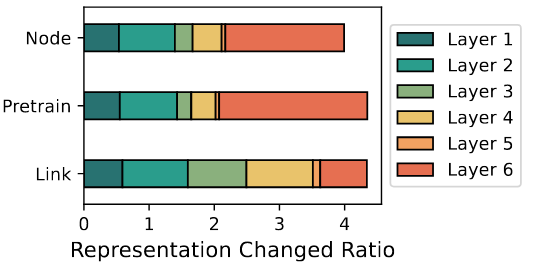

### Summarization：

Three key desirable properties of a GFM: self-supervised pretraining, fluidity in tasks, and graph awareness.

GOFA interleaves randomly initialized GNN layers into a frozen pre-trained LLM so that the semantic and structural modeling abilities are organically combined.

GOFA is pre-trained on newly proposed graph-level next-word prediction, question-answering, and structural tasks to obtain the above GFM properties.

### Title:

GOFA: A Generative One-For-All Model for Joint Graph Language Modeling

### Background:

With the emergence of Large Language Models (LLMs), the field of artificial intelligence is undergoing a profound transformation, shifting from specialized, fragmented models to universal foundation models.

However, despite preliminary efforts, a foundation model in the graph domain has yet to be proposed.

### Related Work:

While past researchers have proposed specialized models to learn graph data [ 57 , 29 ], the models require retraining to accommodate new graphs.

LLM as a predictor, such an approach falls short of understanding graph structures,

LLM as an enhancer, they can only handle specific tasks such as classification, and cannot generalize to a foundational level due to the lack of generation ability

### Innovation:

We first identify three desirable properties of a graph foundation model (GFM), namely large-scale self-supervised pretraining, fluidity in tasks, and graph understanding. 

#### Large-scale Self-Supervised Pretraining:

One fundamental design of LLM is that it unifies all NLP tasks into a single next-token-prediction paradigm, which enables self-supervised pretraining on large corpus collected from different sources.

#### Fluidity in Tasks:

They can continuously train the model on new data without special adaptation.

#### Graph Understanding:

It should not only have LLM's prompt learning capability but also learn graph structure and semantic information jointly.

### Introduction:

#### Generative Modeling for Graph:

Generative modeling for language is to predict the next token given its preceding tokens

To generalize next token prediction to graphs, we propose to specify Nodes Of Generation (NOG) on graphs as starting points for output generation.
$$
p(y|v,G)=\prod_{l=1}^Lp(y_l|y_{<l},v,G)
$$

#### GOFA : Generative One-For-All Model:

GOFA consists of a graph language encoder and an LLM decoder. The LLM compressor and decoders are all pre-trained decoder-only transformers. 

##### LLM compressor:

$$
\begin{aligned}
\{Q_{x}^{t+1},Q_{m,x}^{t+1}\}= & \{q^{t+1}(x_{1}),...,q^{t+1}(x_{l}),q^{t+1}(m_{1}),...,q^{t+1}(m_{K})\} \\
= & LLM^t(\{q^t(x_1),...,q^t(x_l),h^t(m_1),...,h^t(m_K)\})=LLM^t(\{Q_x^t,H_x^t\})
\end{aligned}
$$

The last K tokens attend to all previous tokens, they can compress all information in the sentence into the output embeddings of the K tokens.

##### Token-level GNN:

Conventional GNNs only pass messages between node vector representations, which is incompatible with the vector sequence output $$Q_{m,x}$$ from our LLM. Hence, we propose a simple extension of conventional GNNs to token level.
$$
H_{x(v)}^{t}[k]=GNN(Q_{m,x(v)}^{t}[k],\{(Q_{m,x(u)}^{t}[k],Q_{m,x(e_{uv})}^{t}[k])|u\in\mathcal{N}(v)\}),\quad k=1...K.
$$
While edge memory tokens are passed into GNN to assist message passing, their representations are not updated in the GNN layer but directly passed to the next LLM layer, and $$H_{x(e)}^{t}=Q_{m,x(e)}^{t}$$

##### LLM decoder:

The memory tokens $$Q_{m,x}$$ of every node contain information about the text on the node, the surrounding node text, and the graph structure due to the message-passing process in the GNN layer.
$$
\mathcal{L}=\max_{Q_{m,x(v)}}P(y_{1}...y_{l}|Q_{m,x(v)};\Theta_{\mathrm{DEC}})=\max_{\Theta_{(\mathrm{GNN,DEC,COMP})}}P(y_{1}...y_{l}|v;G;\Theta_{\mathrm{DEC}},\Theta_{\mathrm{COMP}},\Theta_{\mathrm{GNN}})
$$
The compressor, decoder, and GNN parameters can be jointly or separately optimized, potentially with parameter-efficient fine-tuning methods like LoRA.

#### Unified Task Representation in GOFA:

we convert all tasks into subgraph tasks and connect all target nodes in a graph to a virtual prompt node as the NOG for generation.

For node- and link-level tasks, we sample a k-hop rooted subgraph surrounding the target node or node pairs for node- or link-level tasks and connect the prompt NOG node to target nodes. For graph-level tasks, the prompt NOG node will connect to all nodes in the graph.

###### Advantage:

1. We can specify the prompt node as the NOG input to the LLM decoder for generative modeling. Therefore, the distribution of all tasks can be unified into a single space.

2. The text feature for the prompt node describes the task details.

#### Large-Scale Pre-training:

The goal of the pre-training is to let the GOFA model obtain the ability to query graph structure and context but retain the ability to reason about plain text.

##### Sentence completion task:

The objective of the sentence completion task is to train the model to reason about the rest of the text in a node given both the existing text and the information in the rest of the graph.

##### Structural tasks:

The objective of the structural tasks is to pre-train GOFA to understand basic graph structural properties.

##### Question answering task:

Unlike language corpus, which naturally contains many question-and answer (QA) pairs, graph data usually only contain objective descriptions of entities. We synthesize a QA-chain dataset from Ultrachat200k. This QA task provides QA pseudo-graphs missing from the common graph corpus, and we found it critical for allowing the model to be responsive to arbitrary tasks expressed in free-form questions.

### Experiment:

1. Can GOFA use graph information to better model TAG and help complete the target sentence?
2. Does the pre-trained GOFA help with zero-shot learning?
3. Which portion of GOFA gives it unique TAG modeling and in-context learning ability?
4. Can we transfer the prior knowledge in the pre-trained GOFA to downstream fine-tuning tasks?

#### GOFA pre-training:

SPD: shortest path distance

CN: common neighbor

GOFA training loss:

#### Zero-shot learning with GOFA:

The goal of instruction fine-tuning is not to let the model learn particular knowledge from these datasets but to make the model understand the task format.

We notice that SceneGraph contains object coordinate description which makes it easy for LLM to answer tasks about relative location. Whereas, our compressed representation might still discard relevant number information compared to directly prompting this information to LLM. Hence, the advantages of GOFA are not as apparent on tasks where text-only information is sufficient.

#### Investigation of GOFA architecture:

we observe one unique feature of GOFA is that its GNN layers are embedded into the LLM.

a larger value means a higher dependence on graph information.

The pre-trained and arxiv versions have similar importance for each layer as they are all academic datasets and node-level tasks usually obtain enough information for neighbors within 2-hops. The link-finetuned version has larger third and fourth-layer importance, showing that the link task usually requires the model to consider a larger neighborhood to understand the graph structure.

### Limitation:

	1. Extensive training time required due to the use of abundant graph data.
	1. Interleaving GNN layers with LLM layers increases the embedding dimensions for nodes and edges, which consequently extends the inference time beyond that of a typical LLM.
	1. We employ a frozen LLM compressor in our architecture; hence, the compression capability is not dynamically integrated with the graph data, potentially impacting the efficiency and adaptability of the model.
