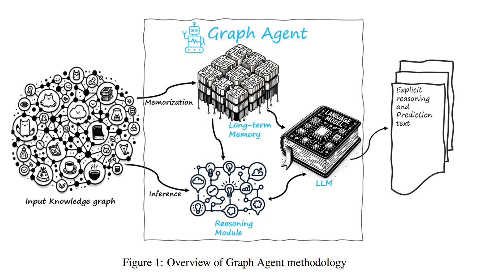
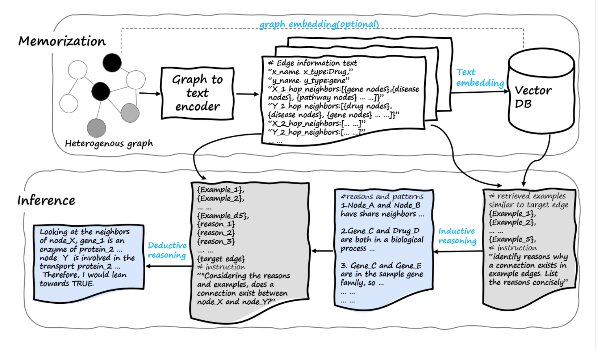
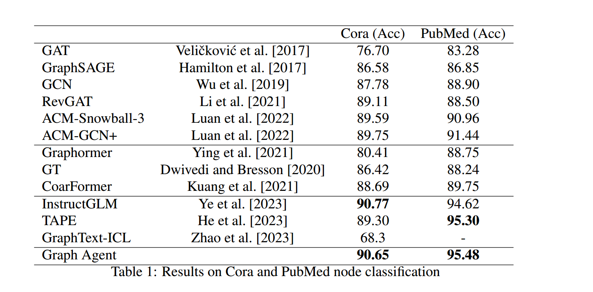
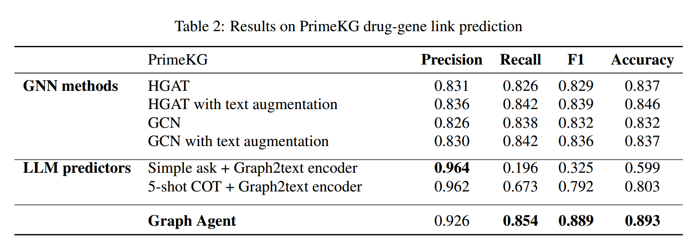
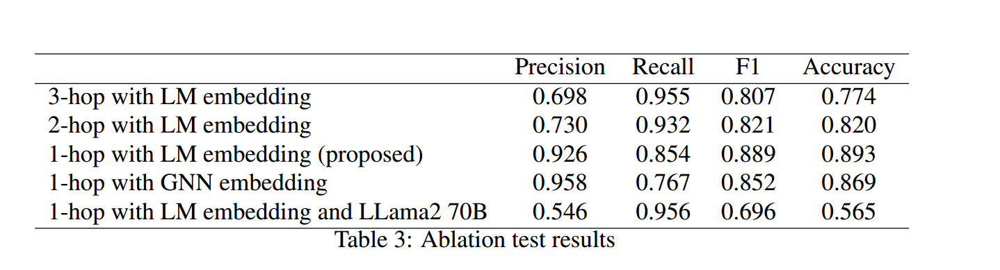

#### Title:

GRAPH AGENT: EXPLICIT REASONING AGENT FOR GRAPHS.

#### Background(Related Work):

Both node features and the GNN kernels are numeric vectors, which are hard to interpret and understand by humans. This disadvantage poses a significant concern, especially in scientific discovery using graph data.

There are symbolic reasoning frameworks available, The intricate nature of heterogeneous graph data often proves too complex to be encapsulated solely by a simple logical system, these explicit logical reasoning methods often under-perform when benchmarked on various data sets.

Researchers have employed LLMs as controllers or agents across a spectrum of tasks.

LLM as an Augmentor: LLMs are pivotal in augmenting graph data. They are adept at generating text contextually related to the graph nodes.

LLM as a Predictor: Deploying LLMs as predictors has also been a significant stride forward.

#### Innovation:

Existing implicit graph reasoning methods lack explainability. To address this issue, we proposed the Graph Agent methodology with long-term memory and an inductive-deductive reasoning module.

#### Introduction:

##### Graph to text encoder and node sampling:

Our study leveraged an encoding strategy optimized for computational efficiency.

For a given node: encoder(v, A, N) = ["node:", v, "attributes:"A, "n-hop-neighbours: "[$$f_{sample}(N_h$$)]]

For graph edges: encoder((x, y),($$A_x,A_y), N_x, N_y$$) = [“edge: ”,(x, y);

​											    “attributes: ”,($$A_x, A_y)$$;
​											    y-“n-hop-neighbours: ”[$$f_{sample}(N_{y_h})]$$​,

​											    x-“n-hop-neighbours: ”[$$f_{sample}(N_{x_h})]]$$

A risk of overloading information beyond the working memory of LLMs, or exceeding the maximum context length of
LLMs.

We computed the average degree $$D_{avg}$$ for each category of nodes, a node’s importance was quantified as the ratio of its degree to $$D_{avg}$$ pertinent to its category. The function select_top_k is an operation selecting the k nodes with the highest node importance.
$$
f_{sample}(N) = select\_top\_k(\{degree(n)/D_{avg, type(n)}: n ∈ N\}, k)
$$

##### Long-term memory:

Graph Agent embedded all training samples and stored them in a vector database. During inference on test samples, we retrieved similar samples from the long-term memory.

For edge embedding, we simply contacted the embedding of two nodes. We used the Cosine similarity of embedding to retrieve similar node or edge examples.

##### Inductive reasoning:

GA initiated a retrieval of analogous examples from its long-term memory for a target sample. The aggregation of these examples formed a structured prompt augmented with task instructions. LMM sought patterns or commonalities within
the examples.

##### Deductive reasoning:

For node classification, the LLM was queried with a crafted question. Similarly, for link prediction, the LLM was instructed. The LLM would respond with explicit reasoning in natural language and a definitive prediction.

#### Experiments:

#####  Node Classification:

1. Datasets: We implemented a 60%/20%/20% partitioning for train/validation/test sets
2. Baselines: Our performance assessment of GA involved juxtapositions with preceding GNN models, transformer models, and those LLM-related methods.
3. Implementation Details: We employed the gpt-4-0613 model as the LLM backend, and used embedding-ada-002 model for graph text embedding.
4. Results: GA outperformed GNN and transformer models, achieving state-of-the-art results on the Cora
   and PubMed datasets.

##### Link Prediction:

1. Dataset: We adopted the Precision Medicine Oriented Knowledge Graph(PrimeKG) dataset,recognizing it as one of the latest and most complex biomedical graphs available. The data set was partitioned into 80%, 10%, and 10% segments for training, validation, and testing.
2. Baselines: We benchmarked GA’s performance against established GNNs and prompt-engineering methods.
3. Evaluation Metrics: Our evaluation adopted precision, recall, the F1 score, and the accuracy of the positive edges.
4. Implementation Details: We only leveraged edge examples that had different nodes with targeted edges. In our approach, we extracted three analogous positive edge instances from long-term memory and arbitrarily selected two negative edges for inclusion in the prompt. We also explored alternative methodologies for comparison: the Simple Ask approach and the 5-shot Chain-of-Thought (COT) technique.
5. Results: 
6. Ablation Results:
7. Qualitative analyses: Even if the thinking processing was wrong, the prediction was correct.

#### limitations:

Our analysis of many graph reasoning outcomes produced by the LLM, indeed affirms a commendable quality of reasoning. Future studies could investigate the reliability of LLM reasoning.

Our current Graph Agent methodology encounters limitations regarding information coverage and flow.GA is constrained by its reliance on sampled local graphs and naive sampling methods for information flow control. Our current Graph Agent only exhibits capacities for shallow reasoning on knowledge graphs, thereby accessing the surface layers of graph information.
