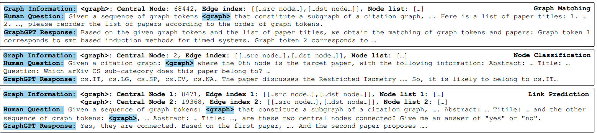
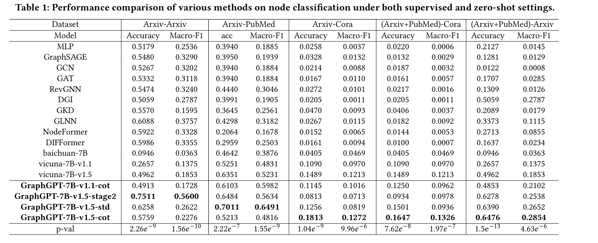
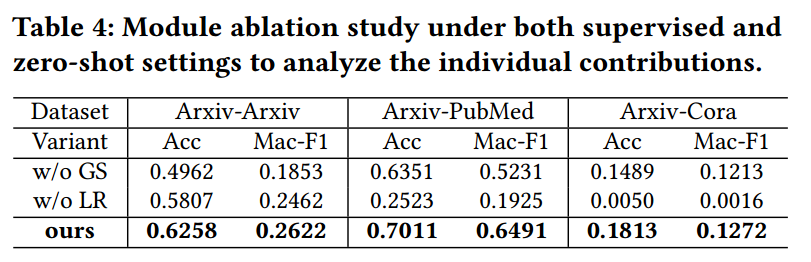
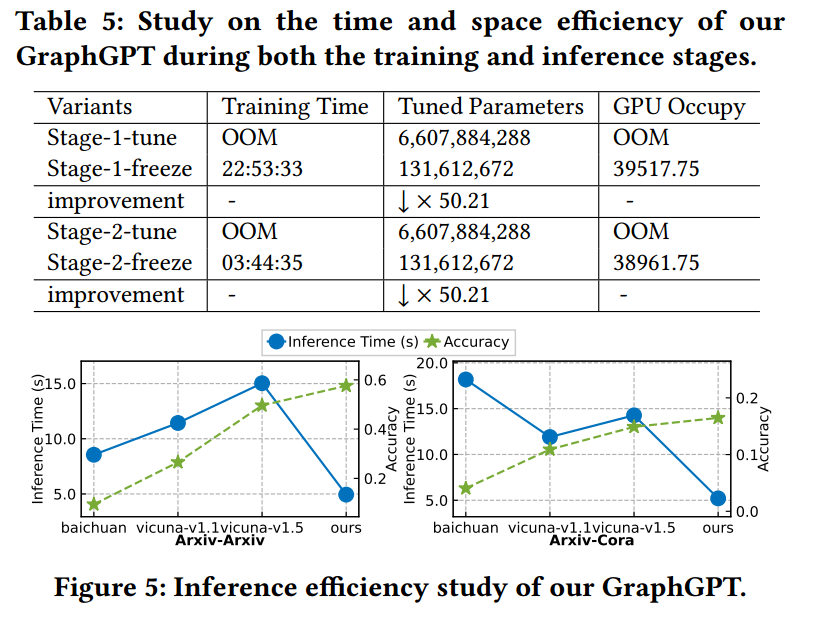

#### Title:

GraphGPT: Graph Instruction Tuning for Large Language Models. (SIGIR 2024 5)

#### Background:

Graph Neural Networks (GNNs) have evolved to understand graph structures through recursive exchanges and aggregations among nodes. To enhance robustness, self-supervised learning (SSL) has become a vital tool for data augmentation. Traditional methods often depend on fine-tuning with task-specific labels, limiting their effectiveness when labeled data is scarce. Inspired by the success of large language models (LLMs), we aim to create a graph-oriented LLM capable of exceptional generalization across various datasets and tasks without relying on downstream graph data.

#### Innovation:

We introduce the GraphGPT framework, which integrates LLMs with graph structural knowledge through graph instruction tuning. This framework includes a text-graph grounding component to link textual and graph structures and a dual-stage instruction tuning approach with a lightweight graph-text alignment projector.

#### Introduction:

##### GNN:

$$
m_v^{(l)}=Propagate^{(l)}(\{h^{(l-1)}_u:u\in N(v)\})\\
h^{(l)}_v=Aggregate^{(l)}(h^{(l-1)}_v,m_v^{(l)})
$$

In Graph Neural Networks, the feature vector of node 𝑣 at layer 𝑙 is denoted as $$ℎ^{(𝑙)}_𝑣$$ . Message passing is performed by the $$Propagate^{(𝑙)}$$ function, aggregating information from neighboring nodes of 𝑣 in layer 𝑙. The $$Aggregate^{(𝑙)}$$ function combines this information with the previous layer’s representation of node 𝑣 to update $$h^{(l)}_v$$.

#####  Structural Information Encoding with Text-Graph Grounding:

We introduce a text-graph grounding paradigm preserving the graph's structural context for language models and connecting the semantic the semantic understanding of textual information with the inherent structural relationships in the graph.

In our GraphGPT, we design the graph encoder to be highly flexible, allowing it to leverage a wide range of backbone GNN architectures obtained from diverse graph pre-training paradigms. We incorporate a message-passing neural network architecture  as the structure-level pre-trained graph model:
$$
H^{(l)}= 𝜎(\hat{A}H^{(𝑙−1)}W)
$$
The self-loop adjacency matrix, denoted as $$\hat{A}$$, is obtained by adding the identity matrix I to the original adjacency matrix A. W is the parameter matrix. This matrix captures the self-connections and local connectivity of nodes in the graph. 𝜎(·) is the non-linear activation. $$H^{(l)}$$ is the graph representations at the $$𝑙-th$$ layer

Given a graph $$\mathcal G (\mathcal V, \mathcal E, A, X)$$ with raw textual contents $$C = 𝑐_i \in R^{𝑙_𝑖 ×𝑑}$$, 1 ≤ 𝑖 ≤ 𝑁 for 𝑁 nodes, we obtain encoded graph representations $$\hat H \in R^{R×D}$$ and encoded text representations $$\hat T \in R^{𝑁 ×𝑑}$$ as follows:
$$
H = 𝑓_G(X), T = 𝑓_T(C),\hat H = norm(H),\hat T = norm(T) 
$$
The text-structure alignment across modalities is conducted as follows:
$$
Γ_1 = (\hat H \hat T^⊤) · exp(𝜏), Γ2 = (\hat H \hat T'^⊤) · exp(𝜏), Γ3 = (\hat T^⊤\hat T'^⊤)·exp(𝜏)
\\\mathcal L =\sum_{𝑖=1}^3 \frac{1}{2}𝜆_𝑖(CE(Γ_𝑖, y) + CE(Γ^⊤_𝑖, y))
$$
where $$\hat T' = {1/|N𝑖|\sum _𝑗 \in N_𝑖 \hat T_𝑗, 1 ≤ 𝑖 ≤ 𝑁} $$and 𝑁 is the number of nodes.

##### Dual-Stage Graph Instruction Tuning:

1. Self-Supervised Instruction Tuning

   We introduce self-supervised instruction tuning  enhances the language model’s reasoning abilities by incorporating graph domain-specific structural knowledge and effectively understanding contextual information within the graph’s structure. The instruction for our graph matching task consists of three components: i) graph information, ii) human question, and iii) GraphGPT response. 

   To optimize the tuning process efficiently, we propose incorporating a Lightweight Alignment Projector. By replacing the indicator token <graph> in the original language token sequence, the aligned graph tokens create a modified token sequence for the LLM. This modified sequence, denoted as {<graph_begin>, <graph_token>1 , · · · , <graph_token>𝑛,<graph_end>}, corresponds to the number of nodes 𝑛 in the graph associated with the given prompt.
   $$
   𝑝(X_O |X_G, X_I) =\prod ^L_{𝑖=1}𝑝_𝜃(𝑥_𝑖|X_\mathcal G, X_I,_{<𝑖}, X_O,_{<𝑖})
   $$
   
2. Task-Specific Instruction Tuning

   We introduce task-specific instruction tuning to customize the model’s reasoning behavior for different graph learning tasks. We utilize a consistent instruction template comprising three parts. To generate graph information for each node, we employ the same neighbor sampling approach as in the first stage. This instruction guides the language model to predict the category of the central node based on both the graph structure data and the accompanying text information. 
   
   
   
   We utilize the parameters of the structure-aware projector that were trained in the first stage as the initial state,we keep the parameters of the language model (LLM) and graph encoder fixed, focusing solely on optimizing the parameters of the projector from the previous stage. By doing so, we ensure that the LLM further aligns with the requirements of downstream tasks, enhancing its ability to comprehend and interpret graph structures. GraphGPT has acquired the capability to comprehend the given graph structure and perform downstream tasks on the provided graph.

##### Chain-of-Thought (CoT) Distillation:

Language models may encounter unfamiliar patterns and structures,we propose incorporating the Chain-of-Thought (COT) technique , which explicitly models the flow of thoughts and reasoning steps,  our language model improves the coherence and consistency of generated text.

#### Experiments:

#### Limitation:

