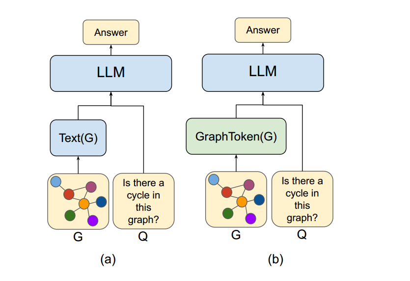
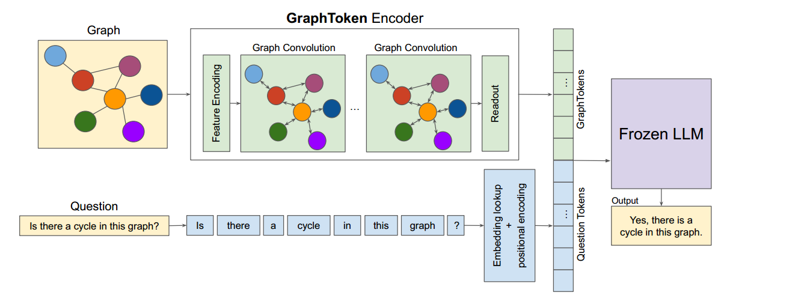
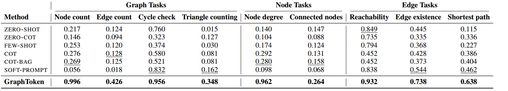
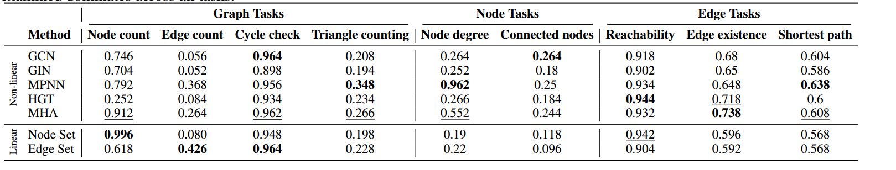
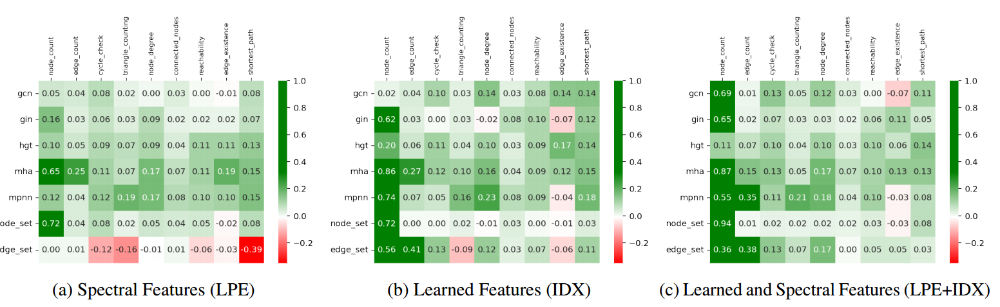
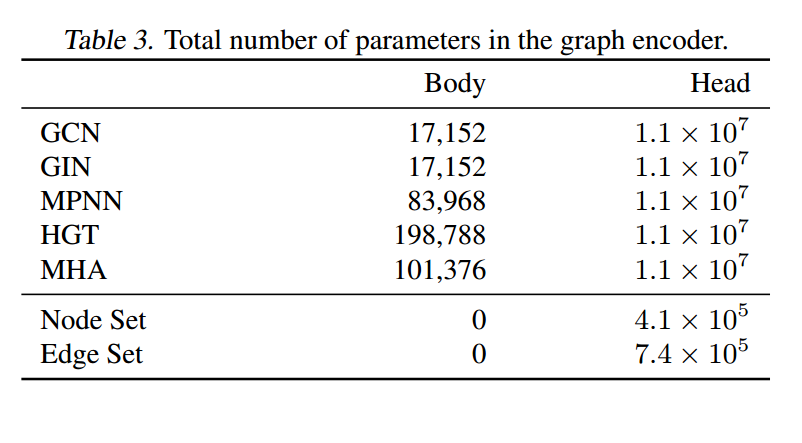

#### Title:

Let Your Graph Do the Talking: Encoding Structured Data for LLMs

#### Background:

The predominant mode of encoding structured data for LLMs is to use various types of hand-crafted, text-based serialization. This approach can impose significant decoding complexity for the language model. LLMs are not able to utilize structure efficiently when posed with common reasoning tasks that are easily answered by classical graph algorithms.

The goal of parameter-efficient fine-tuning (PEFT) is to adapt models to new tasks by updating only a small number of (possibly new) parameters.（Adapter-based approaches, LoRA and its variants, Partial fine-tuning and partial masking approaches, soft-prompt approaches)

#### Innovation:

Inspired by recent advancements in parameter-efficient finetuning , our method, GraphToken, learns an encoding function that generates fine-tuned soft-token prompts. The soft-token prompt extends a textual prompt with explicit GraphToken encoded
structural information, allowing us to train only a trivial number of GraphToken parameters when compared to the total LLM parameter budget.

Our work is the first to develop parameter-efficient encoders specifically for general reasoning tasks on structured data.

#### Introduction:

When considering how to pass structured data to an LLM there are largely two families of options:

1. Encoding it as lexical tokens for LLM embedding.
2.  Encoding it directly to a continuous representation via a neural network – skipping any LLM token embedding.

Our method eschews representing a graph in text in favor of directly producing – using a GNN as an encoder –the continuous representations for the LLM input. We refer to these new graph encoder learned soft-tokens in the LLM embedding space as “graph tokens.” We learn only those parameters of the graph encoder during the training process.

##### Graph Encoder:

1. graph-level : we do global pooling for readout, taking the mean or sum of the representations over all of the nodes.
2. node-level ：we separately output the representation of each node. This can be optionally concatenated with a graph-level pooling.
3. edge-level : we use a global representation or the two node-level representations concatenated.

##### Training procedure:

Our training procedure is very similar to that used by soft prompting methods. The training input consists of triples (G, T, A).In the forward pass, we compute the augmented query Q = E(G)||T (T), concatenating the GraphToken encoding of the graph E(G) with the initial embedding of the task textual representation, T (T). We train by optimizing the final LLM perplexity (total loglikelihood), L(A | Q), of the expected answer A with respect to the augmented query, Q.

#### Experiments:

##### Datasets:

We conduct our experiments on the graph reasoning tasks proposed in GraphQA.

1. Graph-level: node count, edge count, cycle check, triangle counting 
2. Node-level: node degree, connected nodes
3. Edge-level: reachability, edge existence, shortest path

#### Limitation:
