#### Title：

​	GraphTranslator: Aligning Graph Model to Large Language Model for Open-ended Tasks. (WWW 2024 5)

#### Background：

​	LLMs exhibit powerful zero-shot and instruction-following capabilities,while the idea is less explored in the graph domain. Although several methods applying LLMs to graphs have been proposed, they fail to simultaneously handle the pre-defined and open-ended tasks,with LLM as a node feature enhancer or as a standalone predictor.

#### Innovation：

1. To break this dilemma, we propose to bridge the pretrained graph model（GM） and LLM by a Translator, named GraphTranslator, aiming to leverage GM to handle the pre-defined tasks effectively and utilize the extended interface of LLMs to offer various open-ended tasks for GM.
2. To train such Translator, we propose a Producer capable of constructing the graph-text alignment data along node information, neighbor information and model information.

#### Contributions：

1. We propose a novel model GraphTranslator that aligns graph model to large language model, providing a unified perspective for both pre-defined and open-ended tasks.
2. GraphTranslator introduces a Translator module to bridge the modality gap, by converting node embeddings learned by GM to a set of tokens. For further training, a Producer module is designed to generate the alignment data, through seamlessly textualizing the information encoded in node embeddings.
3. The experimental results on real-world datasets demonstrate the effectiveness of GraphTranslator on zero-shot node classification. The graph question answering experiments reveal the noteworthy potential of GraphTranslator when applied to tasks predicated upon language instructions.

#### Introduction：

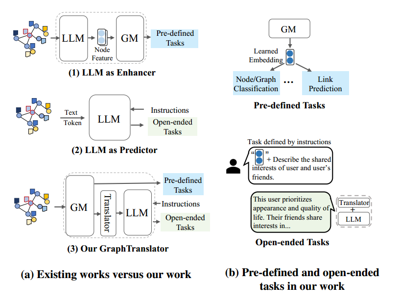

1.  The Translator module learns a set of graph queries to extract the language information of node embeddings, then performs generative learning for adapting to LLM.
2. Introduce a Producer that capable of constructing (node embedding, textual description) pairs through the powerful generation ability of LLMs.

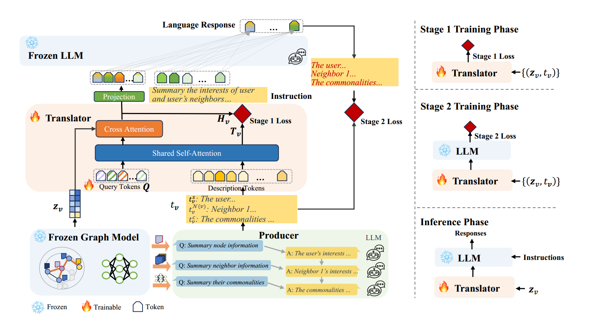

##### GraphTranslator consists of four components:

1. Frozen Graph Model ：Learn node representations for text-attributed graphs to handle pre-defined tasks. 

   Taking the GraphSAGE as an example, typically, GraphSAGE samples a fixed-size neighbors N (𝑣) around target node 𝑣, then concatenates the node’s previous layer embedding $𝒉^{𝑘−1}_𝑣$ with the aggregated neighborhood vectors $\{𝒉^{𝑘−1}_𝑢, ∀𝑢 ∈ N (𝑣)\}$ by:

   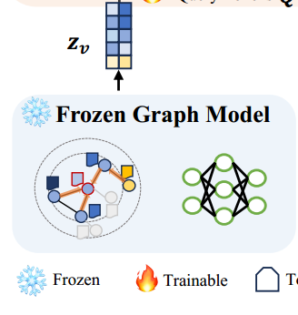

$$
𝒉^𝑘_𝑣 = 𝜎(𝑾𝑘·CONCAT(𝒉^{𝑘−1}_𝑣 ∪AGGREGATE_𝑘\{𝒉^{k-1}_𝑢,∀𝑢∈N(𝑣)\})
$$

​		The pre-trained GM $𝑔_{𝜽^*}$ encodes the local graph information of 𝑣 and yields node embedding $𝒛_𝑣 = 𝑔_{𝜽^∗} (𝑨,𝑿)_v$.

​		Where 𝜽 is set of learnable parameters, 𝑿 is the node features processed by shallow methods such as bag-of-words.

2. Frozen LLM ：Serve as an interface of graph model for open-ended tasks, responding to human instruction.

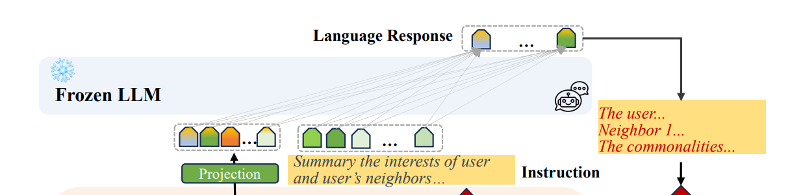

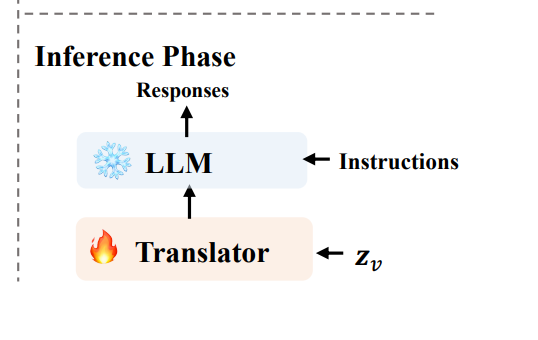

3. Producer Module ：Construct(node representation,descriptive text) pairs data for alignment.

   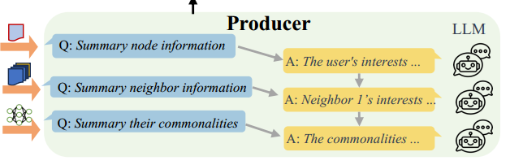

   Construct the alignment data: $𝑃 = \{(𝒛_𝑣, 𝑡_𝑣 )\}^{𝑁_𝑃}_{𝑖=1}$

   Node Description: node information within representations includes node feature, neighbor information, and their commonalities  $𝑡_𝑣 = \{𝑡^𝑠_𝑣, 𝑡^{N (𝑣)}_𝑣, 𝑡^𝑐_𝑣\}$​

   Using “Chain of Thought" (CoT) to guide GPT to progressively generate high-quality description.

4. Translator Module ：Convert node representations into tokens, enabling LLM comprehension.

   In our Translator module, for a pair (𝒛𝑣, 𝑡𝑣 ) in alignment data, we utilize two encoders, denoted as 𝑓𝑧 (·) and 𝑓𝑡 (·), to extract their language features for alignment.

   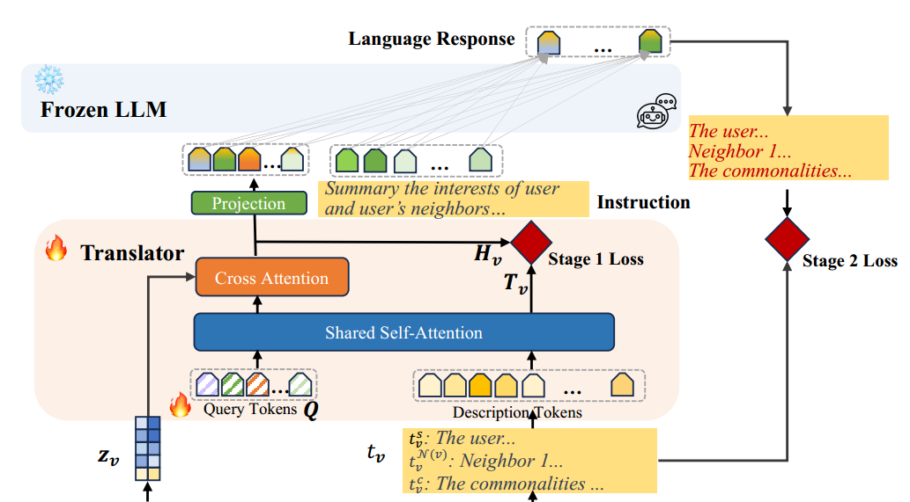

    language features $$𝑻_𝑣 = 𝑓_𝑡 (𝑡_𝑣 )$$ output 𝑀 features $$𝑯_𝑣 = \{𝒉_𝑣,𝑖 \}^𝑀_{𝑖=1}$$and $$𝑯_𝑣 = 𝑓_𝑧 (𝑸, 𝒛_𝑣 )$$ , tokens $$Q=\{q_i\}^M_{i=1}$$ 

   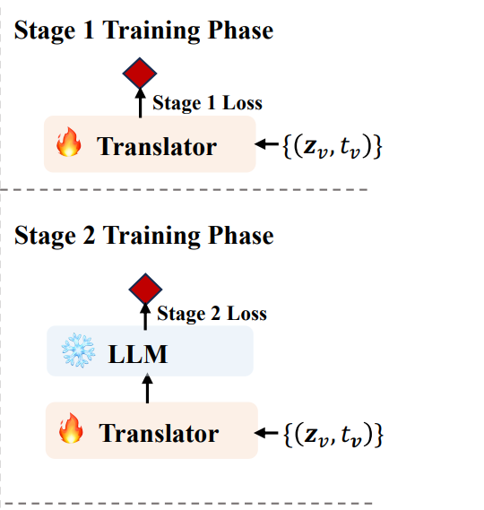

   Stage 1:Training the Translator for GM-text alignment.

   Replace the [CLS] token with [DEC] token for the generation task.

   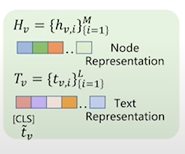

   stage 2:Training the Translator for GM-LLM alignment.

   We use a linear layer to project the output of Translator module, token embeddings $$𝑯_𝑣$$, into the same dimension with the word embedding of LLM. Connect the projected representation with the human instruction and feed into LLM.

   Fine-tune Translator by aligning the response text of LLM with the actual descriptive text.

#### Experiments：

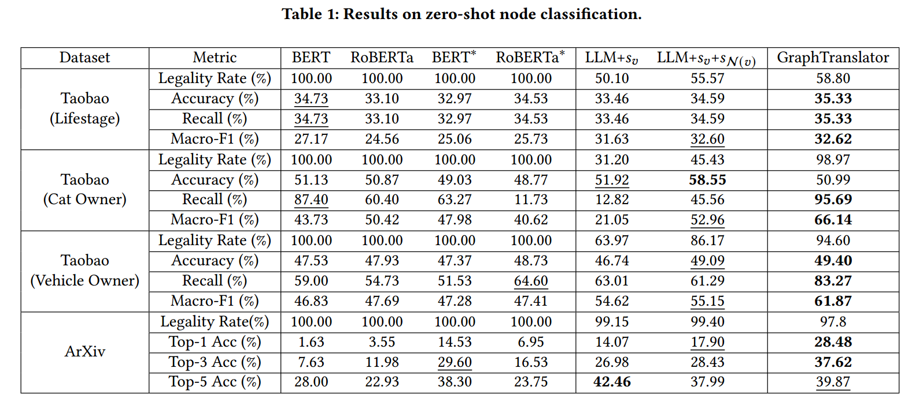

Our GraphTranslator model performs better than Vanilla LLM, including LLM+$$𝑠_𝑣$$ and LLM+$$𝑠_𝑣$$+$$𝑠_{N (𝑣)}$$​ , since LLM directly processes the raw text that contains both node and neighbor attribute, bringing noises and excessive complexity.

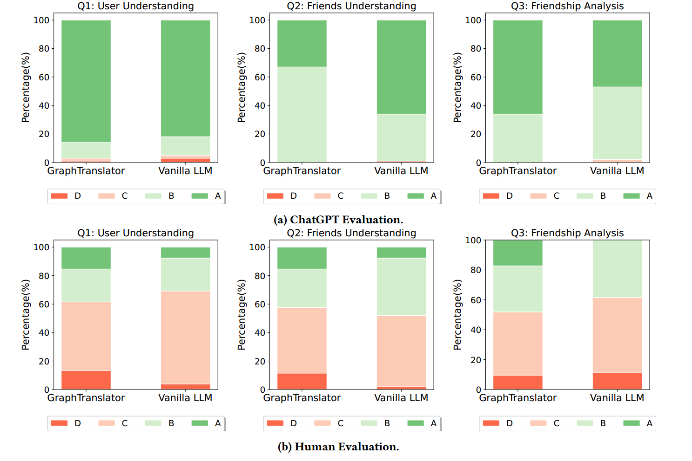

• Rating-A: The answer is correct and concise, the information is correct, and the reasoning is accurate.
• Rating-B: The answer is reasonable, with minor errors or imperfections.
• Rating-C: The answer is relevant to the question, but has obvious errors or inaccuracies in the content.
• Rating-D: The response is irrelevant or completely invalid.

#### Limitations：

​	In the experiment, we only have labels for quantitative analysis in our zero-shot node classification, and for the GQA task, we merely showcase our GraphTranslator performance through specific cases.
