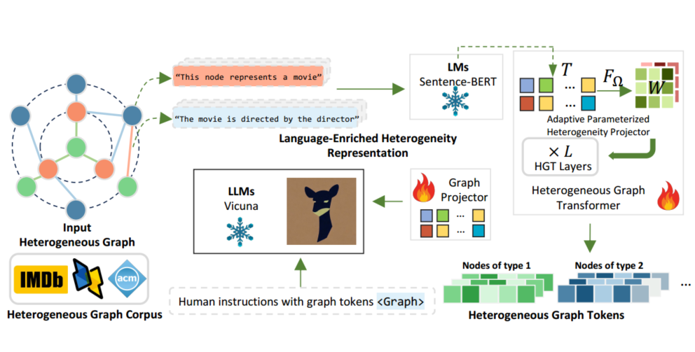
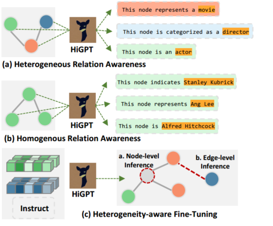
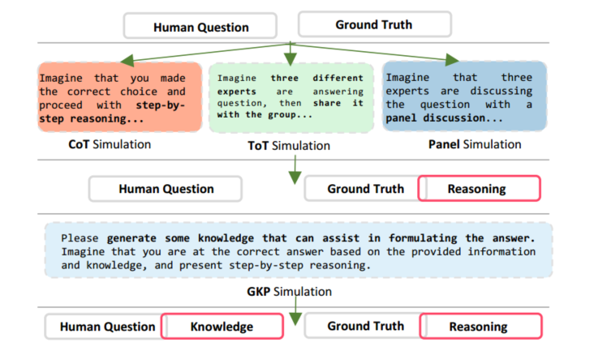
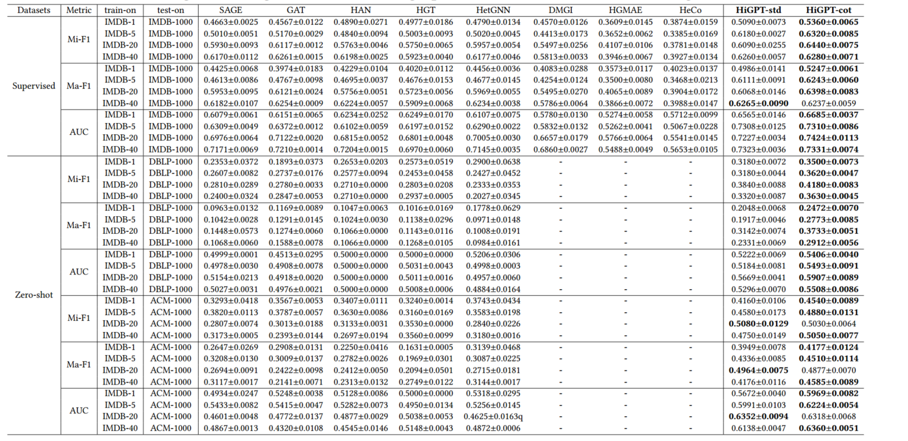
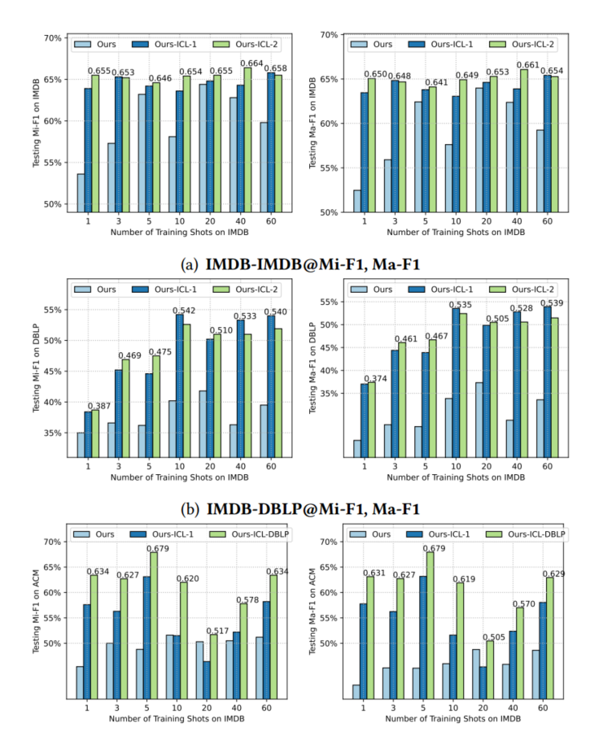

#### Title:

HiGPT: Heterogeneous Graph Language Model(KDD 2024)

#### Background:

Existing frameworks for heterogeneous graph learning have limitations in generalizing across diverse heterogeneous graph datasets. Most of these frameworks follow the "pre-train" and "fine-tune" paradigm on the same dataset, which restricts their capacity to adapt to new and unseen data. This approach presents challenges in adapting and achieving optimal performance on new and unseen data. The heavy reliance on the characteristics and patterns of the original training dataset hinders their ability to effectively handle the intricacies and complexities inherent in different heterogeneous graph datasets.

#### Introduction:

##### heterogeneous graph neural networks (HGNNs):

1. Metapath-based GNNs such as HAN
2. Transformer-enhanced GNNs like HGT

##### C1. Relation Type Heterogeneity Shift:

In an academic graph, the relations could involve "paper-paper", "author-paper", and "paper-venue".

##### Solution: In-Context Heterogeneous Graph Tokenizer:

This tokenizer captures the diverse semantic relationships found in different heterogeneous graphs, providing a unified approach. It comprises two essential components: the in-context parameterized heterogeneity projector, which utilizes language to encode distinct node and edge types, facilitating effective model adaptation, and the parameter allocator, which dynamically assigns tailored parameters to the tokenizer.

##### C2. Complex Heterogeneous Graph Structures:

The primary focus of this study is to tackle the challenge of integrating large language models (LLMs) into heterogeneous graph learning, with the goal of enhancing model generalization.

##### Solution: Heterogeneous Graph Instruction-Tuning:

We introduce a novel heterogeneous graph instruction-tuning framework that integrates inter-type and intra-type token matching tasks to fine-tune large language models (LLMs). Our aim is to bolster the LLMs’ capabilities in the following areas:

1. distinguishing between different types of graph tokens
2. comprehending intricate relationships within heterogeneous graphs
3. preserving the distinctive attributes of entities within homogeneous graphs
4. effectively harnessing diverse graph instructions during the training process

##### C3. Data Scarcity for Model Fine-Tuning:

In practical scenarios involving heterogeneous graph learning, one of the key challenges is the limited availability of data. 

##### Solution: Mixture-of-Thought Augmentation:

Our approach introduces a novel mechanism for augmenting graph instructions, emphasizing the use of Mixture-of-Thought (MoT) combined with various prompting techniques. This integration enables us to generate a diverse and comprehensive set of informative task-specific instructions. By seamlessly incorporating these augmented graph instructions into our framework, we anticipate that our model enhancement will effectively address the challenge of data sparsity.

#### PRELIMINARIES:

##### Heterogeneous Graph: 

$$\mathcal{G}(\mathcal{V},\mathcal{E},\mathrm{A},\mathcal{T},\mathcal{R},\mathrm{X})$$. It consists of nodes represented by $$\mathcal{V}$$, edges represented by $$\mathcal E$$, and an adjacency matrix $$\mathrm A$$ that captures the relationships between nodes. The sets $$\mathcal T$$ and $$\mathcal R$$ signify the types of nodes and edges, respectively. Additionally, the feature matrix $$\mathbf{X}=\{X_{T_{i}}\in\mathbb{R}^{|\mathcal{V}_{T_{i}}|\times d_{T_{i}}}\}$$ contains attributes associated with each node, $$𝑇_𝑖$$ refers to a specific node type, while $$𝑑_{𝑇_𝑖}$$ represents the dimensionality of the corresponding node attributes.

##### Meta Relation:

In a heterogeneous graph, a meta relation is a representation of the relationship between different types of nodes connected by an edge. The meta relation of 𝑒 = (𝑢, 𝑣) is denoted as < 𝜏 (𝑢), 𝜌 (𝑒), 𝜏 (𝑣) >.

##### Heterogeneous Graph Neural Networks (HGNNs):

$$
h_{v}^{(l)}=\underset{\forall u\in\mathcal{N}(v),\forall e\in\mathcal{E}(u,v)}{\textbf{Aggregate}}\left(\textbf{Propagate}\left(h_{u}^{(l-1)};h_{v}^{(l-1)},e\right)\right)
$$

#### In-Context Heterogeneous Graph Tokenizer:

It comprises two essential components: the in-context parameterized heterogeneity projector and the parameter allocator.

The adaptive in-context projector utilizes language to encode the distinct node and edge types within the heterogeneous graphs, facilitating model adaptation.

Meanwhile, the parameter allocator dynamically assigns parameters tailored specifically for the tokenizer. To optimize the tokenizer’s performance and seamlessly integrate it within the HiGPT framework, we conduct pre-training using a simplified text-graph contrastive learning framework. This pre-training process directly incorporates the tokenizer into the HiGPT framework and effectively integrates it with the Large Language Model (LLM).

##### Graph Tokenization with Meta Projector:

The goal of the heterogeneous graph tokenizer is to encode the hidden representations of the heterogeneous graph. The function H = HG-Tokenizer(X, A). The HG-Tokenizer(·) can be implemented using various backbone HGNN architectures, such as HetGNN , HAN, or HGT. In HGT,
$$
\widetilde{h}_v^{(l)}=\oplus_{\forall u\in\mathcal{N}(v)}(\textbf{Attention}(u,e,v)\cdot\textbf{Message}(u,e,v))
\\
\begin{aligned}
h_{v}^{(l)}& =\mathcal{F}_{\Theta_{1}}^{\tau(v)}\left(\sigma\left(\widetilde{h}_{v}^{(l)}\right)\right)+h_{v}^{(l-1)} \\
&=\mathbf{W}_{1}^{\tau(v)}\cdot\left(\sigma\left(\widetilde{h}_{v}^{(l)}\right)\right)+\mathbf{b}_{1}^{\tau(v)}+h_{v}^{(l-1)}
\end{aligned}
$$
The notation $$\mathcal{F}_{\Theta_{1}}^{\tau(v)}\left(\cdot\right)$$represents a fully-connected layer with parameters $$\Theta_{1}=\{\mathbf{W}^{\tau(v)},\mathbf{b}^{\tau(v)}\}$$.
$$
\begin{aligned}&\mathbf{Attention}\left(u,e,v\right)\\&=\mathrm{Softmax}_{\forall u\in\mathcal{N}(v)}\left(\prod_{i\in[1,h]}\mathcal{F}_{\Theta_{2}}^{\tau(u)}\left(h_{u}^{(l-1)}\right)\mathbf{W}_{1}^{\rho(e)}\mathcal{F}_{\Theta_{3}}^{\tau(v)}\left(h_{v}^{(l-1)}\right)\right)\end{aligned}
$$

$$
\mathbf{Message}\left(u,e,v\right)=\prod_{i\in[1,h]}\mathcal{F}_{\Theta_{4}}^{\tau(u)}\left(h_{u}^{(l-1)}\right)\mathbf{W}_{2}^{\rho(e)}
$$

##### Adaptive Parameterized Heterogeneity Projector:

This projector dynamically and automatically encodes the relation heterogeneity into latent representations.
$$
\Theta_{i}=\{\mathbf{W}_{i}^{\tau(v)}; \mathbf{b}_{i}^{\tau(v)}\}=\mathcal{F}_{\Omega}\left(\mathbf{T}^{\tau(v)}\right);\quad\mathbf{W}_{i}^{\rho(e)}\quad=\mathcal{F}_{\Omega}\left(\mathbf{T}^{\rho(e)}\right)
$$

##### Language-Enriched Heterogeneity Representation:

We leverage natural language as a means to generate universal heterogeneity representations for nodes and edges based on their respective types. 

We can describe a "movie" node as "This node represents a movie" using natural language. Similarly, the edge ("movie", "to", "director") can be expressed as "The movie is directed by the director".
$$
\mathbf{T}^{\tau(v)}=\text{Mean-Pooling}\left(\text{Sentence-BERT}\left(\mathbf{S}^{\tau(v)}\right)\right)\\\mathbf{T}^{\rho(e)}=\text{Mean-Pooling}\left(\text{Sentence-BERT}\left(\mathbf{S}^{\rho(e)}\right)\right)
$$
$$S^{("movie","to","director")}$$ = { 

"The movie is directed by the director",

 "The film features direction by the director", · · · }

##### Lightweight Text-Graph Contrastive Alignment:

We employ a text-graph contrastive alignment paradigm for pre-training the proposed heterogeneous graph tokenizer. This approach aims to align the modeling capabilities of language and heterogeneous structures, enabling better collaboration between the tokenizer and the language models. In our approach, we adopt a lightweight text-graph contrastive alignment paradigm formally presented as follows:
$$
\hat{\mathbf{H}}=norm\left(\mathrm{HG-Tokenizer~(X)}\right),\hat{\mathrm{T}}=norm\left(\mathrm{LM-Tokenizer~(C)}\right)
\\
{\mathcal L}=\frac12\left(\mathrm{CE}(\Lambda,\mathbf{y})+\mathrm{CE}(\Lambda^{\top},\mathbf{y})\right),\Lambda=(\hat{\mathbf{H}}\hat{\mathbf{T}}^{\top})\cdot\exp(\tau)
$$

#### Heterogeneous Graph Instruction Tuning:

The natural language instruction is first encoded by a tokenizer into text embeddings
$$
\mathbf{X}_{I}=\mathrm{LM-tokenizer}(\mathrm{instruction})
$$

$$
p(\mathbf{X}_{O}|\mathbf{X}_{\mathcal{G}},\mathbf{X}_{\mathcal{I}})=\prod_{i=1}^{L}p_{\Phi}(x_{i}|\mathbf{X}_{\mathcal{G}},\mathbf{X}_{I,<i},\mathbf{X}_{O,<i})
$$

##### Heterogeneous Relation Awareness:

This is achieved by leveraging the information encoded in the graph tokens.

##### Homogeneous Relation Awareness:

##### Heterogeneous Graph Instruction:

1. To achieve heterogeneous relation awareness, we introduce the inter-type token matching task.
2. For homogeneous relation awareness, we design the intra-type matching task, where the LLM receives encoded sequences of graph tokens from a specific type, allowing it to establish correspondence with the relevant descriptions'.

##### Heterogeneity-aware Fine-Tuning:

In this stage, we incorporate a randomly sampled heterogeneous subgraph centered around the target node, along with a humangenerated question.

#### Mixture-of-Thought (MoT) for Graph Instruction Augmentation:

Utilizes prompt engineering techniques, particularly Mixture-of-Thought (MoT), to generate diverse and informative instructions. The goal is to effectively overcome the challenges posed by data scarcity.

##### Mixture-of-Thought (MoT) Prompting:

1. Chain-of-Thought (CoT): CoT prompts introduce intermediate steps, enabling complex reasoning and sophisticated capabilities.
2. Tree-of-Thought (ToT): ToT maintains a tree structure of coherent language sequences called thoughts.
3. PanelGPT: PanelGPT incorporates panel discussions among language models, enhancing the prompt engineering process through collaboration.
4. Generated Knowledge Prompting (GKP) : GKP involves incorporating additional knowledge into prompts for enhancement.

##### Instruction Augmentation with Priori Knowledge:

Incorporating prior knowledge, specifically the correct answer, into the prompt. It enables LLM to simulate generating the correct answer and produce intermediate reasoning steps using different MoT methods.

#### EVALUATION:

RQ1: How does the performance of our HiGPT compare to that of baseline methods in both few-shot and zero-shot scenarios?

RQ2: To what extent do the key components of HiGPT contribute to its overall performance across various settings?

RQ3: Can the HiGPT’s universal heterogeneity knowledge be leveraged to achieve graph in-context learning solely through graph instruction examples, without any model optimization?

##### Experimental Settings:

Experimental Datasets: IMDB, DBLP, and ACM.

Evaluation Protocols: Our evaluation metrics encompass Micro-F1, Macro-F1, and AUC.

Compared Baseline Methods: 

1. The first category consists of representative homogeneous graph neural networks, including SAGE and GAT.
2. The second category includes approaches utilizing message-passing mechanisms in heterogeneous graph neural networks. This category features models such as HAN, HGT, and HetGNN.
3. The third category focuses on self-supervised techniques for heterogeneous graph learning. This category incorporates generative strategies like HGMAE, as well as contrastive schemes such as DMGI and HeCo.

Implementation Details: In Appendix Sec A.5.1

##### Overall Performance Comparison (RQ1):

1. Superiority of HiGPT in Few-Shot Settings: HiGPT outperforms state-of-the-art baselines consistently in supervised settings. Our proposed MoT graph instruction augmentation method enhances the LLM with diverse mixed reasoning capabilities without the need for additional supervision signals
2. Zero-shot Superiority of HiGPT: In zero-shot settings, our HiGPT surpasses baselines with significant improvements, our approach leverages an in-context heterogeneous graph tokenizer. This tokenizer adapts tokenization based on the input graph, allowing the LLM to seamlessly combine graph tokens that capture higher-order structural features with its semantic understanding.
3. Effectiveness of Mixture-of-Thought Augmentation: Through the implementation of the MoT approach, our model harnesses the varied reasoning capabilities of the formidable LLM (specifically, GPT-3.5) and seamlessly integrates them into our more compact language model.

##### Model Ablation Test (RQ2):

1. Effect of Heterogeneous Graph Instruction-Tuning: We generated the "w/o S1" variant by directly tuning the instructions solely on the downstream task data.
2. Effect of In-Context Heterogeneous Graph Tokenizer: This improvement is attributed to the introduction of graph tokens, which enable the LLM to extract high-dimensional heterogeneous structural information from the in-context graph tokenizer.
3. Effect of MoT Instruction Augmentation: Results showed a significant drop in model performance without instruction augmentation, highlighting its importance in tackling the scarcity of labels in downstream tasks. Additionally, HiGPT’s superior performance in zero-shot settings can be attributed to its enhanced reasoning ability, acquired through training with diverse reasoning instructions.

##### Graph In-Context Learning (RQ3):

###### 1-shot Beat 60-shot with Graph ICL in HiGPT:

Results show that, even with just a single example, most 1-shot models using Graph ICL consistently outperform 60-shot models without further training in both supervised and zero-shot settings

By providing question-and-answer examples with graph tokens, the model gains a deeper understanding of the graph-text relationship. Analyzing and emulating these examples leads to more accurate responses

###### Enhanced Transferability with our Graph ICL:

The advantages of our Graph ICL in HiGPT are particularly evident in zero-shot transfer scenarios. Our HiGPT does not simply overfit to a single dataset but develops the ability to analyze text alongside heterogeneous graph tokens. By incorporating graph examples from other datasets, the model effortlessly transfers this analytical capability, demonstrating strong transfer learning capacity.

###### Benefit of Irrelevant Graph Examples:

