#### Title:

InstructGraph: Boosting Large Language Models via Graph-centric Instruction Tuning and Preference Alignment

#### Background:

Currently, large language models (LLMs) have succeeded in reasoning on textual data. However, there also exists rich information in graph data, that is difficult to represent using plain text. To endow LLMs with the ability to solve graph tasks, a series of works focus on designing the interface (prompt engineering) of LLMs on graph data to make them understand the semantics without parameter optimization , or injecting the graph embeddings into the partial parameters of LLMs through graph neural networks (GNNs). Two challenges:

1) There still exists a semantic gap between graph and text, which may impede the LLM in graph reasoning and generation.
2) LLMs tend to generate hallucinations which may be caused by fabricated erroneous inputs or lack of pertinent knowledge.

A straightforward approach to solve the first challenge is to use a graph description or graph embeddings.(cause information loss)

#### Innovation:

 Inspired by them, we can unify graph data into a code-like universal format to enhance the LLM’s understanding and generation performance on graph tasks. We introduce a structured format verbalizing strategy to transform the graph into a simple code-like format.

#### Instruction:

##### Notation:

Suppose that there are M graph tasks $$D ={D_1, · · · D_M}$$, and the corresponding dataset of each task can be denoted as $$D_j ={(\mathcal I_i, \mathcal G_i,\mathcal P_i,\mathcal A_i)}^{N_j}_{i=1}$$, where $$N_j$$ denotes the number of examples of $$\mathcal D_j$$ , $$\mathcal I_i$$ is the corresponding instruction, $$\mathcal G_i = (\mathcal E_i,\mathcal R_i,\mathcal T_i,\mathcal S_i)$$ is the graph with one node (entity) set $$\mathcal E_i$$, one optional relation set $$\mathcal R_i$$, one edge (triple) set $$\mathcal Ti$$,and one optional textual property set $$\mathcal S_i$$, $$\mathcal P_i$$ is the optional passage , and $$\mathcal A_i$$ is the final answer.

##### Graph Input Engineering：

We introduce a structured format verbalizing strategy to transform the graph into a simple code-like format.

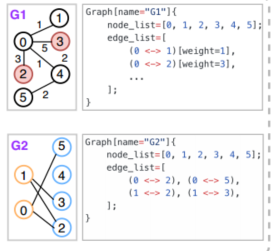

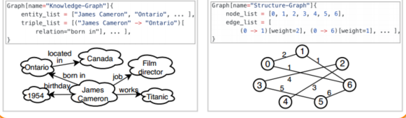

Formally, given one task graph $$G_i \in D_j$$ , we denote M(·) as the structured format verbalizer, and the original graph can be mapped into a sequence as Ci = M(Gi). For the fundamental format, all nodes (or entities) are listed as a sequence with variable node_list (or entity_list), while all edges (or triples) are listed as a sequence with variable edge_list (or triple_list). For graphs that contain side information, we can simulate the object-oriented language to express the node (or entity).

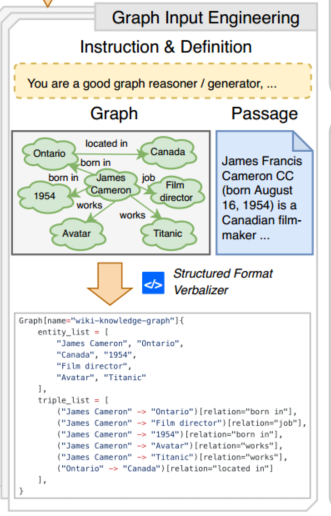

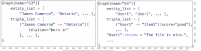

#####  Graph Instruction Tuning:

After graph input engineering, we can directly reuse the standard causal language modeling (CLM) objective to continually tune the LLM on such groups.  Formally, given one task dataset $$D_j = {(\mathcal I_i, \mathcal G_i,\mathcal P_i, \mathcal A_i)}^{N_j}_{i=1}$$​, the LLM can be optimized by maximum likelihood with:
$$
\mathcal L(\mathcal D_j ) = −\sum ^{N_j}_{i=1}log π_θ(\mathcal Y_i = \mathcal A_i|\mathcal X_i),
$$
where $$π_θ$$ denotes the LLM with trainable parameters θ, $$\mathcal Y_i$$ is the model output, $$\mathcal X_i$$ and $$\mathcal Ai$$ respectively represent the input sequence and reference label, which depends on the specific task definition. Therefore, we can obtain an instruction-based graph LLM and named InstructGraph-INS.

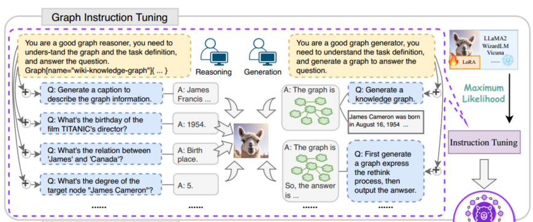

##### Graph Preference Alignment:

We propose graph preference alignment to alleviate the hallucination of LLMs on the graph.

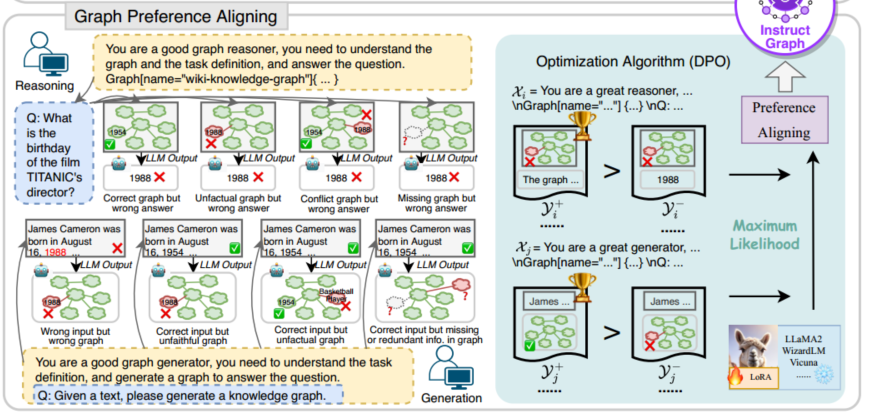

The InstructGraph framework. 1) We first collect multiple graph tasks, and unify them into a code-like format, along with task-specific textual data to form a graph instruction corpus. 2) Then, we perform graph instruction tuning to improve the ability of an LLM to solve graph reasoning and generation tasks. 3) Finally, we investigate multiple graph hallucination scenarios and optimize the LLM by preference alignment.

##### Hallucinations in Graph Reasoning:

1. Correct graph but wrong answer means the LLM makes a wrong prediction even though the input is legal.
2. Unfactual graph but wrong answer means the wrong answer caused by a graph with unfaithful semantics to external knowledge.
3. Conflict graph but wrong answer means there exists conflict information in the input graph.
4. Missing graph but wrong answer means that the input graph is missing some crucial information related to the answer

To simulate the first circumstance, we can randomly choose a result from other examples to form a negative output $$\mathcal Y_i^-$$.

##### Hallucination in Graph Generation:

The following are three kinds of wrong-generated graphs: unfactual graph, conflict graph and missing graph. We next use the DPO algorithm to reduce hallucination. Specifically, given one instruction example $$(\mathcal{X}_{i},\mathcal{Y}^+_{i})$$and a corresponding negative $$(\mathcal{X}_{i},\mathcal{Y}^-_{i})$$,we can define the preference model under the Bradley-Terry as:
$$
\begin{aligned}p_{\theta}(\mathcal{Y}_{i}^{+}>\mathcal{Y}_{i}^{-}|\mathcal{X}_{i})=&\frac{1}{1+\exp\{r(\mathcal{Y}_{i}^{+},\mathcal{Y}_{i}^{-},\mathcal{X}_{i})\}},\\r(\mathcal{Y}_{i}^{+},\mathcal{Y}_{i}^{-},\mathcal{X}_{i})&=-\beta\log\frac{\pi_\theta(\mathcal{Y}_i^+|\mathcal{X}_i)}{\pi_{ref}(\mathcal{Y}_i^+|\mathcal{X}_i)}\\&+\beta\log\frac{\pi_\theta(\mathcal{Y}_i^-|\mathcal{X}_i)}{\pi_{ref}(\mathcal{Y}_i^-|\mathcal{X}_i)},\end{aligned}
$$
where $$β$$ is the balance factor, $$p_θ$$ denotes the preference model, $$π_θ$$ and $$π_{ref}$$ respectively denotes the policy and reference model, which can be initialized from instruction-version LLM. Thus, we can optimize the LLM by maximum likelihood with:
$$
\begin{aligned}&\mathcal{J}(\pi_{\theta},\pi_{ref})=-\mathbb{E}_{(\mathcal{X}_{i},\mathcal{Y}_{i}^{+},\mathcal{Y}_{i}^{-})\sim\mathcal{D}}\\&\left[\log\sigma(\beta\log\frac{\pi_\theta(\mathcal{Y}_i^+|\mathcal{X}_i)}{\pi_{ref}(\mathcal{Y}_i^+|\mathcal{X}_i)}-\beta\log\frac{\pi_\theta(\mathcal{Y}_i^-|\mathcal{X}_i)}{\pi_{ref}(\mathcal{Y}_i^-|\mathcal{X}_i)})\right].\end{aligned}
$$
We denote the policy $$π_θ$$ as InstructGraph-PRE.

#### Experiments:

##### Implementation Settings:

We construct about 1.6M examples for graph instruction tuning and 100K examples for graph preference alignment, we choose LLaMA2-7B-HF from HuggingFace5 as the backbone, the maximum length is set as 2048, the optimizer is AdamW. The learning rate is set to 5e − 5 with a decay rate of 0.1 in the graph instruction tuning stage and will be changed to 5e − 7 in the graph preference alignment stage.

##### Main Results on Graph Instruction Tasks:

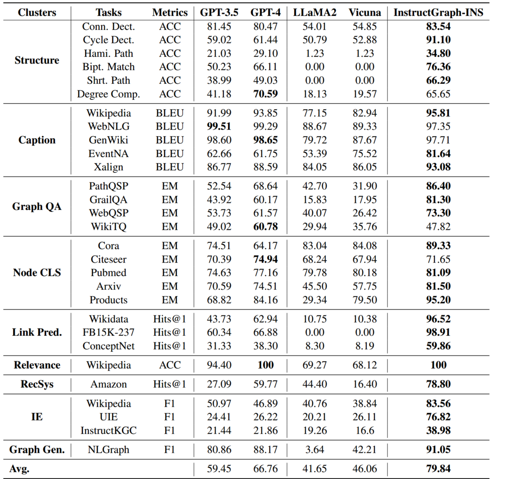

##### Main Results on Graph Preference Tasks:

Performance (%) comparison with LLaMA2, Vicuna, GPT-3.5, and GPT-4 towards the overall graph, named entity recognition (NER), and relation extraction (RE) on graph generation tasks.

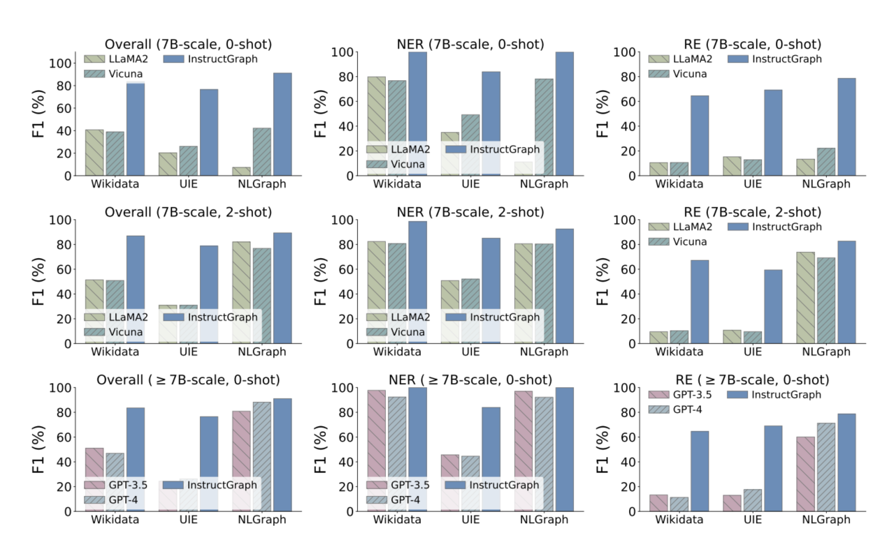

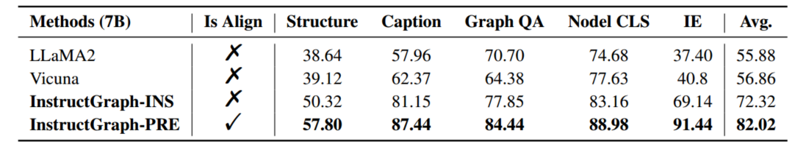

InstructGraph-PRE significantly enhances the instruction version model by about 10%, demonstrating that well-designed preference optimization can hit the upper boundary and endow the LLM with the ability to alleviate the pitfalls of hallucination.

##### Effectiveness of Thought Planning:

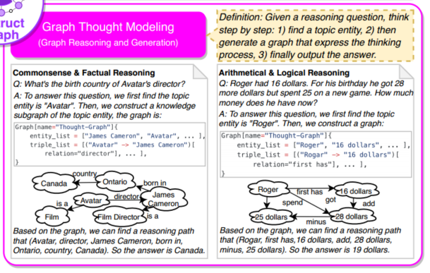

we are eager for the LLM to solve the thought planning tasks, including arithmetic, symbolic, robotic, and logic.

We design two few-shot scenarios:

1. Chain-of-Thought (CoT) directly sampling few-shot exemplars with manually annotated sequence rationales
   to form a prompt.
2. Graph Thought Modeling (GTM) decomposes the sequence rationale into three stages finding topic entities or keywords, building a graph to express the thought, and outputting the final answer.

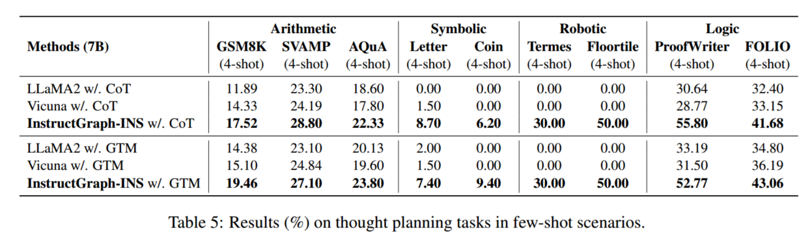

##### Performance on General NLP Tasks:

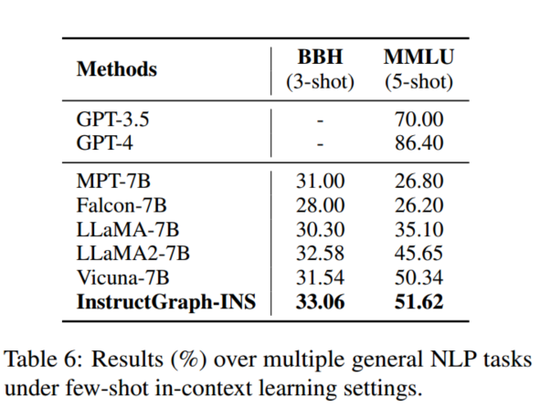
