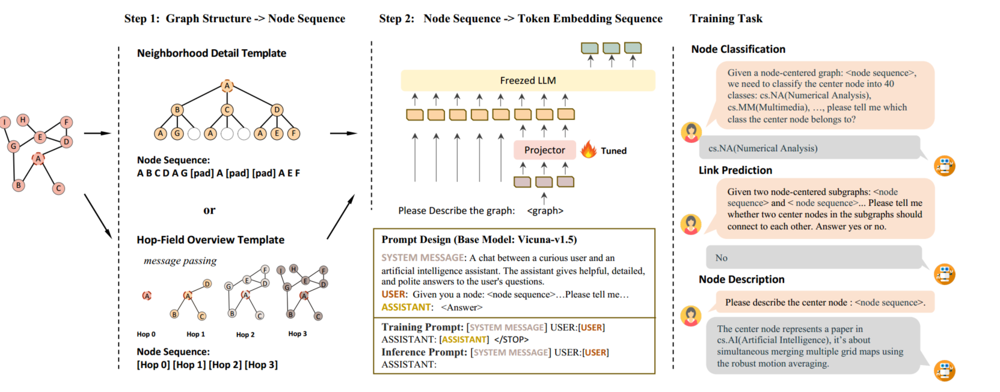
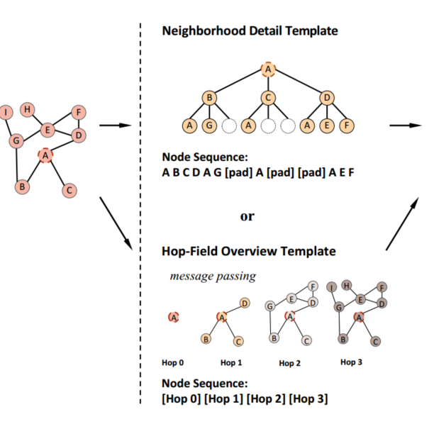
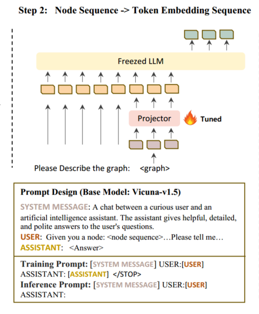
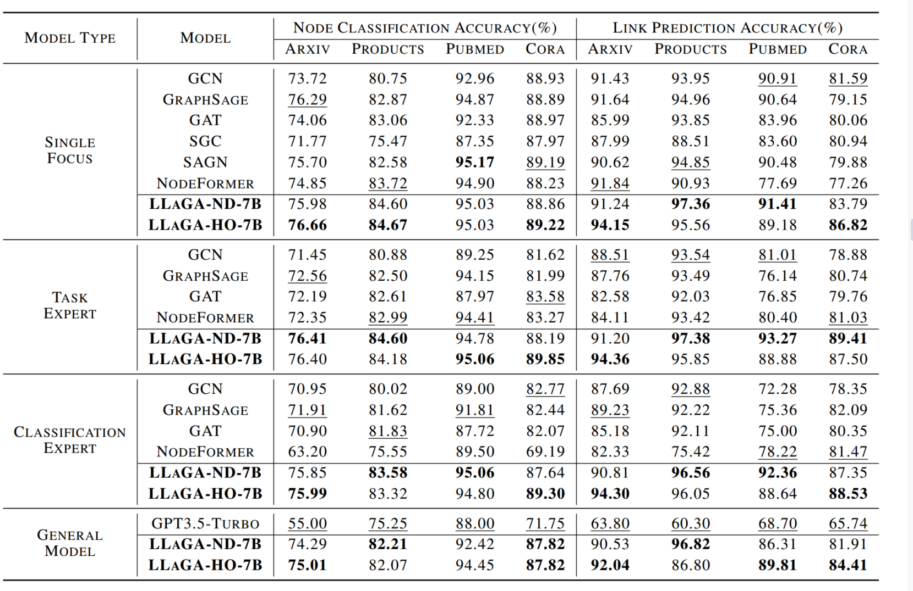
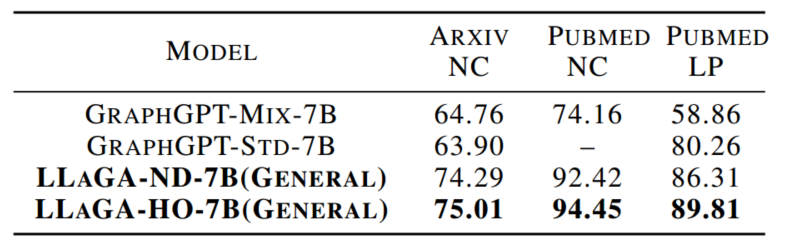
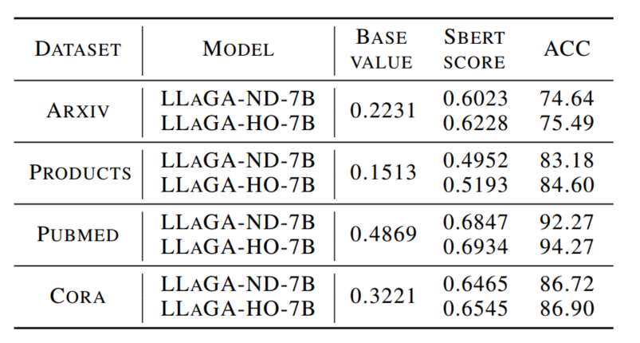
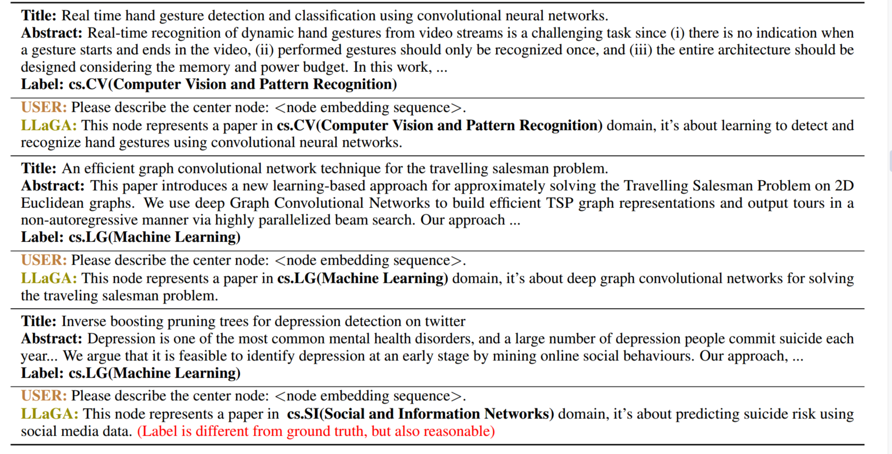
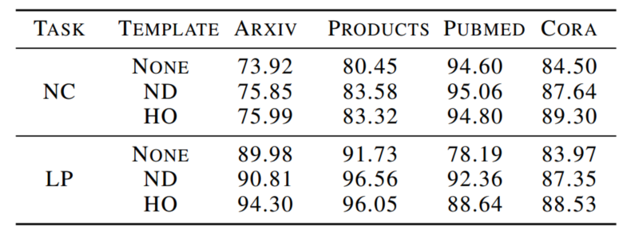

### Summary：

Introducing a novel encoding method that translates graph data into sequences directly compatible with LLMs, avoiding the need for intermediary models.

Neighborhood Detail Template and Hop-Field Overview Template: Graph Structure -> Node Sequence

Projector: Node Sequence -> Token Embedding Sequence

#### Title:

LLaGA: Large Language and Graph Assistant (ICML 2024)

#### Background:

A critical limitation of GNNs is their weak multi-task handling capability.

Self-supervised learning may offer some improvement, but they still require task-specific heads or tuning for downstream tasks.

A key advantage of LLMs is their ability to solve various tasks with a single model, showcasing strong language skills and the capacity to explain provided answers.

#### Innovation:

We introduce the Large Language and Graph Assistant (LLaGA), a novel framework that seamlessly integrates rich graph-structured data with the massive context awareness skills and comprehension capabilities of Large Language Models.

#### Introduction:

LLaGA uniquely reorganizes graph data into node sequences, without converting structural information into potentially ambiguous natural language descriptions. These sequences are formatted with the help of novel node-level templates, to reflect the structural information surrounding each central node while preserving the graph’s node features.

LLaGA translates node representations into LLMs’ comprehensible token embedding space through a versatile projector

##### Notation:

$$\mathcal G = (\mathcal V,\mathcal E,\mathcal X)$$

graph:$$\mathcal G$$ 

set of edges: $$\mathcal E$$

set of nodes(entities):$$\mathcal V$$

attributite information coresponding to the nodes:$$\mathcal X$$

$$k^{th}$$ hop neighborhood set surrounding the node $$v$$:$$\mathcal N^k_v$$

##### Structure-Aware Graph Translation:

The first step involves converting graphs into node embedding sequences.

1. Neighborhood Detail Template: From the 1-hop neighbor set of $$v$$, denoted as $$\mathcal N^1_v$$, we randomly select $$n_1$$ nodes to form a new neighbor set $$\widetilde{\mathcal{N}}_{v}^{1}$$. If the size of $$\mathcal N^1_v$$ is smaller than $$n_1$$, i.e.,$$|\widetilde{\mathcal{N}_v^1}|<n_1$$. We supplement the set with placeholder nodes to reach a size of $$n_1$$.Subsequently, for each node in $$\widetilde{\mathcal{N}}_{v}^{1}$$, we recursively sample $$n_2$$ neighbors as its children. We then perform a level-order traversal on the computational tree, transforming the comprehensive details of the central node and its neighborhood into a fixed-length node sequence. 
   
   We further integrate a Laplacian Embedding at each sequence position, enhancing the representation of structural information. Denoting the adjacency matrix of the computational tree by $$A_{tree}$$, the Laplacian Embedding is defined as the eigenvectors of the Laplacian matrix of $$A_{tree}$$:
   $$
   L=I-\mathcal{D}^{-\frac12}\mathcal{A}_{tree}\mathcal{D}^{-\frac12}=U^T\Lambda U
   $$
   D represents the degree matrix of $$A_{tree}$$ and U symbolizes the Laplacian Embedding of the template.
   
   The process is outlined as follows: Let $$v_1, v_2, ..., v_n$$ represent the encoded node sequence. The final node embedding $$h_{v_i} $$for $$v_i$$​ is given by
   $$
   h_{v_i}=\begin{cases}\mathbf{0}&\mid\mid U_i,&\text{if }v_i=[pad];\\\phi(x_{v_i})&\mid\mid U_i,&\text{otherwise,}\end{cases}
   $$
   $$\|$$ denotes concatenation, $$\phi$$ dennotes encoding models .  Subsequently, the central node and its structural information are transformed into the node embedding sequence $$h_{v_1} , h_{v_2} , ..., h_{v_n}$$.
   
2. Hop-Field Overview Template:

$$
h_v^i=\frac1{|\mathcal{N}_v^1|}\sum_{v^{\prime}\in\mathcal{N}_v^1}h_{v^{\prime}}^{i-1}
$$

Unlike the Neighborhood Detail Template, which utilizes individual embeddings for each neighbor, the HopField Overview Template summarizes each hop’s neighbors with a single embedding.

To enhance the natural comprehension of graph inputs by Large Language Models (LLMs), it is essential to align the node embedding space with the input token space. This alignment is realized by mapping each node embedding into the token embedding space, utilizing a specifically calibrated projector, denoted as $$f_θ$$
$$
e_i=f_\theta(h_i)
$$

In our framework, this transformation is facilitated by a simple MLP serving as the projector.

##### Alignment Tuning:

In the input processing phase, we tokenize all words in the prompt and convert them into their respective token embeddings.
$$
\underset{\theta}{\operatorname*{maximize}}p(X_{answer}|X_{graph},X_{question},X_{system})
$$

#### Experimental Results:

##### Main question:

RQ1: How does LLaGA perform in comparison to baseline models in standard graph tasks, such as node classification and link prediction?

RQ2: How good are the interpretations generated by LLaGA for node embeddings?

RQ3: How effectively does the model transfer knowledge when adapting to new datasets or tasks in zero-shot?

RQ4: What is the contribution of our encoding templates to the overall performance?

##### Setup:

1. Datasets: We train and evaluate our model on four widely recognized graph datasets: ogbn-Arxiv, ogbn-Products, Pubmed, and Cora.
2. Tasks: Node classification, link prediction, and graph-based node description.
3. Evaluation Metrics: For evaluation metrics, we employ Accuracy for both node classification and link prediction tasks, Sbert score and Description Label Accuracy for the node description task. The Sbert score measures the similarity between embeddings of the generated descriptions and the ground truth descriptions encoded by Sbert. Description Label Accuracy represents the Accuracy of labels inferred from node descriptions.
4. Implementation Details: In our model’s implementation, we primarily employ Vicuna-7B-v1.5-16K as the foundational base models, and SimTeg as default text-encoding model. The learning rate is consistently set to 2e-5, and the batch size is maintained at 16 for all models. For the Neighborhood Detail Template, we sample two-hop neighbors around each node, setting the sample size to 10 for each hop. We denote LLaGA implementations with the Neighborhood Detail Template and Hop-Field Overview Template as LLaGA-ND-7B and LLaGA-HO-7B, respectively.
5. Baselines: We benchmark our framework against three categories of state-of-the-art models to ensure a thorough evaluation.(GNN,transformer,GPT-3.5,GraphGPT)

##### Overall Performance Comparison (RQ1):

Single Focus, Task Expert, Classification Expert, General Model

##### Comparison with Baselines:

1. LLaGA framework demonstrates superior performance compared to baseline models across all settings, particularly in multi-task learning scenarios.
2. While many baseline models experience significant performance degradation in multi-task learning scenarios, LLaGA stands out by exhibiting minimal decline or even improvements in performance.
3. Both the Neighborhood Detail Template and the Hop-Field Overview Template exhibit distinct advantages.

##### Comparison with Concurrent Work:

GraphGPT is a generalizable model designed for solving graph tasks using LLM. It employs a text-encoding model to extract node features and utilizes a pre-trained graph transformer for encoding structural information.

##### Interpretation Ability Investigation (RQ2):

We also include a Base value for your reference, representing the average similarity across two randomly chosen samples.

##### Zero-Shot Ability Investigation (RQ3):

The results reveal that our model exhibits robust zero-shot capabilities in both scenarios.  This indicates that LLaGA can effectively discern and leverage similar patterns across datasets, adeptly transferring knowledge not only to analogous data but also to datasets that markedly differ in domain.

##### Templates Ablation Study (RQ4):

 For this, we train a new model in a classification expert setting, but without using a template. This model solely relies on the embedding of the center node for prediction, rather than a node embedding sequence that encapsulates structural information surrounding the center node. 

It is evident that both the Neighborhood Detail Template and the Hop-Field Overview Template significantly enhance performance compared to the model without a template. All these findings underscore the effectiveness of our templates in encoding the structural information of nodes.
