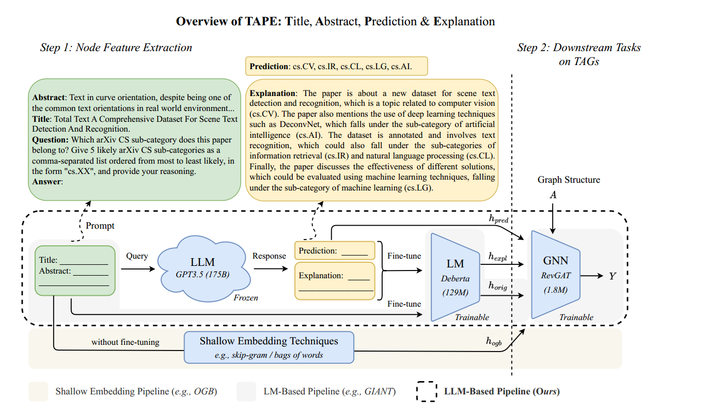

#### 题目：

​	HARNESSING EXPLANATIONS: LLM-TO-LM INTERPRETER FOR ENHANCED TEXT-ATTRIBUTED GRAPH REPRESENTATION LEARNING. (ICLR 2024 5)

#### 背景(传统方法)：

​	文本属性图（TAG）上的表征学习成为近几年一个重要的研究课题。现有的文本属性图表征学习方法，将每个结点的文本属性编码为浅层或人工制作的特征，例如skip-gram或bag-of-words方法，然后将得到的结点特征作为GNN的输入。然而，这些浅层的文本嵌入难以捕获的复杂的语义特征。

​	基于LM方法的文本属性图学习，旨在设计更好的LM方法来更好的捕获TAG中文本的上下文和细微差别。首先，对预训练的LMs进行微调，生成特定TAG任务的文本嵌入。但是，这类方法需要复杂的设计与大量的计算资源。此外，现有的工作大多数依赖相对较小的LMs，比如BERT，DeBERTa，因此缺乏像大语言模型强大的推理能力。

​	尽管大语言模型的出现彻底改变了自然语言领域，增强了处理各种各样自然语言处理任务，但是他们在文本属性图上的应用还未探索，本文的工作就是探索LLM在文本属性图上的潜力。

#### 创新点：

​	提示LLM执行零样本分类，请求其对决策过程进行文本解释，设计LLM-to-LM解释器，使用LLM-to-LM将解释翻译为结点特征向量表示，将特征向量用于处理下游任务的GNNs。

#### 介绍：

​	

##### TAG：

$$\mathcal{G}=(\mathcal{V},A,\{s_{n}\}_{n\in\mathcal{V}})，\mathcal{V}$$表示具有N个结点的集合,$$A\in\mathbb{R}^{N\times N}$$是邻接矩阵，$$s_n\in \mathcal{D}^{L_n}$$是与结点$$n\in\mathcal{V}$$相关的文本序列，$$
\mathcal{D}$$是单词或tokens字典，$$L_n$$是序列长度。本文研究结点分类任务，给定一些被标记的结点$$
\mathcal{L}\subset \mathcal{V}$$,预测剩余未被标记的结点$$\mathcal{U}=\mathcal{V}\setminus \mathcal{L}$$

##### 语言模型用于文本分类：

可以使用LM来编码与每个节点相关的文本属性，并学习捕获文本的语义含义的表示。

$$s_n∈D^{L_n}$$定义为结点$$n$$的文本属性，LM是一个预训练的网络，比如BERT或DeBERTa。结点$$n$$的文本属性可以通LM来编码：
$$
h_n=LM(s_n)∈R^d
$$

其中，$$h_n$$是LM的输出，d是输出向量的维度。目标是学习一个函数，将编码的文本属性映射到相应的节点标签。

##### 大语言模型和提示：

提示可以采用多种形式，例如单个句子或较长的段落，并且可以包含其他信息或约束来指导模型的行为,$$\mathcal{M}$$定义为一个LLM，tokens序列$$x = ( x_1 , x_2 , . . . , x_q )$$ 作为输入，tokens序列$$y = ( y_1 , y_2 , . . . , y_q )$$作为输出。模型$$ \mathcal{M}$$通常被训练优化条件概率分布$$p (y∣x)$$，其在给定x的情况下为每个可能的输出序列$$y$$分配概率。
为了在输入序列$$x$$中包含提示符$$p$$，我们可以将它们连接成一个新的序列$$x = ( p , x 1 , x 2 , . . . , x q )$$。然后，我们使用$$\hat{x} $$ 来计算条件概率分布$$p ( y ∣ \hat{x} )$$。在形式上，输出序列$$y$$在给定x的情况下的概率为：
$$
p(y∣\hat x)=\prod^p_{i=1}(y_i∣y_{<i},\hat{x})
$$
其中，$$y_{< i}$$表示序列$$y$$到位置$$i-1$$的前缀，$$p ( y_i ∣ y_{< i} ,\hat{x})$$表示给定$$y_{< i} $$和$$ \hat{x} $$生成token $$ y_i$$的概率。

##### 结点分类：

节点分类中，任务是根据其属性和与其他节点的连接来标记图中的每个节点。GNN通过聚合来自节点邻居的信息来操作，然后基于聚合的信息更新节点的表示。GNN的第k层为：
$$
h_i^k=f^k(h_i^{k−1},AGG(\{h_j^{k−1} :j∈N_i\}))∈R^d
$$
其中，$$h_i^k∈\mathcal{R}^d$$是第k 层结点i的表征，$$ \mathcal{N}\subseteq \mathcal{V}$$是结点i的邻居集合，函数$$f^k$$是根据节点的前一层表示和来自其邻居的聚合信息来更新节点的表示的函数。$$ \mathrm{AGG}$$​聚合节点邻居表征和自身表征。最终的表示输入到一个全连接层和一个softmax函数中进行类别预测。

##### 生成基于LLM的预测和解释：

本文提出的方法是指导LLM做出多个预测，并为其决策提供解释。有效地提取其推理能力和常识的文本格式。然后使用LLM-to-LM解释器处理这些基于文本的输出，转化为嵌入的向量给你，为下游GNN创建节点特征。

为此，对于每个节点$$i \in \mathcal{V}$$，我们生成一个提示，其中包括论文的标题和摘要，还有一个关于论文主题的问题。提示的问题具体内容根据任务和数据集制定。

##### LM解释器的微调与节点特征提取：

首先，将原始文本（标题和摘要）和LLM的解释转换成适合下游GNN任务需求的固定长度节点特征。采用的方法是微调一个较小的LM，充当LLM的文本解释的“解释器”。这一步骤背后的基本原理是，LLM和LM都具有明显的优势：LLM具有更强大的能力和更多的知识，但灵活性较低，而LM尽管能力不强大，但可以根据特定任务进行微调。因此，LM用于为GNN解释LLM的输出，文本解释充当有效的通信的中间媒介。然后，对LM进行微调，使其能够从解释中提取最有价值和任务相关的特征。

首先对预训练的LM进行如下微调：让$$\mathrm{LM_{orig}}$$ 和$$\mathrm{LM_{expl}}$$分别作为原始文本序列$$s^{orig}$$ 和解释文本序列$$s^{expl}$$的输入。为每个源获取文本嵌入：

$$
h_{orig}=LM_{orig}(s^{orig})\in R^{N×d},h_{expl}=LM_{expl}(s^{expl})\in R^{N×d}
$$
然后，上述结果作为MLP输入，以获得表示LM对每个节点的预测的$$N \times C$$​维预测矩阵：
$$
y_{orig} =MLP_{orig}(h_{orig} )\in R^{N×C} ,y_{expl} =MLP_{expl}(h_{expl})\in R^{N×C}
$$
使用交叉熵损失函数来微调LM和MLP。最后，来自$$h_{orig}$$和$$h_{expl}$$​两个源的文本嵌入作为特征来训练下游GNN。

除了解释，LLM还为每个节点提供了top-k排名的预测列表，这增加了有价值的信息。为了结合该知识，节点$$i$$的top-k个预测首先被独热编码为向量$$p_{i,1},...,p_{i,k}\in \mathbb{R}^C$$。这些向量随后被连接成$$kC$$维向量，随后进行线性变换以产生长度为$$d_P$$的固定大小的向量。这个过程产生了所有结点的一个预测特征矩阵$$h_{pred} \in \mathbb{R}^{N \times d_P}$$ 。特征定义为$$ h_{TAPE}=\{h_{orig},h_{expl},h_{pred}\}$$​，其中“TAPE”代表每个节点的标题、摘要、预测和解释。并且，要求这些特征在下游GNN训练期间保持冻结，确保LM和LLM不参与GNN训练过程。

最后一步是使用$$h_{TAPE}$$特征训练GNN，目标是在不增加GNN的内存需求或对其架构进行任何更改的情况下实现。

本文使用集成的方法，作为一个简单而有效结合特征的方式。具体来说，我们分别在特征$$h_{orig}、 h_{expl}和h_{pred}$$上独立地训练GNN模型$$f_{orig}、f_{expl}和 f_{pred}$$​ ，预测真实节点标签：
$$
\hat y_{orig/expl/pred}=f_{orig/expl/pred}(h_{orig/expl/pred} ,A)\in R^{N×C}
$$
然后，我们对这些预测取平均值：
$$
\hat y=mean(y_{orig},\hat y_{expl},\hat y_{pred})\in R^{N×C}
$$

##### 理论分析:

证明——LLM生成的解释对于较小的LM来说可能是有价值的功能
具体地说，如果解释$$E$$在描述LLM的推理时具有保真度，那么它们是有帮助的;并且LLM是非冗余的，利用了较小LM不使用的信息。设$$ E$$是由LLM生成的文本解释; $$Z_L$$和$$Z$$分别是来自LLM和较小LM的嵌入，$$y$$是目标，$$ H(·|·)$$是条件熵。

理论：给定以下条件：1）保真度：$$E$$是$$Z_L$$的良好代理，使得$$H(Z_l| E)=\epsilon，且\epsilon > 0$$；非冗余：$$Z_L$$包含不存在于$$Z$$中的信息，表示为$$H(y| Z,Z_L)= H(y| Z)-\epsilon'，其中\epsilon'>\epsilon$$，则$$H(y| Z，E)< H(y| Z)$$。

#### 实验结果：

#### 局限性：

​	需要为每个数据集制定提示，依赖于手工制作的提示，这可能不是每个数据集的节点分类任务的最佳选择。未来会往自动化提示生成过程发展或探索替代提示设计、发展TAG

