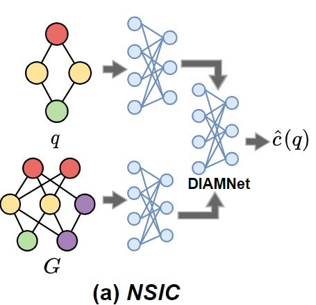
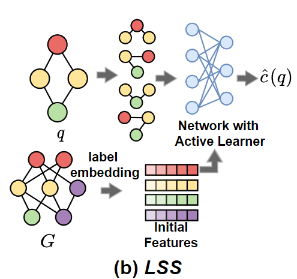
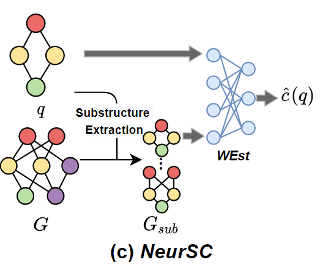
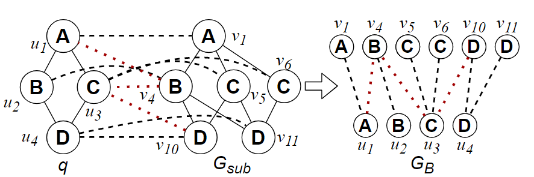
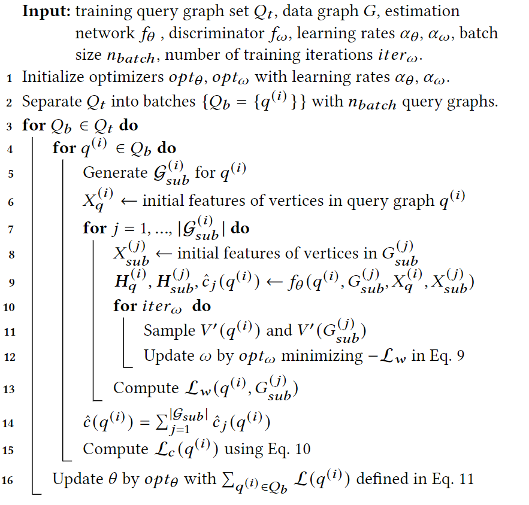
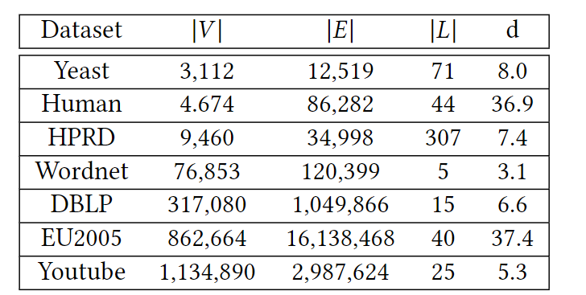
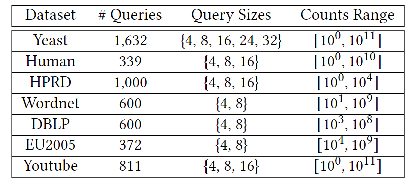

## Title:

Neural Subgraph Counting with Wasserstein Estimator

## Introduction:

Graph structured data has been widely used. One important methodology is to investigate the graphs from a subgraph perspective. At the heart of the subgraph analysis approaches lies the subgraph counting problem, that is, to compute the numbers of subgraphs in a data graph 𝐺that match the given query graph $$q$$.

###  Non-learning-based:

Existing non-learning-based subgraph counting algorithms are classified into two categories: summary-based techniques or sampling-based techniques.

###  Learning-based:

#### NSIC:

First encodes both query and data graphs into vectors with recurrent neural networks (RNNs) or GNNs and then predicts the subgraph counts with the proposed network DIAMNet which is based on RNN.

Because the model encodes both full-sized query and data graphs, and the model has a large parameter space, NSIC suffers from severe efficiency and scalability issues.

#### LSS with an active learner:

LSS decomposes the given query graph $$q$$ into smaller substructures and encodes these substructures into vector representations by GNN. Then LSS estimates the subgraph counts of query graph $$q$$ by aggregating the representations of all substructures with a network using self-attention mechanism.

LSS either only exploit the label frequencies in data graph or directly use the embeddings of labels in data graph produced by task-independent network embedding methods. This initialization method ignores the query structural information.

The substructures of query graphs are obtained by a 𝑘-hop breadth-first search (BFS) starting from each query vertex 𝑢, where 𝑘 is a fixed constant 3 in LSS for all queries regardless of their sizes.

#### NeurSC:

The circumstance that the existing learning-based subgraph counting methods either only support exceedingly small data graphs or cannot fully exploit the data graph information motivates us to design a novel model.

NeurSC has two main components: (1) the extraction approach which generates the candidate substructures, and (2) the learning-based estimator named WEst which produces the subgraph counts prediction with input query graph and candidate substructures.

Since there could exist multiple candidate substructures, NeurSC could make a trade-off between efficiency and accuracy by adjusting the number of substructures involved in the computation.

##### WEst:

WEst consists of the intra-graph neural network, inter-graph neural network and the Wasserstein discriminator.

## Contributions:

1. We propose a learning-based subgraph counting method NeurSC that estimates the subgraph counts with both individual and joint distributions of both query and data graphs.
2. NeurSC extracts the substructures from data graph adaptively according to the query graph to reduce the sizes of graphs that should be processed, and hence not only avoids the influence from the unpromising data vertices and edges during the representation learning process but also improves the efficiency and scalability of the model.
3. We design a Wasserstein discriminator in our model to leverage the vertex correspondence information to further improve the estimation accuracy.
4. We conduct experiments on 7 real-life data graphs and demonstrate that NeurSC could significantly improve estimation accuracy and robustness. For instance, NeurSC could reduce up to 95% of the error compared to the state-of-the-art technique LSS in the experiments.

## SUBSTRUCTURE EXTRACTION:

### Motivation:

The **structural and attribute information** within both query and data graph serves a critical role in subgraph counting. LSS only applies the graph neural networks on query graphs; NSIC applies the graph neural networks on both query and the entire data graph, which makes it **time prohibitive** for queries on large scale data graphs. Besides, the learning model applied on the entire data graph will inevitably produce representations of **unpromising data** vertices which cannot be matched to query vertices.

### Candidate Filtering:

Our proposed model adopts the candidate set generation method from **GraphQL**, generates the candidate set with the smallest number of vertices $$\left|\cup_{u\in V(q)}CS(u)\right|$$.

NeurSC generates the candidate set with two stages: **local pruning** and **global refinement**.

**Local pruning** filters out the invalid nodes based on the profile of the neighborhood graph of the query vertex 𝑢, which is the lexicographically ordered labels of 𝑢 and neighbors of 𝑢 within **distance** 𝑟.

**Global refinement** prunes 𝐶𝑆 (𝑢) as follows: given 𝑣 ∈ 𝐶𝑆 (𝑢), the algorithm first builds a bipartite graph $$B_{u}^{\upsilon}$$ between 𝑁 (𝑢) and 𝑁 (𝑣) by adding𝑒 (𝑢′, 𝑣 ′) if 𝑣 ′ ∈ 𝐶𝑆 (𝑢′), where 𝑢′ ∈ 𝑁 (𝑢) and 𝑣 ′ ∈ 𝑁 (𝑣).

## WASSERSTEIN ESTIMATOR:

### Feature Initialization:

Considering that the number of labels and the maximum degree in the graph are relatively **small**, use the binary encoding function to convert the **decimal digits** into a **binary number** and directly use this as a **multi-hot vector**.

The **input feature vector** for vertex 𝑣 in either query graph or candidate substructure can be obtained with the equation:
$$
x_v=f_b(deg_v)\parallel f_b(f_l(v))\parallel_{i=1}^kMP_{\forall v^{\prime}\in N^{(i)}(v)}(f_b(deg_{v^{\prime}})\parallel f_b(f_l(v^{\prime})))
$$
where ∥ indicates the concatenation operation, $$f_b$$ is the binary encoding function, 𝑀𝑃 is mean pooling and $$N^{(i)}(v)$$ is 𝑖-hop neighbors of 𝑣. Eventually, the initial features $$𝑿_𝑞 = \{𝒙_𝑢 \in \{0, 1\}^{𝑑𝑖𝑚_0} ; 𝑢 ∈𝑉 (𝑞)\}$$ and $$𝑿_{𝑠𝑢𝑏} = \{𝒙_𝑣 \in \{0, 1\}^{𝑑𝑖𝑚_0} ; 𝑣 \in 𝑉 (𝐺_{𝑠𝑢𝑏} )\}$$ for query graph and substructures are generated as the input of WEst, where $$𝑑𝑖𝑚_0$$ is the dimension of the initial features.

### Intra-Graph Neural Network:

Our preliminary experiment suggests that GNN in is **more time** consuming with a limited improvement of estimation accuracy compared to GIN in our framework. As a result, GIN is exploited as the intra-graph neural network.

GIN adopts the conventional framework of graph neural networks with an aggregate-and-combine scheme as follow:
$$
\boldsymbol{h}_u^{(k)}\in\mathbb{R}^{dim_k}
$$

$$
h_u^{(k)}=CO\mathcal{M}^{(k)}(h_u^{(k-1)},\mathcal{AGG}^{(k)}\{h_{u^{\prime}}^{(k)};u^{\prime}\in N(u)\})
$$
***COM*** is the combine operation.

In GIN, AGG and COM is modeled as **multilayer perceptrons** (MLP). $$\boldsymbol{h}_u^{(k)}\in\mathbb{R}^{dim_k}$$ can be computed by GIN formulated as follows:
$$
h_{u}^{(k)}=\sigma(MLP^{(k)}((1+\epsilon^{(k)})h_{u}^{(k-1)},\sum_{u^{\prime}\in N(u)}h_{u^{\prime}}^{(k)}))
$$
### Inter-Graph Neural Network:

we first build a **bipartite graph** $$𝐺_𝐵$$ with the vertex set $$V(G_{B})=V(q)\cup V(G_{sub})$$ and then apply an attentive network on $$𝐺_𝐵$$.
$$
\begin{aligned}E(G_B)=\{(u,v);u\in V(q)\wedge v\in V(G_{sub})\wedge v\in CS(u))\}\end{aligned}
$$

Candidate data vertex has **different importance** to query vertex in terms of the subgraph isomorphism counting. Therefore, the **attentive graph neural network** is applied on the bipartite graph.

Suppose there are 𝐾 ′ layers in the attentive graph neural network, the 𝑘-th layer is formulated in the following
$$
h_u^{(k)}=\sigma(\alpha_{uu}^{(k)}\Theta^{(k)}h_u^{(k-1)}+\sum_{v\in N_{G_B}(u)}\alpha_{uv}^{(k)}\Theta^{(k)}h_v^{(k)})
$$
$$𝛼_{𝑢𝑣^′}$$ is the attention coefficient between vertices 𝑢 and $$𝑣^′$$ which is computed as
$$
\alpha_{uv}=\frac{\exp(\text{LeakeyRelu}(a[\Theta_ah_u]\parallel[\Theta_ah_v]))}{\Sigma_{v^{\prime}\in N_{G_B}(u)}\exp(\text{LeakeyRelu}(a[\Theta_ah_u]\parallel[\Theta_ah_{v^{\prime}}]))}
$$

$$
\boldsymbol{h}_u^{inter}=\boldsymbol{h}_u^{(K^{\prime})}\in\mathbb{R}^{dim_{K^{\prime}}}
$$

### Readout and Prediction:

WEst produces the final representations by **concatenating these two vectors**, $$𝒉_𝑢 = 𝒉^{𝑖𝑛𝑡𝑟𝑎}_𝑢 ∥𝒉^{𝑖𝑛𝑡𝑒𝑟}_𝑢$$ with dimension $$𝑑𝑖𝑚_𝐾 + 𝑑𝑖𝑚_{𝐾^′}$$ , for each vertex 𝑢 ∈ 𝑉 (𝑞) and 𝑣 ∈ 𝑉 ($$𝐺_{𝑠𝑢𝑏}$$ ). To compute the representation vectors for query graph and candidate substructure, WEst aggregates the corresponding vertex representations with a Readout function:
$$
h_q=Readout(H_q),h_{G_{sub}}=Readout(H_{G_{sub}}),
$$
where $$𝑯_𝑞$$ (resp. $$𝑯_{𝐺_{𝑠𝑢𝑏}}$$ ) is the matrix of representations of all vertices in query graph 𝑞 (resp. substructure $$𝐺_{𝑠𝑢𝑏}$$ ) and 𝑅𝑒𝑎𝑑𝑜𝑢𝑡 (·) is a permutation invariant and injective function: **sum pooling**.

In the prediction procedure, the final representation for prediction is generated by **concatenating** $$𝒉_𝑞$$ and $$𝒉_{𝐺_{𝑠𝑢𝑏}}$$ , $$𝒉_𝑝 =𝒉_𝑞 ∥𝒉_{𝐺_{𝑠𝑢𝑏}}$$. Then $$𝒉_𝑝$$ with dimension 2∗ ($$𝑑𝑖𝑚_𝐾 +𝑑𝑖𝑚_{𝐾^′}$$ ) is fed into an MLP which outputs a one-dimension scalar $$\hat 𝑐_𝑖 (𝑞)$$ as the **estimated subgraph counts** of 𝑞 on $$𝐺^{(𝑖)}_{𝑠𝑢𝑏}$$ . WEst aggregates the subgraph count estimations by summation of the estimations on **all substructures** in $$\mathcal G_{𝑠𝑢𝑏}$$ , $$\hat 𝑐 (𝑞) = \sum ^{|\mathcal G_{𝑠𝑢𝑏}|}_{𝑖=1} \hat 𝑐_𝑖 (𝑞)$$, to predict the subgraph counts of query graph 𝑞 on data graph 𝐺.

### Wasserstein Discriminator:

Wasserstein Discriminator is designed to minimize the distance between the representations of corresponding query and data vertices in terms of a specific distance metric.

#### Wasserstein distance:

$$
W_1(\mathbb{P}_q,\mathbb{P}_g)=\inf_{\gamma\in\Pi(\mathbb{P}_q,\mathbb{P}_g)}\mathbb{E}_{(\mu,\nu)\sim\gamma}[\|\mu-\nu\|]
$$
where $$\Pi(\mathbb{P}_q,\mathbb{P}_g)$$ denotes the set of all joint distributions 𝛾 (𝜇, 𝜈) whose marginals are respectively $$P_𝑞$$ and $$P_𝑔$$.

𝛾 indicates how much "mass" must be transported from 𝜇 to 𝜈 to transform the distributions $$\mathbb P_q$$ into the distribution $$\mathbb P_g$$. Then the **Wasserstein-1** (W-1) distance is the "**cost**" of the optimal transport plan.
$$
W_1(\mathbb{P}_q,\mathbb{P}_g)=\sup_{\|f_\omega\|_L\leq1}\mathbb{E}_{\mu\sim\mathbb{P}_q}[f_\omega(\mu)]-\mathbb{E}_{\nu\sim\mathbb{P}_g}[f_\omega(\nu)]
$$
the Wasserstein distance between query graph 𝑞 and substructure $$𝐺_{𝑠𝑢𝑏}$$ is minimized when $$𝑓_𝜔$$is optimized to $$\text {maximize}\ \mathcal L_𝑤 (q, G_{𝑠𝑢𝑏} ) (\text {minimize} −\mathcal L_𝑤 (𝑞, 𝐺_{𝑠𝑢𝑏} )) $$in the following equation proposed in
$$
\mathcal{L}_w(q,G_{sub})=\sum_{u\in V^{\prime}(q)}f_\omega(h_u)-\sum_{v\in V^{\prime}(G_{sub})}f_\omega(h_v)
$$
Computing the exact correspondence relationship is obviously inefficient and expendable due to the **quadratic time complexity**.

$$f_{\omega}(h_{u})$$ and $$f_{\omega}(h_{v})$$ are calculated for each vertex in two graphs. Then the vertices in 𝑉 (𝑞)that minimize $$f_{\omega}(h_{u}) $$and the vertices in $$V(G_{sub})$$ that maximize $$f_{\omega}(h_{v})$$ will be the selected vertex pairs. Though this approximation method is efficient with **linear time complexity**, it totally ignores the **correspondence relationship** in making its selection.

To address this issue, in WEst, we select the **vertex pairs** with the help of the candidate set.

WEst first calculates $$f_{\omega}(h_{u})$$and $$f_{\omega}(h_{v})$$ for each vertex in two graphs. Then starting from the query vertex 𝑢′ that minimizes $$f_{\omega}(h_{u'})$$, the data vertex 𝑣 ′ that belongs to the candidate set of 𝑢′,  𝑣 ′ ∈ 𝐶𝑆 (𝑢′), and also maximizes$$f_{\omega}(h_{v'})$$ is selected.

#### Learning Objectives and Training:

There are two learning objectives in WEst, one is to **reduce the differences** between learned counts $$\hat{c}(q)$$ and the ground-truth counts $$c(q)$$, and another objective is  to explore a **better lower bound** of the Wasserstein distance.

**Loss function** is defined as:
$$
\mathcal{L}_c(q)=\max(\frac{c(q)}{\hat{c}(q)+\varepsilon},\frac{\hat{c}(q)}{c(q)})
$$
we define the overall loss function to optimize the parameters in WEst as follows:
$$
\mathcal{L}(q)=(1-\beta)\mathcal{L}_c(q)-\frac{\beta}{|\mathcal{G}_{sub}|}\sum_{G_{sub}^{(i)}\in\mathcal{G}_{sub}}\mathcal{L}_w(q,G_{sub}^{(i)})
$$
Training procedure:

## Experiment:

### Experiment Setup:

#### Dataset:

We use 7 real-life datasets for this experimental study.

#### Compared Methods:

#### Experiment Settings:

#### Evaluation Metrics:
