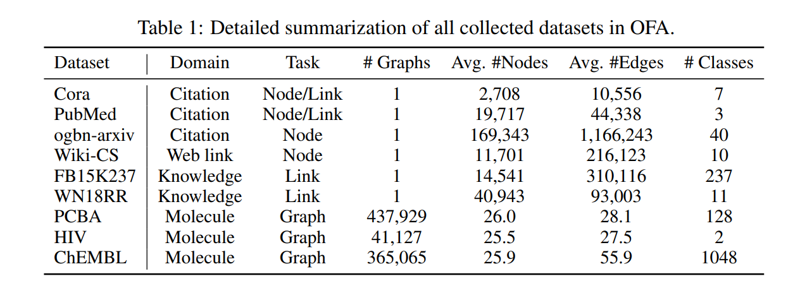
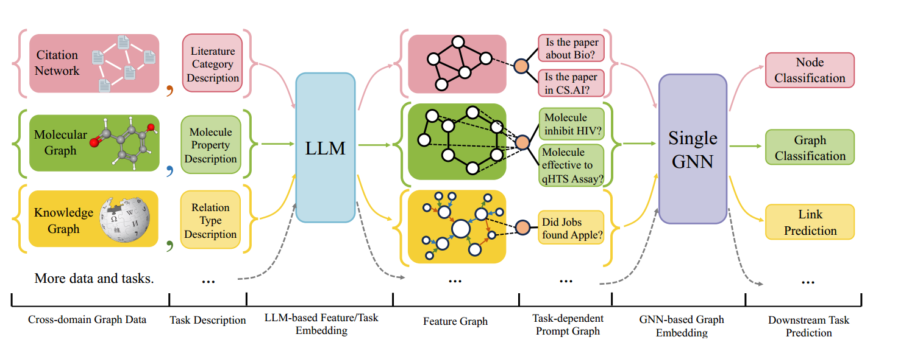
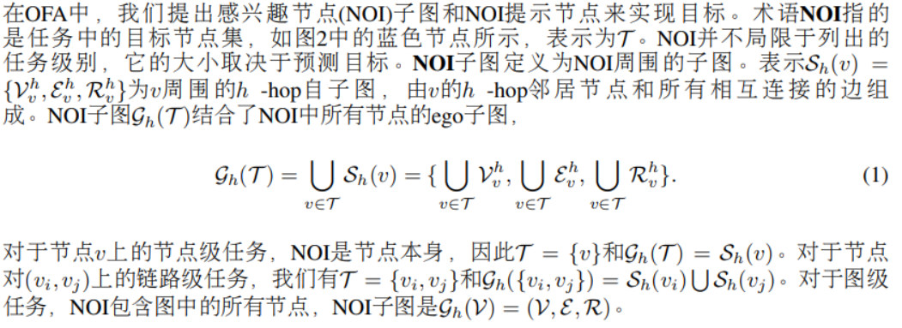
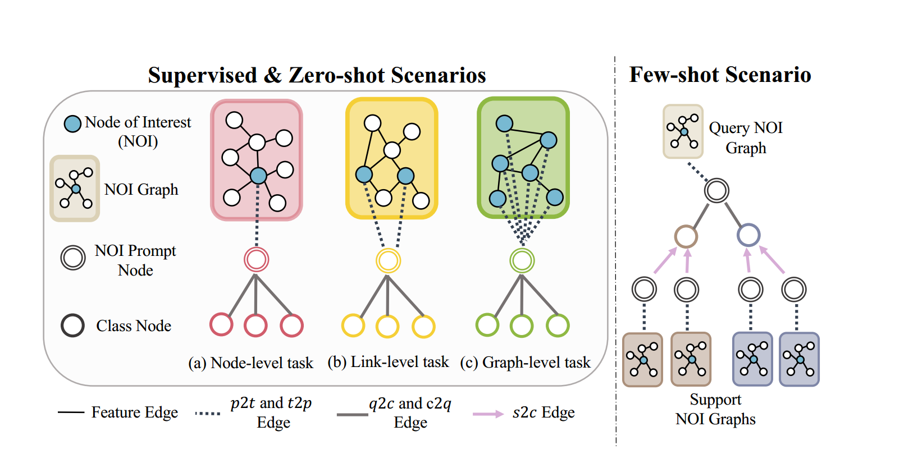
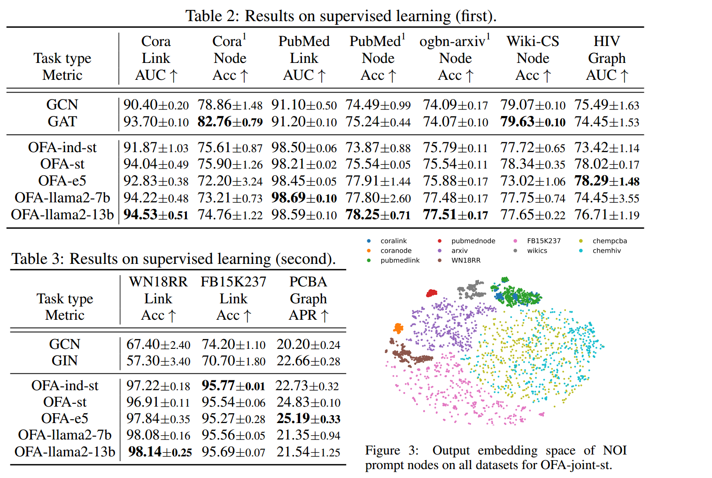

#### 题目：

ONE FOR ALL: TOWARDS TRAINING ONE GRAPHMODEL FOR ALL CLASSIFICATION TASKS. (ICLR 2024 7)

#### 背景：

LLMs因其强大的学习能力，在执行跨领域的下游任务上取巨大的成功，但是在图领域上还没有一个统一的模型解决图结构数据上不同的任务。

#### 创新点：

#####  文本属性图（TAG）：

OFA使用文本属性图（TAGs）将来自不同领域的图数据整合到一个大的TAG数据集，并利用LLMs的能力从所有领域中共同学习。9个常见的来自不同领域的数据集，用文本描述图中所有的结点和边，然后使用单个LLM将来自不同领域的文本嵌入到同一个嵌入空间。

#####  NOI子图 和NOI提示结点：

NOI（nodes-of-interest）子图 和NOI提示结点，不仅统一了不同类型的图任务，而且提高了基础模型学习图中结构信息的能力。

#####  图提示范式 (GPP)：

图提示范式 (graph prompting paradigm，GPP)——插入一个提示图到原始的输入图中的特定任务的方式。提示图中的节点包含关于下游任务的所有相关信息（由文本描述，并由与输入图相同的LLM编码器编码）。然后，修改后的图形成为基础模型的实际输入。

#### 介绍：

本文所提出的OFA是一个通用的图学习框架，使用一个模型来同时解决不同格式和背景的分类任务，类似于LLMs，可以使用相同的模型权重回答本质上不同的问题。
OFA可以分为三个部分。首先，将来自不同领域的图集成到具有相同格式的文本属性图中，允许单个LLM将所有标签嵌入到相同的空间中。
在第二部分中，OFA通过引入NOI子图和NOI提示节点来统一图中不同的任务类型，使图模型能够自动关注与任务相关的信息。
最后，OFA提出了图提示范式(Graph prompt Paradigm, GPP)，将任务信息有机地注入到图数据中，从而实现上下文学习。

建立基础模型统一不同域的图形数据：
Text feature of nodes: Feature node. <feature description>: <feature content>; <feature
description>: <feature content>

Example: 

1. Feature node. Atom: Carbon, Atomic number 6, helix chirality, is not in a ring

2. Feature node. Paper title and abstract: Attention is all you need. The dominant sequence transduction models are .

Text feature of edges: Feature edge. <feature description>: <feature content>; <feature
description>: <feature content>;

Example:

1. Feature edge. Chemical Bond: ionic bonding, is conjugated.

2. Feature edge. Citation from one paper to another.

Text feature of the NOI prompt node: Prompt node. <task description>.

Example:

1. Prompt node. Graph classification on molecule properties.
2. Prompt node. Node classification on the literature category of the paper.

图领域中的下游分类任务可以分为以下不同类别：
(1)节点级任务，其中任务是对图中的节点进行分类；
(2)链路级任务，其任务是推理节点对之间的连接；
(3)图级任务，任务是在整个图上进行预测。
然而，不同层次的任务需要不同的过程和方法来处理，这使得构建图的基础模型变得困难。相比之下，语言中的不同下游任务具有相同的自回归生成性质，这使得从llm中使用的下一个token预测任务中学习到的知识一致有利于各种下游任务。那么问题来了：我们能否将不同的图任务统一为一个单一的任务，以促进图领域的训练和知识迁移?

认识到上下文学习的核心原则涉及操作输入数据，使其与下游任务保持一致。本文提出图提示范式(GPP)来操纵输入图，使图型可以从输入本身获取与任务相关的信息。这种范式赋予图模型对可见类和未见类都具有上下文学习能力，从而实现零样本学习。具体来说，提示图$$P = (V_p,E_p, R_p)$$ 有两种类型的节点，第一种节点类型是NOI提示节点，假设我们正在查询目标NOI子图$$G^q_h(T^q)=(V^h_q,E^h_q,R^h_q)$$ 并且NOI提示节点是$$p_q$$ ,GPP在NOI提示节点和NOI中的每个节点之间添加边，如图中虚线所示，

Text feature of class node: Prompt node. <class description>.

Example: 

1. Prompt node. Molecule property. The molecule is effective in:
2. Prompt node. Literature Category. cs.AI (Artificial Intelligence). Covers all areas of
   AI except Vision.

#### 实验：

#### 局限性：

由于回归目标可以是无限的所以学习回归任务存在不足

