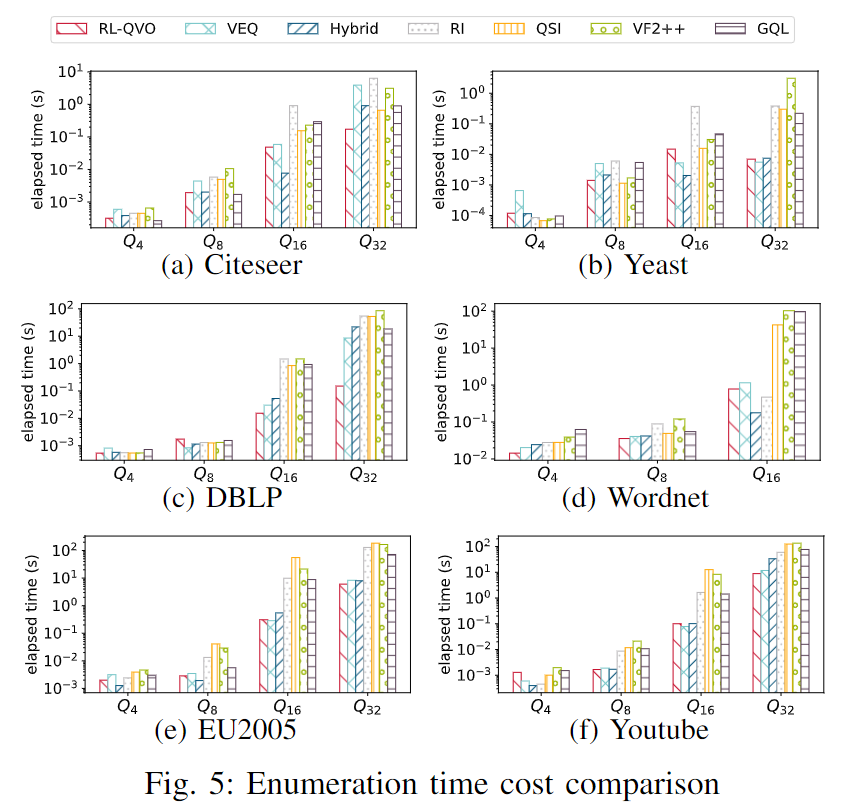

problem: heuristics

### Title:

Reinforcement Learning Based Query Vertex Ordering Model for Subgraph Matching

### Motivation:

1. Make Full Use of the Graph Information, adaptive priority for heuristics under particular query graph could significantly enhance the ordering methods, which requires the whole picture of graph information and decision making based on these information.
2. Limitation of Greedy Heuristics, these methods cannot consider the long-term query time cost.

### Approaches:

1. Capture the Graph Information with Graph Neural Network.
1. A reinforcement learning based framework to learn a policy for matching order generation. We craft the long-term cumulative reward for the RL-based model to force the model to consider the overall computational cost when selecting the next node for matching order φ

### Contributions:

1. Our proposed RL-QVO is the first work to employ Reinforcement Learning technique to obtain high-quality matching order for backtracking based subgraph matching algorithms.
2. Our RL-based model could fully exploit the graph information and select the next query node for the matching order at every step according to the cumulative reward, which can consider the long-term benefits.
3. Extensive experiments conducted on 6 real-life graphs demonstrate that the high-quality matching order obtained by RL-QVO can significantly save the query processing time by up to two orders of magnitude.

### BACKGROUND AND RELATED WORK:

#### Hybrid:

##### Candidate Set Generation:

Hybrid utilizes the candidate vertex filtering method in GraphQL.

##### Matching Order Generation:

Hybrid exploits RI's order generation method which is the state-of-the-art ordering method.

1. the maximum value of $$|\{u^{\prime}\in\phi_{t}|\exists u^{\prime\prime}\in V(q)\setminus \phi_{t},e(u^{\prime},u^{\prime\prime})\in E(q)\wedge e(u,u^{\prime\prime})\in E(q)\}|$$.
2. $$\begin{aligned}|u_{unv}|=|\{u^{\prime}\in N(u)-\phi_{t}|\forall u^{\prime\prime}\in\phi,e(u^{\prime},u^{\prime\prime})\not\in E(q)\}|\end{aligned}$$. If these values are still the same for at least two nodes, Hybrid will choose a node arbitrarily.

##### Enumeration Procedure:

Hybrid adopts the recursive enumeration procedure which is also widely used in existing backtracking search based methods.

#### VEQ:

##### Candidate Set Generation:

VEQ first builds the query directed acyclic graph (DAG) of query graph q by assigning directions to edges in q. 

VEQ also finds the neighbor equivalence class (NEC) for degree-one vertices, in which the query vertices have the same label and the same neighbors.

VEQ then builds the candidate set by using extended DAG-graph dynamic programming with an additional filtering function that utilizes a concept called neighbor-safety.

##### Matching Order Generation:

VEQ generates the matching order based on the size of candidate set and the size of neighbor equivalence class (NEC), which could reduce the redundancy in search space.

##### Enumeration Procedure:

VEQ follows the same enumeration procedure introduced above.

### Approach:

#### Motivation:

With the reinforcement learning framework, RL-QVO does not need to make assumptions on the query or data graph distributions, but regards the ordering process as a black-box computation on representations learned by GNNs with carefully designed initial features.

These motivate us to apply the Graph Neural Networks and Reinforcement Learning techniques to better utilize the graph information and find high-quality matching orders by looking multi-steps ahead (long-term rewards) during the training process.

The methods use value function, such as Q-learning and actor-critics, are hard to converge, which leads to unsatisfactory results, we choose to apply policy search method in our model.

#### Query Vertex Ordering as Markov Decision Process:

##### State:

At step t, the state is defined by the order $$φ_t$$ which contains t vertices and query graph representation matrix $$H^t_q$$.

For each vertex in query graph, we carefully initialize a feature representation $$\boldsymbol{h}^{(0)}_u$$ .

##### Feature Representations:

We use a scaled degree as one of the initial state value.
$$
\boldsymbol{h}_u^{(0)}(1)=degree(u)/\alpha_{degree}
$$
where $$α_{degree}$$ is a scaling factor to ensure the computation stability.
$$
\boldsymbol{h}_u^{(0)}(2)=label(u)
$$

$$
\boldsymbol{h}_u^{(0)}(3)=id(u)
$$

They are vectorized in the initial feature representation.
$$
\boldsymbol{h}_{u}^{(0)}(4)=\left|\{v\in G|d(u)<d(v)\}\right|/(|V(G)|\times\alpha_{d})
$$

$$
\boldsymbol{h}_{u}^{(0)}(5)=\left|\{v\in G|L(u)=L(v)\}\right|/(|V(G)|\times\alpha_{l})
$$

We put the number of unordered vertices and a trailing indicator at the initial representation.
$$
\boldsymbol{h}_u^t(6)=|V(q)|-t+1
$$
The indicator variable is 0 if the vertex u has not been ordered before the selection at time step t and 1 otherwise.
$$
\boldsymbol{h}_u^t(7)=1(u\in\phi_{t-1})
$$

##### Action:

Select vertex u′ from N (φt) according to the predicted probabilities and add u′ into the matching order for next step, $$\phi_{t+1} = \phi_t \cup \{u′\}$$.

##### Reward Design:

One immediate reward is the reduced **enumeration number** $$∆\#_{enum} = \#_{enum}(\phi) −\#_{enum}(\phi_{base})$$,where $$\phi$$ is the learned order of RL-based agent and $$\phi_{base}$$ is the baseline order produced by existing subgraph matching algorithms.

Considering the varying orders of magnitude of $$∆\#_{enum}$$ with different query graphs, the enumeration reward $$r_{enum}$$ is defined as $$r_{enum}$$ = $$f_{enum}(∆\#_{enum})$$, where $$f_{enum}(·)$$ is a function such as logarithm which reduces the **gaps** (differences) between enumeration rewards under different query graphs to **stabilize the computation**.

The enumeration reward $$r_{enum,t}$$ at step t cannot be determined until the final order $$\phi$$ is obtained, all rewards $$r_{enum,t}$$ at steps t share the **same value** as $$r_{enum} = f_{enum}(∆\#_{enum})$$.

A small **positive reward** is assigned if the policy network produces a valid probability distribution, the vertex with largest probability is in the action space u′ ∈ N (φt). Otherwise, a **negative** punishment is assigned which is greater than the positive reward in absolute value.

Even if the policy network produces invalid probabilities, our model still guarantees to generate a connected order φ by **masking out** the vertices that are not in the action space before making selection.

**Entropy reward** $$r_{h,t}$$ is defined as $$r_{h,t} = H(P_{\pi_\theta} (\phi_t, N (\phi_t)))$$, where $$H(\cdot)$$ is the entropy function, $$\pi_\theta$$ is a policy network with parameters $$\theta$$, and $$P_{\pi_\theta} (\phi_t, N (\phi_t))$$ is the output probability at step t with given order $$\phi_t$$ and action space $$N (\phi_t)$$.
$$
H(P)=-\sum_ip_i\log(p_i)
$$
overall step-wise reward:
$$
R_t=r_{\mathrm{enum}}+\beta_{\mathrm{val}}\cdot r_{\mathrm{val},t}+\beta_h\cdot r_{h,t}
$$
We assign a decay factor to the step-wise rewards and formulate the overall rewards as follows:
$$
R_{q,\theta}=\sum_{t=1}^{|V(q)|}\gamma^tR_t
$$

####  RL-QVO Policy Network Architecture:

##### Framework:

##### Action Space:

vertices set $$N (\phi_t) = {N (u)|\forall u ∈\phi_t, N (u) \notin \phi_t}$$

##### Policy Network:

With given state, a policy network returns a probability distribution over the action space.

In our model, the policy network includes two main parts: the graph neural network that aggregates and extracts the graph information; and the multi-layer perceptron which finally produces the probability distribution.

The aggregation of graph convolutional neural network can be formulated as follows:
$$
H^{(l+1)}=\sigma(\tilde{D}^{-\frac{1}{2}}\tilde{A}\tilde{D}^{-\frac{1}{2}}\boldsymbol{H}^{(l)}\boldsymbol{W}^{(l)})
$$
RL-QVO then applies the multi-layer perceptron (MLP) on obtained representation $$H_{q}^{\mathcal{L}}$$ to select the next node. Specifically, we use two linear neural layers with mask and normalization operations:
$$
\mathbb{P}_{u^{\prime}}^{(t)}=\pi(\cdot|S^{(t)})=Softmax(mask_{u^{\prime}\in AS(t)}(\boldsymbol{W}_{2}\cdot\sigma(\boldsymbol{W}_{1}\boldsymbol{h}_{u^{\prime}}^{(t)}))),
$$

$$
Softmax(\boldsymbol{z})=\frac{e^{\boldsymbol{z}_{i}}}{\sum_{j}(e^{\boldsymbol{z}_{j}})}
$$

#### Policy Training:

The reward of RL-QVO's policy network $$π_θ$$ with parameters θ at time step t is the summation of rewards for all query graphs in the training batch as follows:
$$
r_t(\theta)=\sum^{N_T}R_i(\phi_i;\theta_i)
$$
We utilize the proximal policy optimization (PPO) to train the policy network.

Loss function:
$$
J_{r}^{(t)}(\theta)=\sum_{(a_{t},s_{t})}min(\frac{\pi_{\theta}(a_{t}|s_{t})}{\pi_{\theta^{\prime}}(a_{t}|s_{t})}r_{t}(\theta),clip(\frac{\pi_{\theta}(a_{t}|s_{t})}{\pi_{\theta^{\prime}}(a_{t}|s_{t})},1-\epsilon,1+\epsilon)r_{t}(\theta))
$$

$$
J(\theta)=\sum_{t=1}^{|V(q)|}J_r^{(t)}(\theta)
$$

where θ′ is the parameters of policy network in previous epoch, $$\epsilon$$ is a factor to clip $$\frac{\pi_\theta(a_t|s_t)}{\pi_{\theta^{\prime}}(a_t|s_t)}$$which is the probability ratio of action $$a_t$$ with state $$s_t$$ computed by current and sampling policy networks.

#### Incremental Training:

In our experiment, we found a smaller value of training epochs is enough to prevent RL-QVO from catastrophic forgetting, improve the performance of RL-QVO on new query set and save the overall training time. 

#### Complexity Analysis:

In order to obtain the matching order for graph with |V (q)| vertices, such computation should be executed for |V (q)| times. Since the time complexity of GNN is O(|E(q)|) and that for MLP is $$O(d^2)$$ where dis the dimension of representations.

As a result, the overall time complexity of RL-QVO for query vertex ordering is $$O(|V (q)|×(|E(q)|+d^2))$$.

the space complexity is $$O(\mathcal L × d^2)$$

### EXPERIMENT:

#### Experiment Setup:

##### Compared Methods:

QuickSI, RI, VF2++, VEQ, Hybrid, RL-QVO

##### Data Graph:

##### Query Graph:

50% of the query graphs are used for training, and the remaining query graphs are used for evaluation.

##### Experiment settings:

The learning rate is set to $$10^{-3}$$, the output dimension of GCN is set to 64, number of training epochs is 100 by default and 10 for incremental training. All the scaling factors α are set to 1. We also apply a dropout ratio at 0.2 during training.

We set a time limit 500 seconds for subgraph matching, if the query process exceeds the time limit during training, we skip this query graph for training to save experimental time.

If a query graph remains unsolved by all compared methods, we would exclude this query graph in computing the average query processing time and enumeration time

##### Evaluation Metrics:

We use the average query processing time and enumeration time for the comparison.

#### Query Processing Time Comparison:

$$t = t_{filter} + t_{order} + t_{enum}$$

##### Average Query Processing Time:

##### Cumulative Query Processing Time Distribution:

##### Number of Unsolved Queries:

#### Enumeration Time Comparison:

The enumeration time is the determining factor of the overall time cost of subgraph matching process, and also directly reflects the qualities of matching orders generated by different algorithms.

##### Average Enumeration Time:

##### Comparison with Optimal Matching Order:

#### Ablation Study:

#### Query Processing Time vs. Output Dimension:

When the output dimension is 32, RL-QVO has limited performance because of the small parameter space. With the growth of output dimension, the query processing time reduces, and the salient point is around 64. When the dimension continues growing, the query processing time will increase because the time cost for ordering $$t_{order}$$ increases with the growth of output dimension.

#### Training Time and Order Inference Time:

1. We train the model with the default query set for 100 epochs on corresponding data graphs.
2. For each data graph, we first train the model on query set with less query vertices like Q8(for Wordnet) or Q16 (for other data graphs) for 100 epochs. Then incremental training is applied on default query set for 10 epochs.
3. The pre-trained model is directly applied on default query set.

#### Query Processing Time vs. Number of GNN layers:

#### Enumeration Time vs. Number of Matches:

#### Space Evaluation:

In terms of the memory consumption, RL-QVO might require more space for query graphs, however, the memory cost is still dominated by the parameter space of the model, which is relatively small.
