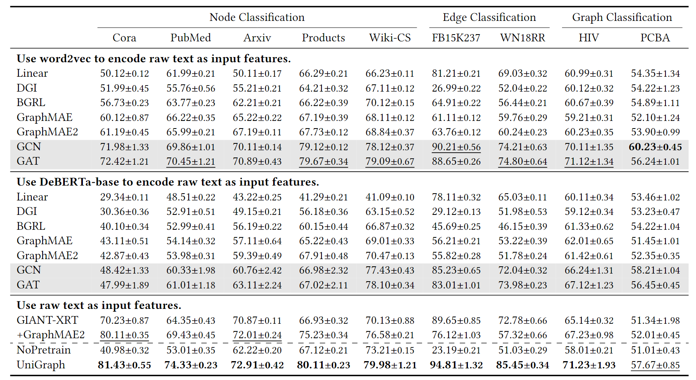

### Summarization：

We present our UniGraph framework, designed to learn a foundation model for TAGs, which is capable of generalizing to unseen graphs and tasks across diverse domains.

Random Mask, Target LM Encoder, Target GNN Encoder(Latent Loss) 

Overview of UniGraph framework. 1) In pre-training, we employ a self-supervised approach, leveraging TAGs to unify diverse graph data. This phase involves a cascaded architecture combining LMs and GNNs. We propose Graph Siamese Masked Autoencoders as the training architecture, which learns to reconstruct the masked text of each node using the text of its neighbors. 2) In few-shot transfer, the pre-trained model can make predictions with minimal data by comparing the embeddings of the query and support graphs. 3) Zero-shot transfer is achieved through graph instruction tuning with LLMs, enabling it to understand category labels in natural language and make predictions on unseen graphs without any graph-specific training.

#### Title:

UniGraph: Learning a Unified Cross-Domain Foundation Model for Text-Attributed Graphs

#### Background:

Foundation models in artificial intelligence are large-scale pretrained models that provide a versatile base, enabling a wide range of applications and tasks. However, in the graph learning community, the long-standing practice is to train a model specific to one graph at a time, which we call a single-graph model. Single-graph models typically require a substantial amount of labeled data for each specific task, which can be a significant limitation in data-scarce scenarios.

#### Related Work:

For graph transfer learning within the same domain, the most successful are pre-trained models on molecular graphs, benefiting from similar node/edge semantics. In addition, techniques such as fine-tuning, domain adaptation, and prompt graphs are used to achieve cross-graph transfer within the same domain.

OFA leverages pre-trained LMs to align the feature spaces of TAGs from different domains, while also transforming all downstream classification tasks into binary classification tasks, enabling it to conduct supervised training across all graphs.

#### Connections to existing methods:

Different between OFA:

1. UniGraph performs end-to-end representation learning on TAGs, whereas OFA's training is decoupled, using frozen LMs to generate features and then training GNNs separately.
2. UniGraph is a self-supervised learning framework, whereas OFA is a supervised learning framework that requires specific downstream task labels.
3. UniGraph, after pretraining, can generalize to any unseen target TAGs. In contrast, OFA co-trains on multiple target graphs simultaneously and then infers on each separately.

#### Contributions:

1. We propose a foundation model for TAGs, named UniGraph, which incorporates a novel cascaded LM and GNN backbone. Additionally, we propose the first pre-training algorithm specifically designed for large-scale self-supervised learning on TAGs.
2. We explore the use of graph instruction tuning to leverage the powerful generalization capabilities of LLMs for making zero-shot predictions on graph learning tasks.
3. UniGraph outperforms not just other cross-domain methods, but also supervised methods trained on the target dataset.

#### Introduction:

##### Challenges:

The major challenge in learning a graph foundation model is the diversity of graph domains and, furthermore, how to learn the invariances across different domains.

1. Firstly, graphs from different domains have distinct feature spaces and label spaces.
2. Secondly, as a universal data structure applied across various domains, graphs exhibit significant structural differences.

##### Presented work:

To learn transferable invariances across different graphs and tasks, we design a universal template to unify different tasks by contextualizing the nodes/edges/graphs on which we make predictions.

For node/edge-level tasks on large-scale graphs, we adopt the Personalized PageRank (PPR) algorithm to sample subgraphs, thereby mitigating differences in graph structures across different domains, while also making the model scalable.

We propose a cascaded architecture of LMs and GNNs and new pre-training objectives based on Masked Graph Modeling (MGM), specifically tailored for self-supervised learning on TAGs at scale.

We propose a cascaded architecture of LMs and GNNs and new pre-training objectives based on Masked Graph Modeling (MGM), specifically tailored for self-supervised learning on TAGs at scale.

To further endow our model with zero-shot capabilities, we concatenate pre-trained graph embeddings with natural language instructions and perform instruction tuning on LLMs, allowing us to unify the label spaces of graphs from different domains through natural language in a generative manner.

##### Text-Attributed Graphs

$$\mathcal{G}=(\mathcal{V},\mathcal E,\mathcal T_\mathcal V,\mathcal T_\mathcal E)$$

##### Problem Definition

1. Self-supervised representation learning
2. Few-shot transfer
3. Zero-shot transfer

##### Unifying Graphs and Tasks from Diverse Domains

The unification of node, edge, and graph-level tasks can be achieved through a **general contextual subgraphs processing** and **Anchor Nodes embedding refinement operation**
$$
\mathbf{h}=g(\mathcal{X},\mathcal{A})=R(f_\theta(\mathcal{X}),\mathcal{A})
$$
The Personalized PageRank (PPR) algorithm computes a relevance score for each node in $$\mathcal G$$ with respect to the Anchor Node 𝑣

$$C_𝑣$$ is the set of top-k nodes based on PPR scores, then: $$\mathcal G_𝑣 = (\mathcal V_𝑣,\mathcal E_𝑣 )$$ where $$\mathcal V_𝑣=\{v\}\cup C_{\upsilon}\mathrm{~and~}\mathcal{E}_{\upsilon}=\{(u,w)\in\mathcal{E}:u,w\in\mathcal{V}_{\upsilon}\}$$

##### Graph Siamese Masked Autoencoders on TAGs

We adopt DeBERTa-base as our LM and GAT as our GNN. We designed Graph Siamese Masked Autoencoders, enabling largescale self-supervised pre-training on TAGs.

###### Masking

$$
t_v=[[\mathrm{CLS}],T_1,T_2,\ldots,T_{n_v},[\mathrm{SEP}]]
$$

$$
m_v=\mathrm{Mask}(t_v)=[[\mathrm{CLS}],M_1,M_2,\ldots,M_{n_v},[\mathrm{SEP}]]
$$

$$
M_{i}=\begin{cases}[\text{MASK}],&\text{with probability }p\\T_{i},&\text{otherwise.}\end{cases}
$$

###### Encoder

The input to $$𝑓_{GNN}$$ is a matrix $$\widetilde{E}_{\mathrm{cls~}}\in\mathbb{R}^{|\mathcal{V}|\times d}$$ consisting of embedding of the [CLS] token for all nodes. The output of the GNN,$$\widetilde{E}_{\mathrm{cls}}^{\prime}\in\mathbb{R}^{|\mathcal{V}|\times d}$$ , is another matrix of embeddings, representing the propagated features: $$\widetilde{E}_{\mathrm{cls}}^{\prime}=f_{\mathrm{GNN}}(G,\widetilde{E}_{\mathrm{cls}})$$

###### Decoder

$$
H_v=\mathrm{Linear}(\widetilde{E}_v\oplus(\widetilde{e}_{v_{\mathrm{cls}}}^{\prime}\otimes1_{n_v+2}^\top))
$$

⊗in this context represents the outer product, which replicates the vector $$\widetilde{e}_{\mathrm{cls~}}^{\prime}$$ to form a matrix whose number of rows matches the number of tokens in $$\widetilde{E}_{v}$$. $$\mathrm{Linear}(*):\mathbb{R}^{2d}\to\mathbb{R}^d$$

We use an MLMHead, which is an MLP, to map transformed embeddings to vocabulary space, producing probability distributions: $$P_𝑣$$= MLMhead($$H_𝑣$$ )

The training loss is computed using a CrossEntropy loss function for each node 𝑣 on the graph, aiming to predict the original tokens at the masked positions.
$$
\mathcal{L}_{\mathrm{mask}}=-\frac1{\sum_v\sum_i\mathbb{I}(v,i)}\sum_{v\in\mathcal{V}}\sum_{i=1}^{\boldsymbol{n}_v}\mathbb{I}(v,i)\cdot\log\mathbf{P}_v[i,T_i]
$$
where $$\mathbb I(𝑣, 𝑖)$$ is an indicator function that is 1 if the 𝑖-th token in the sentence/node 𝑣 is a [MASK] token and 0 otherwise. $$P_𝑣 [𝑖,𝑇_𝑖 ]$$refers to the probability assigned to the true token $$𝑇_𝑖$$ for the 𝑖-th token in the sentence/node 𝑣.

Latent space regularization
$$
\mathcal{L}_\mathrm{latent}=\frac1{|\mathcal{V}|}\sum_i^{|\mathcal{V}|}(1-\frac{\bar{z}_i^\top\boldsymbol{e}_{\mathrm{cls}_i}^{\prime}}{\|\bar{z}_i\|\cdot\|\boldsymbol{e}_{\mathrm{cls}_i}^{\prime}\|})
$$

$$
\mathcal{L}=\mathcal{L}_\mathrm{mask}+\lambda\cdot\mathcal{L}_\mathrm{latent}
$$

###### Inference

In inference, we discard the decoder and target network, using only the encoder to generate embeddings.

###### Enabling in-context learning

$$
\mathcal{M}=\frac1{|Q|}\sum_{\boldsymbol{h}_q\in Q}\mathbb{1}\left[\arg\max_{c\in\{1,...,N\}}\frac{\boldsymbol{h}_q\cdot\overline{e_c}}{\|\boldsymbol{h}_q\|\|\overline{e_c}\|}=y_q\right]
$$

##### Graph Instruction Tuning

###### Instruction prompts

We design prompt templates that include graph embeddings, graph structure, and natural language instructions.

###### Training

Then we combine graph embeddings and natural language instructions as inputs to the LLM. We select Llama-7B as our LLM and adopt LoRA for fine-tuning the LLM while keeping the word embeddings frozen.

#### EXPERIMENTS

##### Self-Supervised Representation Learning

We adopt the most commonly used linear probing protocol to evaluate the representation learning ability of self-supervised pre-trained models on unseen datasets.

1. UniGraph outperforms state-of-the-art graph self-supervised learning methods by a large margin.
2. Compared to using pre-processed features, learning directly from TAGs is more advantageous for cross-domain transfer.
3. As a single pre-trained model applied to various downstream datasets, UniGraph exhibits better or comparable performance than supervised learning models trained directly on those downstream datasets.

##### Few-Shot Transfer

The results demonstrate that our UniGraph framework consistently outperforms all the baselines. In particular, compared to Prodigy and OFA, which are pre-trained on the same tasks as the downstream tasks, our model still achieves superior performance.

##### Zero-Shot Transfer

We can observe that our proposed UniGraph significantly outperforms open-source LLMs, confirming that our framework can effectively align graph embeddings with natural language representations.

##### Comparisons With Dataset-Specific Graph Self-Supervised Learning

From the experimental results, we observe that UniGraph still outperforms dataset-specific Graph SSL, further illustrating the potential and feasibility of foundation models.

##### Model Analysis

The overall results confirm that all key designs contribute to the performance of UniGraph.

We can observe that pre-training on graphs from the same domain enhances the performance of downstream tasks. This suggests that in-domain transfer remains simpler than cross-domain transfer.

The results show that larger LMs can achieve better performance, but practical experiments may need to consider the trade-off between performance and speed.

##### Efficiency Analysis

