### Title:

In-Memory Subgraph Matching: An In-depth Study

### Summarization:

1. GraphQL的过滤方法与最新的算法CFL、CECI、DP-iso相比也有竞争力
2. GraphQL和RI的排序方法通常是最有效的
3. CCIE和DP-iso中基于集合交集的局部候选计算在枚举中表现最好
4. DP-iso 中的失败集修剪可以显着提高查询集变大时的性能

### Introduction:

1. exploration-based method(沿着查询顶点的顺序将查询顶点映射到数据顶点来递归地扩展中间结果)
2. state space representation(每个状态代表一个中间结果)
3. constraint programming(query中的顶点和边分别对应变量和约束)

尽管模型不同，但这三种方法都采用了回溯搜索，通过将查询顶点映射到数据顶点来递归地扩展部分结果以找到所有解决方案

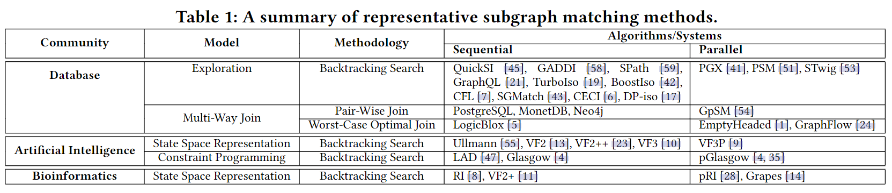

匹配算法：

1. direct-enumeration framework(直接探索G获得结果) (QuickSI, RI and VF2++)
2. indexing-enumeration framework(G上构建索引，在索引的帮助下回答查询) (GADDI, SPath and SGMatch)
3. preprocessing-enumeration framework(为每个查询顶点生成候选顶点集，构造辅助结构保持候选顶尖集之间的边) (GraphQL, TurboIso, CFL, CECI and DP-iso)

### COMPARISON AND ANALYSIS OF COMPETING ALGORITHMS:

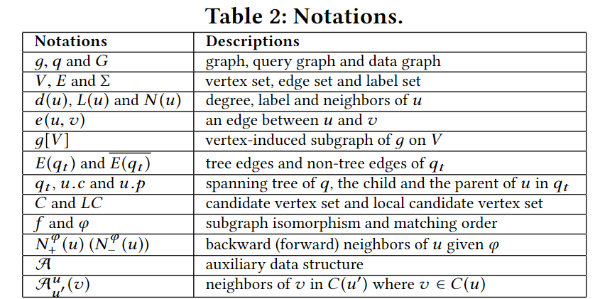

#### Basic Methods:

##### LDF:

label and degree filtering $$C(u)=\{v\in V(G)|L(v)=L(u)\wedge d(v)\geqslant d(u)\}$$

##### NLF:

neighbor label frequency filtering 

if there exists $$l \in L(N (u))$$ such that$$|N(u,l)|>|N(\upsilon,l)$$ where$$L(N(u))=\{L(u^{\prime})|u^{\prime}\in N(u)\}\mathrm{~and~}N(u,l)=\{u^{\prime}\in N(u)|L(u^{\prime})=l\}$$，then remove v from C (u)

如果u的邻接节点里含有l标签的数量大于v邻接节点里含有l标签的数量，那么把v从C(u)中移除

#### Filtering Methods:

##### QuickSI, RI and VF2++

直接枚举，不生成候选顶点集，使用一些过滤规则在枚举过程中修剪无效顶点

##### GraphQ

1. 局部修剪 local pruning 基于u的邻域子图生成C(u)通过比较节点的profile筛选，profile是节点r跳内节点的标签按照字典序排列形成的一个字符串

   全局细化 global refinement 使用伪子图同构算法修剪上一步生成的候选顶点集，将边e(u '，v ')添加到$$B^u_v$$中在N(u)和N(v)之间建立二部图$$B^u_v$$，u '∈N (u)和v '∈N (v)，如果v '∈C (u ');

2. 检查$$B^u_v$$中是否存在半完美匹配，即N (u)中的所有顶点都匹配

   

3. 如果不是半完美匹配，把v从C(u)中移除

重复k次，k人为定义

局部修剪的时间复杂度：$$O(|V(q)\times |E(G|)$$ 

总时间复杂度：$$O(|V(q)|\times|E(G)|+\sum_{u\in V(q)}\sum_{\upsilon\in V(G)}(d(u)\times d(\upsilon)+\Theta(d(u),d(\upsilon))))$$

##### CFL:

树状辅助数据结构$$\mathcal A$$叫做compressed path index， 空间复杂度$$O(|V(q)| \times |E(G)|)$$，时间复杂度$$O(|E(q)| \times |E(G)|)$$

1. 构造BFS树$$q_t$$，从顶到底逐层生成C(u)，同时进行过滤修剪。（其实还是要用NLF生成一遍C(u)）

   生成规则：u的candidate是u的所有neighbor的候选集的neighbor的交集。

   过滤规则：v的neighbor不是u的neighbor的candidate，v就不是u的candidate

2. 按照顺序自下而上根据邻居节点的candidate修剪C(u)

##### CECI:

辅助数据结构compact embedding cluster index，与CFL相同的生成候选顶点集，但保留非树边

时间复杂度和空间复杂度O(|E(q)|$$\times$$|E(G)|)

1. 按照顺序根据NLF构造C(u)
2. 根据邻居节点candidate逆序修剪C(u)

##### DP-iso:

辅助结构candidate space，如果u和u'之间存在边，保留C(u)和C(u')之间的边

时间复杂度和空间复杂度O(|E(q)|$$\times$$|E(G)|)

1. BFS q 根据LDF生成C(u)
2. 按顺序根据邻居节点candidate修剪C(u)(重复k次交替反向顺序)

#### Ordering Methods:

##### QuickSI:

infrequent-edge first ordering method

根据对应边的数量给出边的权重选取边权重最小的

##### GraphQL:

left-deep join based method它将查询建模为左深度连接树，其中叶节点是候选顶点集

树的左节点是上一步的结果，右节点是新的限制条件

first selects $$u^∗ = arg min_{u\in V(q)} |C (u)|$$ 作为φ的开始顶点

GraphQL iteratively selects $$u^∗ = arg min_{u\in N (φ )−φ} |C (u)|$$ as the next vertex in $$φ$$.

##### CFL:

path-based ordering method

它首先选取 min $$\frac{|\{v\in V(G)|\bar{L(u)}=L(v)\}|}{d(u)}$$的三个核心顶点 u，然后从具有最小 |C (u)| 的三个查询顶点中选择根顶点 $$u_r$$，其中 C (u) 由 NLF 生成，最后生成以 $$u_r$$ 为根的 q 的 BFS 树 $$q_t$$。设P表示qt中的所有根到叶路径P

##### CECI:

C(u) is generated by NLF

$$u_r=arg \min_{u\in V(q)}\frac{|C(u)|}{d(u)}$$ as the start vertex of $$\varphi$$

performs a BFS on q started from $$u_r$$ to obtain the matching order

##### DP-iso:

C(u) is generated by LDF

$$u_r=arg\min_{u\in V(q)}\frac{|C(u)|}{d(u)}$$ as the start vertex

DP-iso generates a collection of tree-like paths P in q according to δ(BFS遍历顺序)

##### RI:

$$u^{*}=arg\operatorname*{max}_{u\in V(q)}d(u)$$ as the start vertex of $$\varphi$$

iteratively select $$u^*=arg\max_{u\in N(\varphi)-\varphi}|N(u)\cap\varphi|$$

breaks ties by the maxinum value of

1.  maximum value of $$|\{u^{\prime}\in\varphi|\exists u^{\prime\prime}\in V(q)-\varphi,e(u^{\prime},u^{\prime\prime})\in E(q)\wedge e(u,u^{\prime\prime})\in E(q)\}|$$ (φ中的u′有在φ外的neighbor u′′，且u′′是u的neighbor)
2. maximum  values of $$|\{u^{\prime}\in N(u)-\varphi|\forall u^{\prime\prime}\in\varphi,e(u^{\prime},u^{\prime\prime})\notin E(q)\}|$$ (u′是u的neighbor但不在φ里，且φ里没有u′的neighbor)

##### VF2++:

first picks the vertex $$u \in V(q)$$ the label of which is least frequently appeared in G but with the largest degree as the root vertex $$u_r$$

VF2++ adds query vertices to φ depth-by-depth from depth 0

iteratively select $$u^*=arg\max_{u\in V_i(q_t)-\varphi}|N(u)\cap\varphi|$$ (与匹配集$$\varphi$$的邻接交集最多的节点)

处理匹配冲突的策略

1. the largest degree value
2. the minimum value of $$|\{\upsilon\in V(G)|L(u)=L(\upsilon)\}|$$

#### Optimization Methods:

##### Graph Compression:

1. 数据图压缩技术，只适用于数据图密集时
2. 查询图压缩方法，只有少数查询顶点能被压缩
3. CFL表现的比采用压缩技术的算法更好

##### Failing Sets Pruning:

失败集记录搜索子树中导致失败的部分映射或条件，利用这些失败集的信息提前排除某些部分映射

在探索以部分结果 M 为根的子树时，如果确定了某些映射组合无效：

- 记录这些映射组合或条件为失败集。

在搜索树的同一层（即 M 的兄弟节点）或更深层次时：

- 检查当前的部分结果是否满足失败集的条件。
- 如果满足，直接剪枝，避免无效计算。

#### Glasgow Algorithm:

基于 **约束编程（Constraint Programming, CP）** 思想实现。它将查询图 q 和数据图 G 的匹配问题转化为变量和约束的组合，通过高效的剪枝和搜索策略解决子图匹配问题。搜索过程中维护了许多状态，消耗了大量内存。

### Experiments:

#### Evaluating Filtering Methods:

##### Preprocessing Time:

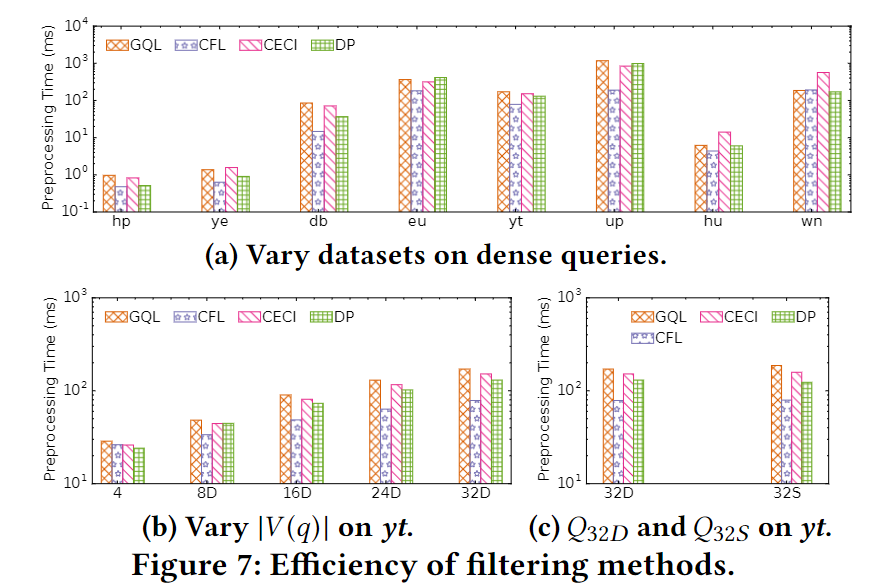

CECI、DP 与CFL具有相同的时间复杂度, 但比CFL花费更多的时间。因为CECI必须同步C(u)的复印本，DP要执行三次迭代，而CFL只需要自下而上一次，CECI和DP保存了$$q_t$$里的非树边的候选集之间的边。

##### Number of Candidate Vertices:

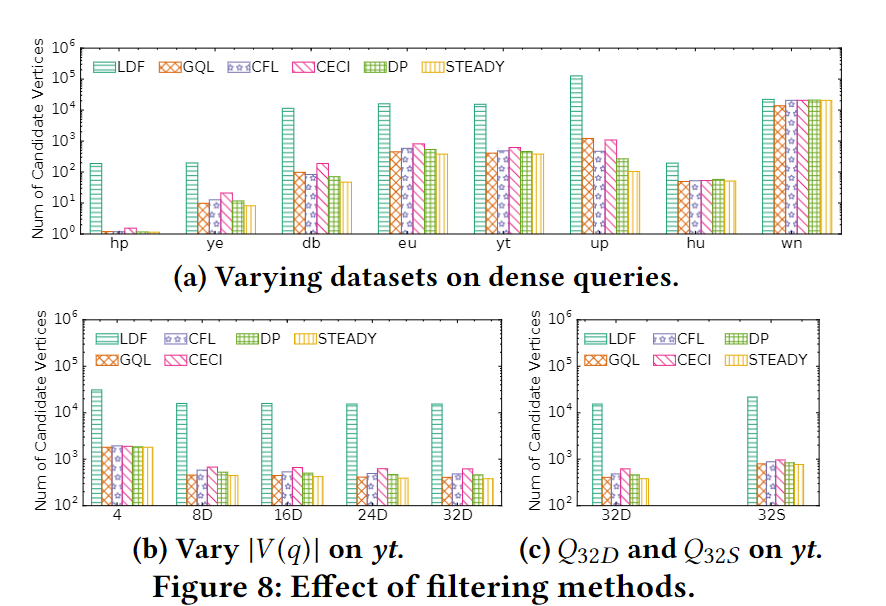

steady 表示使用这个方法过滤Given X ⊆ N (u) and v ∈ C (u) whereu ∈ V (q), if there exists u′ ∈ X such that C (u′) T N (v) = ∅, then v can be safely removed from C (u) without breaking its completeness.

在WordNet数据集中GraphQL算法表现明显由于其他的，但在其他数据集中并没有，因为它以随机的顺序获取C(u)，且这些数据集有很多不同的标签。

CECI表现的比CFL和DP更差，因为，CECI基于$$q_t$$中的$$u_c$$，而CFL和DP考虑了更多u的邻居。DP略好于CFL因为DP进行了更多的细化。尽管 CFL 和 DP 只执行少量改进，但它们的性能通常接近 STEADY。

#### Evaluating Enumeration Methods:

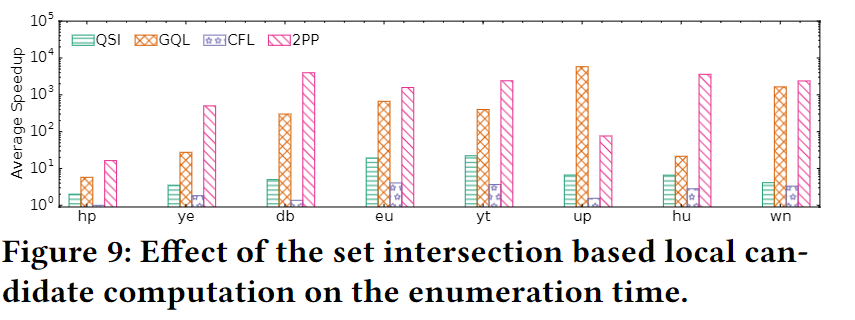

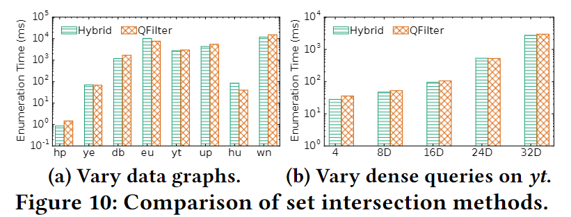

检查了每种算法优化实现的枚举时间的平均加速。省略了 RI，因为 RI 与 QSI 具有相同的本地候选计算。使用 LDF 生成的 C (u) 作为 QSI 和 2PP 的候选顶点集。

过滤器步骤的开销以及紧凑的布局使得 QFilter 在稀疏图上的表现优于 Hybrid。

#### Evaluating Ordering Methods:

##### Enumeration Time:

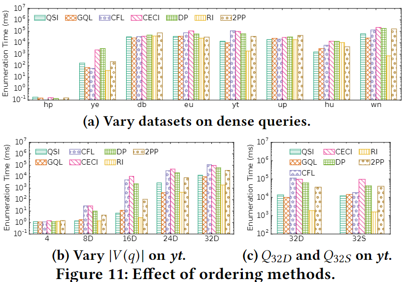

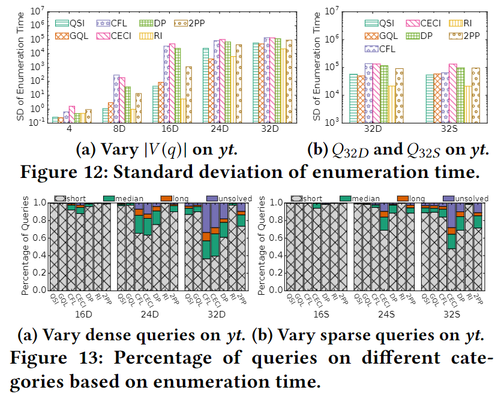

RI completes more than 95% queries within 1 second on $$Q_{32D}$$and $$Q_{32S}$$ , which significantly outperforms other algorithms.

##### Number of Unsolved Queries:

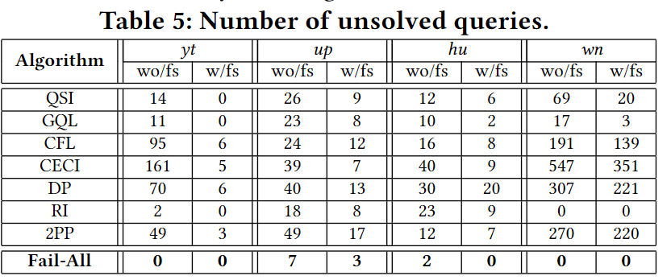

If a query cannot be completed within the time limit by any competing algorithms, it is called as a fail-all query.

##### Spectrum Analysis:

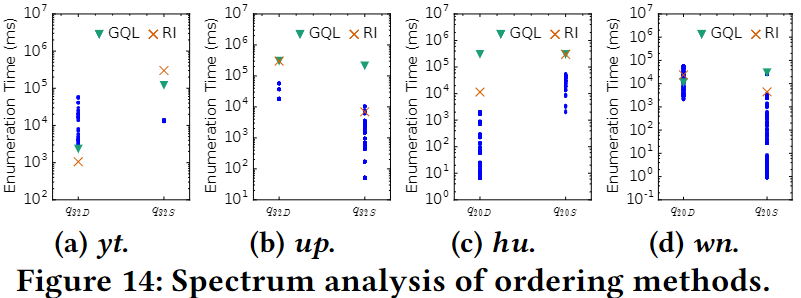

The blue point is the enumeration time with our generated orders.

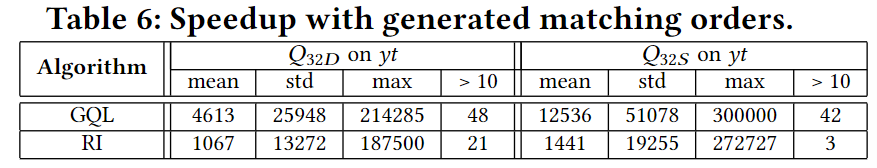

For comparison, we also measure the performance of the other algorithms under study as well as the performance of the 1000 randomly sampled matching orders.

It also lists the number of queries with a speedup of more than 10 times, denoted as ">10".

##### Discussion:

因为当数据集稀疏时，给定两个顶点，它们拥有更少的公共邻居，所以优先考虑非树边更有效，所以RI在稀疏图上表现非常好，因为RI的排序方法在每一步选择具有更多后向邻居的查询顶点。GQL和RI表现得比其他方法好。

#### Evaluating Optimization Methods:

失败集剪枝操作在$$Q_4$$和$$Q_8$$表现比没有差，在大的查询图中优化效果好，因为可以提前终止大型查询。

#### Overall Performance:

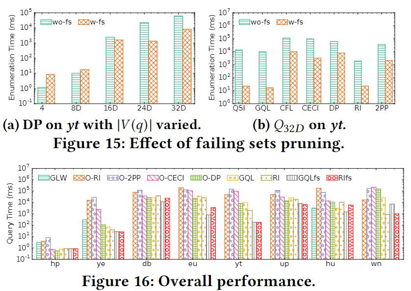

#### Scalability Evaluation:

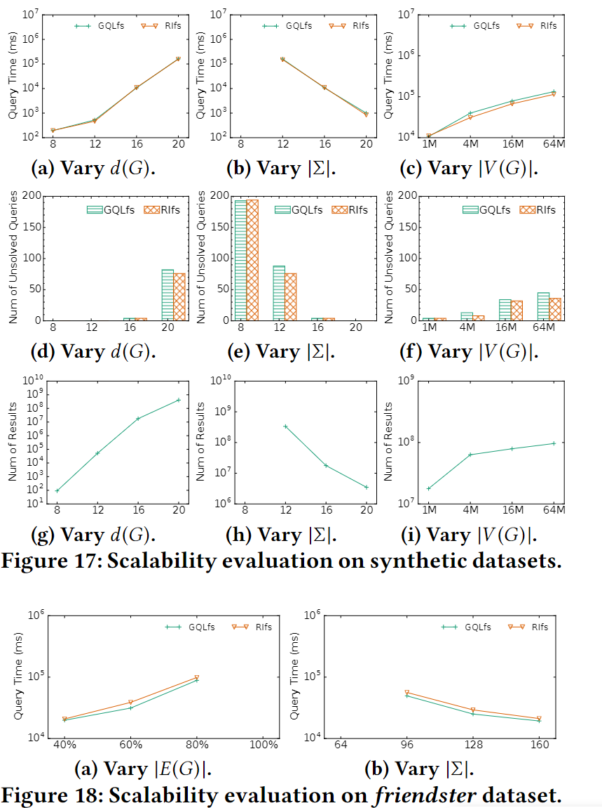

### Conclusions:

#### Comparison with results in previous research:

##### previous studies:

1. 没有算法能在所有情况比其他算法都好，排序方法会生成一些无效匹配顺序
2. 不同算法在同一个查询集中得差异很大，不同的查询在同一查询集中的运行时间也可能差异很大

##### latest algorithms:

例如CFL、CECI和DP-iso因为有效的过滤方法和排序方法的整体性能取得了很大的改进

但实验结果表明GraphQL 的过滤方法与最新算法具有竞争力，并且最新算法的排序方法比 QuickSI 和 GraphQL 等早期算法表现更差。

新算法整体表现比GraphQL好因为用来辅助数据结构来保存候选之间的边

##### preprocessing-enumeration algorithms:

表现优于直接枚举算法

原因：

1. 过滤方法生成的候选顶点集可以为排序方法提供更准确的信息
2. 辅助数据结构显着提高了局部候选计算的效率

#### Effectiveness of techniques in each category:

1. GraphQL、CFL和DP-iso的滤波方法在pruning能力方面优于CECI，三种方法通常相互竞争
2. GraphQL 和 RI 的排序方法通常在竞争排序方法中最有效，因为它们倾向于将非树边放在匹配顺序前面。CFL 和 DP-iso 中的基于路径的排序方法可能会导致大量未解决的查询，并且自适应排序在我们的实验中不会主导静态排序。
3. 局部候选计算方法对枚举性能有很大影响，基于集合交集的方法在竞争方法中表现最好。因此，有必要构建辅助数据结构来保持候选者之间的边缘。
4. 失败的集修剪技术会减慢小型查询的性能，但可以显着提高大型查询的性能并减少未解决查询的数量。

#### Recommendation:

1. 默认使用GraphQL的候选顶点计算方法。如果预处理时间通常支配查询时间，则切换到 CFL 或 DP-iso 的方法。
2. 分别采用GraphQL和RI在密集和稀疏数据图上的排序方法
3. 使用 CECI/DP-iso 风格的辅助数据结构来保持候选者之间的边缘，并采用基于集合交集的局部候选计算。如果数据图非常密集，则使用 QFilter 作为集合交集方法。
4. 启用在大型查询上的失败集修剪，但在小型查询上禁用它。
